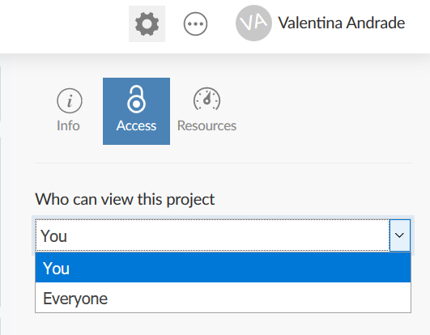
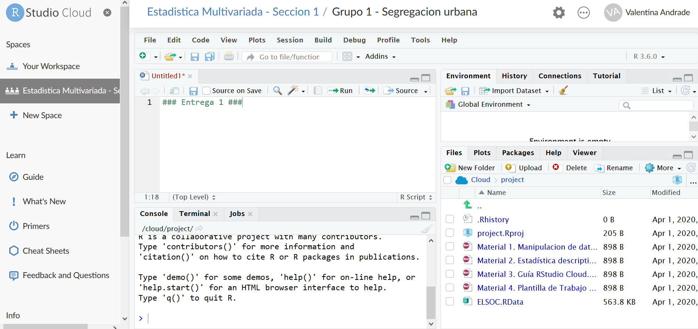
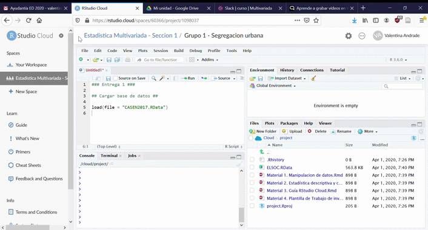
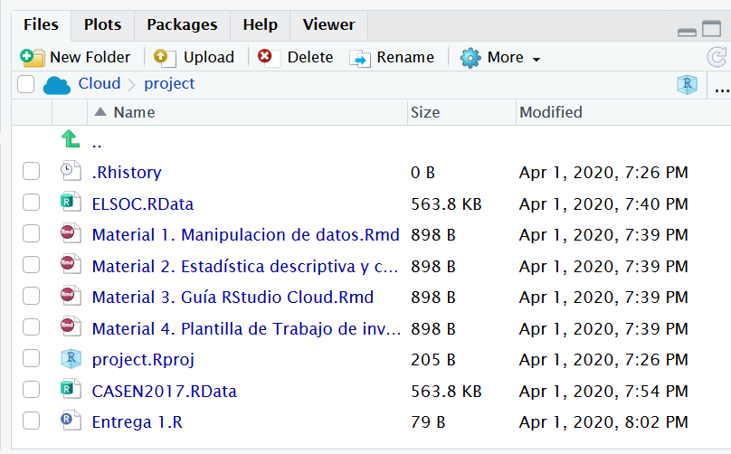

```{r setup, include=FALSE}
knitr::opts_chunk$set(echo = TRUE)
```

## RStudio Cloud

La plataforma [RStudio Cloud](https://rstudio.cloud/) se define como un *Cloud computing*. En esta el hardware, software, datos y recursos que utilizabas para tus cursos de estadística pasan de estar en nuestras computadoras a estar *“en la nube”*. RStudio Cloud será el sitio donde podremos interactuar de manera directa para la elaboración de los trabajos de investigación.


## Estructura básica de RStudio Cloud 

* Debes iniciar sesión con un cuenta de gmail (o tu cuenta github asociada a tu correo).
  + Este correo electrónico es el que indicaste en la [inscripción de grupos](https://docs.google.com/spreadsheets/d/1bS5n9en7nDXnRhZZPzS-RO1UdmM6ofCJ69wPqmajYLU/edit#gid=0)

### Projects

Un *project* es la unidad fundamental de trabajo en RStudio Cloud. Reúne el código R, los paquetes y los archivos de datos, y proporciona aislamiento de otros análisis. Es muy similiar a los *proyect* del RStudio que tienes en tu computadora, solo que tiene algunos metadatos adicionales para acceder y compartir tus análisis. 

Para crear un nuevo proyecto desde cero, simplemente debes pulsar el botón "New Proyect". Sin embargo, para efectos del curso, tu proyecto ya estará creado previamente. Este debería aparecer en "Your Workspace"

```{r project, echo=FALSE, out.width='80%', fig.asp=.80, fig.align='center'}
knitr::include_graphics("image1.png")
```

### Your Workspace

Cada usuario de RStudio Cloud obtiene un espacio de trabajo personal, llamado "Your Workspace", en el que se pueden crear proyectos.

Sólo tú puedes trabajar en los proyectos en tu espacio de trabajo, pero puedes elegir dejar que sean vistos (y copiados) por otros usuarios de RStudio Cloud.

De manera predeterminada, cualquier proyecto que creas sólo puede ser accedido por ti. Para compartir un proyecto con otros, abra el proyecto, haga clic en el botón "Project Settings" (el engranaje en la parte superior derecha), seleccione el panel "Access" y cambie "Who can view this project" a "Everyone".

```{r workspace, echo=FALSE, out.width='80%', fig.asp=.80, fig.align='center'}

```

**¿Cómo compartir mi proyecto?** 

Debes dar la dirección del proyecto que aparece en tu navegador y enviar el enlace. Ten en cuenta que cualquier usuario con el enlace podrá ver tu proyecto.


### Trabajo colaborativo 

+ Cuando accedes a un proyecto creado por otra persona, RStudio Cloud crea automáticamente una copia temporal del proyecto original para ti.

* **Puedes hacer ediciones, pero ninguno de tus cambios se reflejará en el original.**

* Si quieres conservar los cambios que has hecho, sólo tienes que guardar una copia del proyecto para ti mismo presionando el botón "Save a Permanent Copy".

```{r savecopy, echo=FALSE, out.width='80%', fig.asp=.80, fig.align='center'}
knitr::include_graphics("image3.png")
```

En consecuencia, esta nube les permite trabajar colaborativamente pero **no al mismo tiempo** o simultáneamente. Nuevamente, si no guardas tu trabajo, tus compañeros no podrán ver lo que hiciste. 

### Video tutorial

En el siguiente video podrán ver de manera directa todos los elementos señalados anteriormente

<div style="width: 100%; height: 600px; overflow: hidden;">
<video  style="width: 100%;" controls>
<source src="https://www.dropbox.com/s/6nqm99dqnjvtmry/rcloud.mp4?raw=1" type="video/mp4">
</video>
</div>


## RStudio Cloud para Estadística Multivariada 

### "Estadística Multivariada" Space

Al costado izquierdo de tu RStudio Cloud aparecerá un espacio de trabajo que será un área específica de trabajo que compartirás y colaborarás con tus compañeras/os, ayudantes y apoyo docente. Cada sección tendrá su propio espacio de trabajo. 


```{r estadisticamultivariada, echo=FALSE, out.width='80%', fig.asp=.80, fig.align='center'}
knitr::include_graphics("image4.png")
```


* Roles del espacio de trabajo

  + Admin: es quién puede incorporar a miembros al espacio de trabajo, editar y administrar proyectos. Este rol lo tiene tu **apoyo docente**
  
  + Moderador: puede ver y editar todos los proyectos del espacio. Este rol lo tienen **ayudantes**
  
  + Contribuidor: puede editar y ver su propio proyecto de investigación del curso. Este rol estará previamente asignado a **estudiantes**. 
  
### Proyecto de investigación 

Como notarás, cada grupo tendrá asignado un **proyecto**. 

Como habíamos mencionado antes los proyectos en RStudio Cloud tienen la misma funcionalidad que en RStudio de tu computadora. Estos buscan agrupar todos las sintaxis (códigos) y archivos que utilizas en tu proyecto (es *básicamente* una carpeta). Puedes comprobar en "Files" que los proyectos pueden contener: 

+ RScript (códigos para el análisis de tu proyecto)
+ RMarkdown (documento para las entregas o presentaciones)
+ Bases de datos (en los distintos formatos)
+ Otros archivos (imágenes, logos, etc). 

```{r proyectos, echo=FALSE, out.width='80%', fig.asp=.80, fig.align='center'}

```

En tu **proyecto** deberás cargar en "Files" los distintos archivos que necesites para elaborar tu trabajo

+ Código de preparación
+ Código de análisis
+ Base de datos
+ Base de datos procesada

```{r archivos, echo=FALSE, out.width='80%', fig.asp=.80, fig.align='center'}
knitr::include_graphics("image6.png")
```


### Cargar elementos a mi proyecto

Para cargar alguno de estos elementos solo debes ir a "Upload". Por ejemplo, si necesitas cargar la base de datos necesaria para tu proyecto presiona el botón "Upload" y se abriran tus archivos del computador. 


```{r upload, echo=FALSE, out.width='100%', fig.asp=1, fig.align='center'}

```

### Guardar

- Algunos pasos que no debes olvidar es guardar tu RScript. Los pasos a seguir es presionar el botón "File", "Save" y luego nombrar tu archivo, por ejemplo, "Codigo de preparacion". Como podrás ver, luego de eso aparecerá en "Files"

```{r save1, echo=FALSE, out.width='80%', fig.asp=.80, fig.align='center'}

```

- Una vez que la hayas trabajado **no olvides apretar el botón "Save a Permanent Copy"** de modo que tus compañeras/os de grupo puedan ver los cambios que realizaste. 

