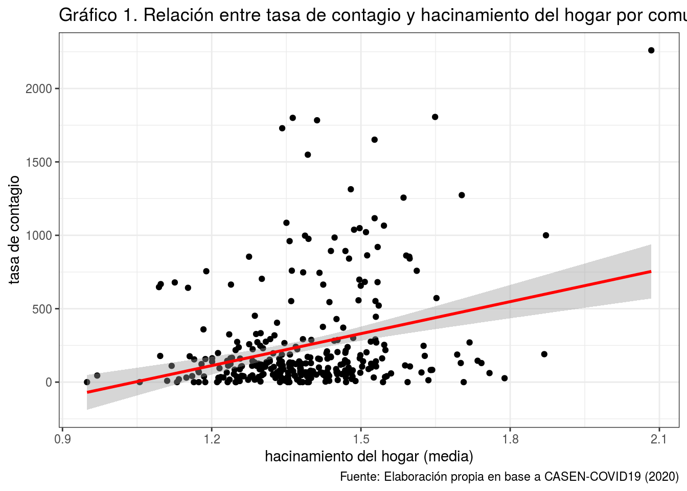
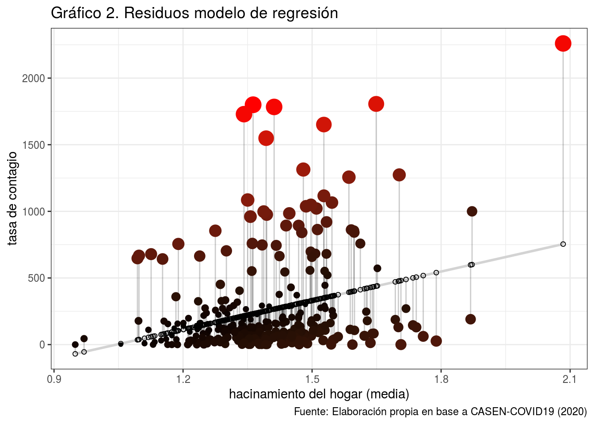

preservefe7b109974aebfcd

# 1. Identificación

Nombre: Estudiante de Estadística Multivariada

Sección: 1

Tema: COVID y comuna de resencia

# 2. Resumen

La pandemia por COVID-19 se ha extendido rápidamente por el mundo. A la fecha, se han registrado más de 4 millones de casos confirmados y cerca de 290 mil muertes en el mundo. En Chile, según reportes del Ministerio de Salud, 69.102 personas han sido contagiadas, 761 personas han fallecido, con 40.236 casos activos estimados al 24 de Mayo 2020. En este complejo contexto, el Gobierno ha utilizado la estrategia de *cuarentenas dinámicas* que consisten en realización de cuarentenas comunales según la evolución del contagio. A la fecha se desconoce y cuestiona su eficiencia

En ese sentido, para enfrentar la crisis sanitaria, uno de los principales desafíos es contar con estudios y acceso a información útil para informar la toma de decisiones. En consecuencia surge la pregunta de si *¿hay relación entre la tasa de contagio y variables de comuna de residencia?*. Para abordar esta pregunta, nos centraremos en una variable: `hacinamiento`. En consecuencia, ¿tiene relación la **tasa de contagio** con la media del índice de **hacinamiento** medio por comuna?

Los resultados muestran que hay una relación positiva entre la tasa de contagio con el hacinamiento. A partir de los modelos de regresión se puede señalar que por cada unidad que aumente el hacinamiento en los hogares por comuna, la tasa de contagio aumentará en 726.12 casos por cada 100.000 habitantes. Sin embargo, el ajuste del modelo es deficiente para explicar la variabilidad de la tasa de contagio.

## 3.  Antecedentes de la relación estudiada

Recientemente, la Organización Mundial de la Salud (OMS) ha publicado directrices para la prevención del coronavirus. De las medidas señaladas no solo destacan estrategias relativas a *prácticas sanitarias* como lavarse las manos frecuentemente y desinfectar superficies, sino que también *prácticas sociales* como el distanciamiento social (WHO,2020).

El gobierno chileno ha utilizado el último grupo de estrategias, principalmente a través de iniciativas como las *cuarentenas dinámicas*, que consisten en realización de cuarentenas comunales según la evolución del contagio. Esta iniciativa ha producido una serie de críticas por parte de expertos y la ciudadanía (Cabello, 2020)

El centro de la crítica reside en la desigualdad socioeconómica entre los residentes de las distintas comunas, y con ello en la posibilidad de cumplir con las medidas de prevención. Una de ellas refiere a la posibilidad de distanciamiento social difiere de manera importante entre las comunas: hay comunas en donde la concentración de individuos a nivel comunal y de los hogares hace imposible el distanciamiento.

Este punto no es menor considerando que ya el 2018 la OMS publicó que una directriz para el cuidado de virus implica elaborar políticas para reducir el hacinamiento (OMS,2018), y que ha sido rectificada como una estrategia necesaria no solo en el mundo sino que en los países vecinos (Santa Maria, 2020; Oliveira, Lucas & Iquiapaza, 2020)

En Chile, estudios recientes han señalado la importancia de abordar las medidas de aislamiento (MOVID19, 2020). Entre ellas se incluye considerar el hacinamiento de los hogares bajo el argumento principal de que a mayor hacinamiento, mayor es la tasa de contagio. Sin embargo, la evidencia aun no es concluyente.

# 4. Metodología

## 4.1 Descripción base de datos

**CASEN-COVID19** consiste en una base de datos que resume a nivel comunal información sobre la población contagiada por el virus COVID19 y encuesta de Caracterización Socioeconómica Nacional (CASEN).

- [CASEN (2017)](http://observatorio.ministeriodesarrollosocial.gob.cl/casen-multidimensional/casen/basedatos.php): su objetivo es medir pobreza, otorgando datos necesarios para la caracterización socioeconómica de individuos y hogares en Chile.

- [Datos Covid19 (2020)](https://github.com/MinCiencia/Datos-COVID19): presenta información detallada sobre los casos confirmados del virus COVID19 por comuna hasta el último informe epidemiológico entregrado por el gobierno de Chile (24 de abril de 2020).

La base cuenta con un total de 346 casos (que consisten en las comunas) y 6 variables comunales como nombre de la comuna, tamaño de la población, ingresos, año de escolaridad, previsión de salud, pobreza, deficit de acceso a servicios de salud y deficit de acceso a servicios básicos.

## 4.2 Variables

Para la realización de este ejercicio se tomaron en consideración las siguientes variables de la base de datos **casen_covid19**

* [`comuna`] = nombre de la comuna

* [`poblacion`] = número de habitantes por comuna

* [`hacinamiento`] = *media comunal* de la razón entre el número de personas residentes en la vivienda y el número de dormitorios de la misma, considerando piezas de uso exclusivo o uso múltiple. Contempla las categorías: sin hacinamiento, medio y crítico.

* [`casos_conf`] = casos confirmados por COVID19 en la comuna (número de contagiados confirmados)

Antes de pasar a describir las variables, se ponderó el número de `casos_conf` por `poblacion` de la comuna, a modo de capturar mejor la tasa de contagio según el número de habitantes. Basándose en las mediciones del MINSAL se calculó el número de casos confirmados por cada 100.000 habitantes, dividido en la población de la comuna.

En la Tabla 1 podemos observar la distribución de las variables. Principalmente podemos ver que nuestra variable dependiente, la tasa de contagio, tiene acumulado un 50% de sus casos cada 100.000 habitantes en 106.6 y 236.3 de media, lo que indica una concentración en los datos en valores menores a 100 casos por cada 100.000 habitantes, pero con una dispersión hacia los casos extremos (tasas muy altas) produciéndose una gran desviación estándar (355.4). Mientras que, la variable hacinamiento promedio por comuna presenta una distribución normal donde sus valores oscilan entre 0.9 a 2.1.

preserve64cd43a2e4668c67

Para entender mejor el hacinamiento por hogar promedio, se resume el índice de hacinamiento de [CASEN (2017)](http://observatorio.ministeriodesarrollosocial.gob.cl/casen/casen_def_vivienda.php) en la Tabla 2

Tabla 2: Índice de hacinamiento por hogar

Personas por dormitorio en vivienda | Tipo de hacinamiento
----------------------------------- | ---------------------
2,4 y menos | Sin hacinamiento
2,5 a 4,9 | Hacinamiento medio
5 a más | Hacinamiento crítico

# 5. Análisis

# 5.1 Análisis descriptivo

El *Gráfico 1* resume la relación entre la tasa de contagio y el hacinamiento promedio de los hogares, indicando cada uno de los puntos una comuna de todo el país. A partir de este podemos decir que en términos de correlación se observa una posible asociación positiva entre las variables.

Como es poco definitorio el gráfico, podemos corroborar tal dirección de la relación con una matriz con todas las correlaciones de las variables. En este caso solo nos fijaremos en la intersección entre `t_contagio` y `hacinamiento`

<table style="border-collapse:collapse; border:none;">
<caption style="font-weight: bold; text-align:left;">Tabla 3. Matriz de correlaciones entre tasa de contagio y variables de CASEN-COVID19</caption>
<tr>
<th style="font-style:italic; font-weight:normal; border-top:double black; border-bottom:1px solid black; padding:0.2cm;">&nbsp;</th>
<th style="font-style:italic; font-weight:normal; border-top:double black; border-bottom:1px solid black; padding:0.2cm;">t_contagio</th>
<th style="font-style:italic; font-weight:normal; border-top:double black; border-bottom:1px solid black; padding:0.2cm;">hacinamiento</th>
<th style="font-style:italic; font-weight:normal; border-top:double black; border-bottom:1px solid black; padding:0.2cm;">casos_conf</th>
<th style="font-style:italic; font-weight:normal; border-top:double black; border-bottom:1px solid black; padding:0.2cm;">poblacion</th>
</tr>
<tr>
<td style="font-style:italic;">t_contagio</td>
<td style="padding:0.2cm; text-align:center;">&nbsp;</td>
<td style="padding:0.2cm; text-align:center;">&nbsp;</td>
<td style="padding:0.2cm; text-align:center;">&nbsp;</td>
<td style="padding:0.2cm; text-align:center;">&nbsp;</td>
</tr>
<tr>
<td style="font-style:italic;">hacinamiento</td>
<td style="padding:0.2cm; text-align:center;">0.294***</td>
<td style="padding:0.2cm; text-align:center;">&nbsp;</td>
<td style="padding:0.2cm; text-align:center;">&nbsp;</td>
<td style="padding:0.2cm; text-align:center;">&nbsp;</td>
</tr>
<tr>
<td style="font-style:italic;">casos_conf</td>
<td style="padding:0.2cm; text-align:center;">0.686***</td>
<td style="padding:0.2cm; text-align:center;">0.126*</td>
<td style="padding:0.2cm; text-align:center;">&nbsp;</td>
<td style="padding:0.2cm; text-align:center;">&nbsp;</td>
</tr>
<tr>
<td style="font-style:italic;">poblacion</td>
<td style="padding:0.2cm; text-align:center;">0.404***</td>
<td style="padding:0.2cm; text-align:center; color:#999999;">0.024</td>
<td style="padding:0.2cm; text-align:center;">0.795***</td>
<td style="padding:0.2cm; text-align:center;">&nbsp;</td>
</tr>
<tr>
<td colspan="5" style="border-bottom:double black; border-top:1px solid black; font-style:italic; font-size:0.9em; text-align:right;">Computed correlation used pearson-method with listwise-deletion.</td>
</tr>
 
</table>

La *Tabla 3* muestra una **correlación positiva** entre la tasa de contagio y el hacinamiento de los hogares. Sumado a esto, esta asociación es estadísticamente significativa (p< 0.001) Ahora bien, el **tamaño de efecto**  muestra una magnitud mediana-pequeña para las ciencias sociales (Cohen, 1988)

Ahora bien, ¿cómo se relaciona **más específcamente** la tasa de contagio del COVID19 y la media de hacinamiento por hogar de la comuna?

# 5. Modelo de regresión

## Estimación modelo de regresión

Ahora bien, ¿cómo se relaciona **más específcamente** la tasa de contagio del COVID19 y la media de hacinamiento por hogar de la comuna? La ecuación que resume la relación entre estas dos variables es de la siguiente manera:

$$\widehat{t_{contagio}}=b_{0} +b_{1}\cdot {hacinamiento} $$

Donde

- $\widehat{t_{contagio}}$ es la tasa de contagio estimada
- ${hacinamiento}$ es el hacinamiento del hogar promedio a nivel comunal
- $b_{0}$ es el **intercepto** de la recta (el valor de Y cuando X es 0)
- $b_{1}$ es el coeficiente de regresión, que nos dice cuánto aumenta Y (la tasa de contagio) por cada punto que aumenta X (hacinamientode hogar)

<table style="border-collapse:collapse; border:none;">
<caption style="font-weight: bold; text-align:left;">Tabla 4. Modelo de regresion</caption>
<tr>
<th style="border-top: double; text-align:center; font-style:normal; font-weight:bold; padding:0.2cm;  text-align:left; ">&nbsp;</th>
<th colspan="2" style="border-top: double; text-align:center; font-style:normal; font-weight:bold; padding:0.2cm; ">t contagio</th>
</tr>
<tr>
<td style=" text-align:center; border-bottom:1px solid; font-style:italic; font-weight:normal;  text-align:left; ">Predictors</td>
<td style=" text-align:center; border-bottom:1px solid; font-style:italic; font-weight:normal;  ">Estimates</td>
<td style=" text-align:center; border-bottom:1px solid; font-style:italic; font-weight:normal;  ">p</td>
</tr>
<tr>
<td style=" padding:0.2cm; text-align:left; vertical-align:top; text-align:left; ">(Intercept)</td>
<td style=" padding:0.2cm; text-align:left; vertical-align:top; text-align:center;  ">-758.88</td>
<td style=" padding:0.2cm; text-align:left; vertical-align:top; text-align:center;  "><strong>&lt;0.001</td>
</tr>
<tr>
<td style=" padding:0.2cm; text-align:left; vertical-align:top; text-align:left; ">hacinamiento</td>
<td style=" padding:0.2cm; text-align:left; vertical-align:top; text-align:center;  ">726.12</td>
<td style=" padding:0.2cm; text-align:left; vertical-align:top; text-align:center;  "><strong>&lt;0.001</td>
</tr>
<tr>
<td style=" padding:0.2cm; text-align:left; vertical-align:top; text-align:left; padding-top:0.1cm; padding-bottom:0.1cm; border-top:1px solid;">Observations</td>
<td style=" padding:0.2cm; text-align:left; vertical-align:top; padding-top:0.1cm; padding-bottom:0.1cm; text-align:left; border-top:1px solid;" colspan="2">324</td>
</tr>
<tr>
<td style=" padding:0.2cm; text-align:left; vertical-align:top; text-align:left; padding-top:0.1cm; padding-bottom:0.1cm;">R2 / R2 adjusted</td>
<td style=" padding:0.2cm; text-align:left; vertical-align:top; padding-top:0.1cm; padding-bottom:0.1cm; text-align:left;" colspan="2">0.087 / 0.084</td>
</tr>

</table>

En la *Tabla 4* nos reporta que por cada unidad que aumente el hacinamiento en los hogares por comuna, la tasa de contagio aumentará en 726.12 casos por cada 100.000 habitantes. Esto quiere decir que, por ejemplo, cuando el hacinamiento de hogares promedio por comuna es cercano a 1,5 (sin hacinamiento) la tasa de contagio es cercana a la media 258.32 casos por cada 100.000 habitantes. Mientras que cuando el hacinamiento es cercano a 3 la tasa de contagio se acerca a 1419.48 casos por cada 100.000 habitantes.

## Bondad de ajuste

Ahora bien, como podemos ver en *Gráfico 2*, existe una gran variabilidad de los residuos. Con esto se quiere decir que la relación entre los valores predichos y los valores observados varía: por un lado, hay en una gran cantidad de casos (valores observados) donde la recta de regresión estaría sobreestimando su tasa de contagio (ver las comunas bajo la recta de regresión); por otro, hay una cantidad menor de casos (comunas) donde la recta de regresión subestima la tasa de contagio comunal. Un punto importante a notar es que si bien son menos comunas donde se estaría subestimando su tasa de contagio según su índice de hacinamiento, si ocurre que los residuos de este grupo de comunas es mucho mayor (comunas sobre la recta de regresión).

Analizando específicamente la bondad de ajuste de nuestro modelo, podemos ver que si bien la relación de hacinamiento y tasa de contagio es estadísticamente significativa, nuestro modelo explica solo un 8.4% de la variabilidad de los datos observados. Es decir, el hacinamiento explica en una pequeña proporción la variación observada de la tasa de contagio. Por ello, el hacinamiento no debería ser la única variable a considerar en futuras investigaciones.

# Referencias

- Cabello, F (2020) Covid-19: ¿Cuán dinámicas y efectivas son las cuarentenas parciales? [CIPER](https://ciperchile.cl/2020/04/18/covid-19-cuan-dinamicas-y-efectivas-son-las-cuarentenas-parciales/)

- CASEN (2017) Manual de Investigador Encuesta de Caracterización Socioeconómica.

- Cohen, Jacob (1988). Statistical Power Analysis for the Behavioral Sciences. [Routledge](https://books.google.cl/books?id=2v9zDAsLvA0C&pg=PP1&redir_esc=y#v=onepage&q&f=false)

- Santa María, R (2020) La importancia de la vivienda para el cuidado de la salud en el Perú, en el marco de la pandemia COVID-19. [Universidad Ricardo Palma](http://repositorio.urp.edu.pe/bitstream/handle/URP/3036/Articulo-DirectricesVivienda-OMS-COVID-19-SantaMaria-.pdf?sequence=1&isAllowed=y)

- Oliveira, Lucas & Iquiapaza (2020). ¿ LO QUE LA PANDEMIA COVID-19 NOS ENSEÑÓ SOBRE LA ADOPCIÓN DE LAS MEDIDAS PREVENTIVAS?. Texto & Contexto-Enfermagem, 29.

- OMS (2020) Actualización de estrategia frente a COVID. [Organización Mundial de la Salud](https://www.who.int/docs/default-source/coronaviruse/covid-strategy-update-14april2020_es.pdf?sfvrsn=86c0929d_10)

- MINSAL (2020) Plan de Acción Coronavirus COVID-19. Criterios para determinar una cuarentena. [Ministerio de Salud de Chile. Nuevo Coronavirus COVID-19](https://www.minsal.cl/nuevo-coronavirus-2019-ncov/)

- MOVID19 (2020) ¿Cómo podemos mejorar el aislamiento de casos COVID-19?
Una mirada desde la respuesta del sistema de salud y las condiciones sociales. [Monitereo Nacional de Síntomas Y Prácticas COVID19](https://movid19.cl/)

- WHO  (2018). WHO  Housing  and  health  guidelines. ISBN 978-92-4-155037-6. [World Health Organization](https://bit.ly/2ym6Vy)

# Anexos

[Código preparación de datos]("input/proc_data/proc-data.R")

[Código de análisis](proc/analisis-data.R)
