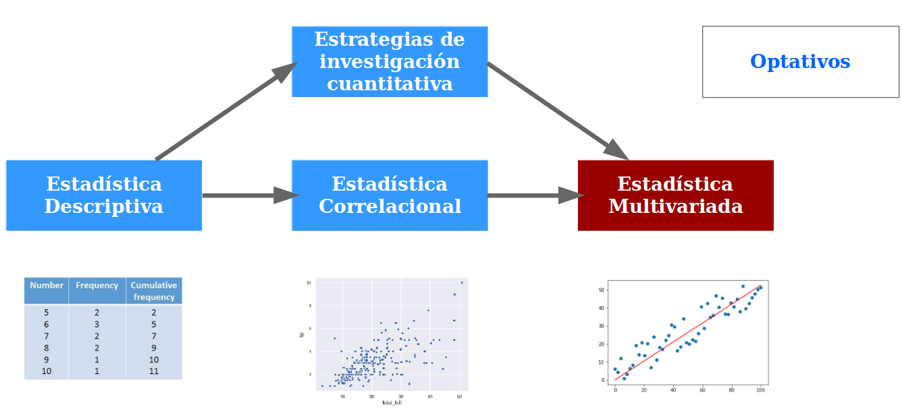
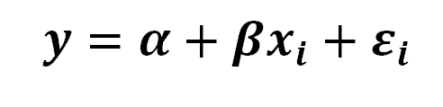
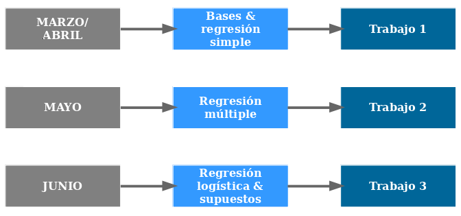
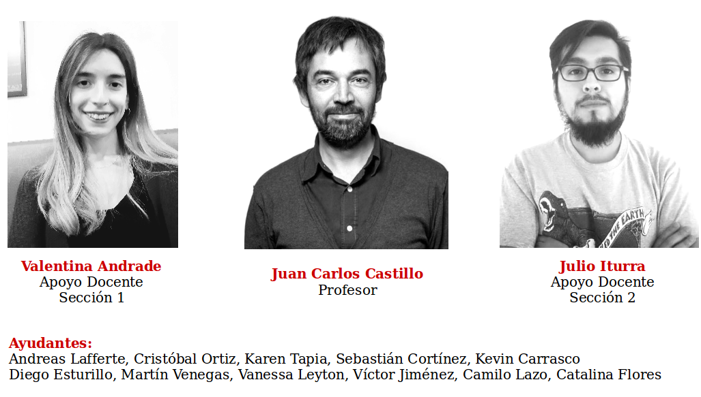

class: front

<!---
Para correr en ATOM
- open terminal, abrir R (simplemente, R y enter)
- rmarkdown::render('static/docpres/07_interacciones/7interacciones.Rmd', 'xaringan::moon_reader')

About macros.js: permite escalar las imágenes como [scale 50%](path to image), hay si que grabar ese archivo js en el directorio.
--->

.pull-left-narrow[
# Estadística Multivariada
## Juan Carlos Castillo
## Sociología FACSO - UChile
## 1er Sem 2021 
## [.white[multivariada.netlify.app]](https://multivariada.netlify.com)
]

.pull-right-wide[
.right[

 
 

##.red[Sesión 0: Presentación & organización]

]
]

---
class: roja, bottom, center

# Presentación

---
class: inverse, middle, center

# ¿Dónde estamos?

---
# Ciclo de formación en métodos cuantitativos

--
### Descripción --------- Asociación --------- Explicación 

---
class: inverse middle center

# Este curso

---

<iframe src="https://multivariada.netlify.app/" height="550" width=100% allowfullscreen="true">
</iframe>

---
# Estadística multivariada

- Hacia la **explicación** de los fenómenos sociales

---
# Estadística multivariada

- Hechos sociales: **multicausales**

---

# Estadística multivariada

### - Intentando dar cuenta de la complejidad: **modelos matemáticos**

--

.center[

]
### - A partir de un modelo matemático denominado **regresión**, este curso busca entregar herramientas de análisis de datos que permitan aproximarse a la **explicación de fenómenos sociales multicausales**.

---
# Estructura general

---
class: roja, middle, center

# Equipo
---
class: middle center

---
class: inverse, middle, center

# Sitio web del curso:

----

# [multivariada.netlify.com](https://multivariada.netlify.com/)
---
class: front

.pull-left[
# Estadística Multivariada
## Juan Carlos Castillo
## Sociología FACSO - UChile
## 1er Sem 2020
## [multivariada.netlify.app](https://multivariada.netlify.com)
]

.pull-right[
.right[
 

]

]
