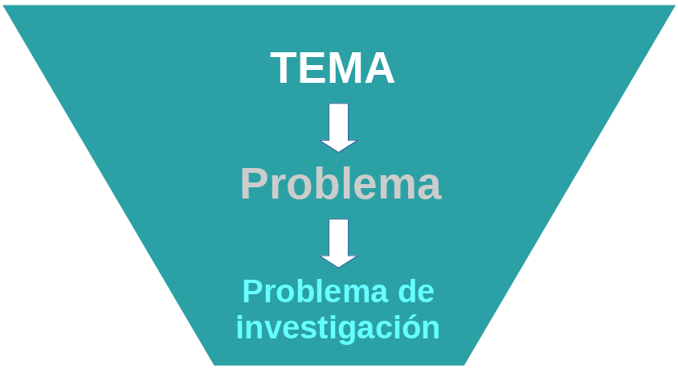
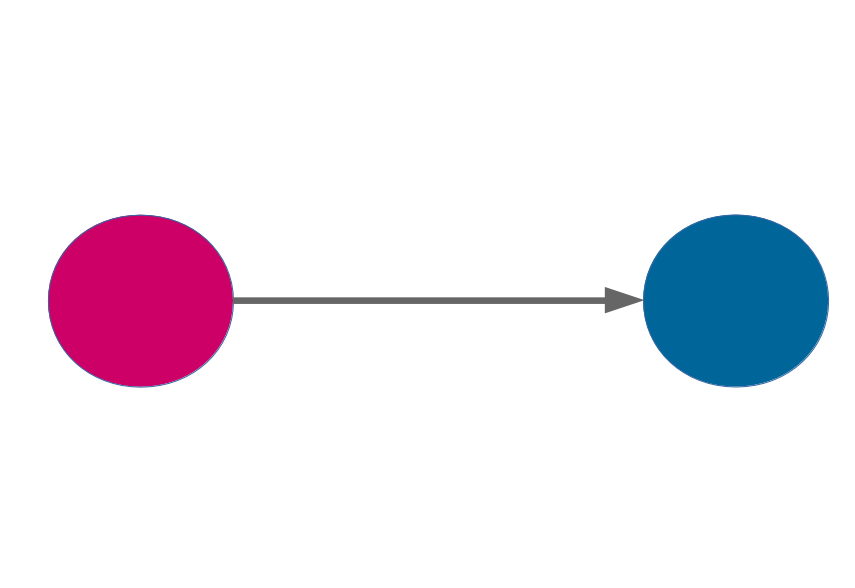
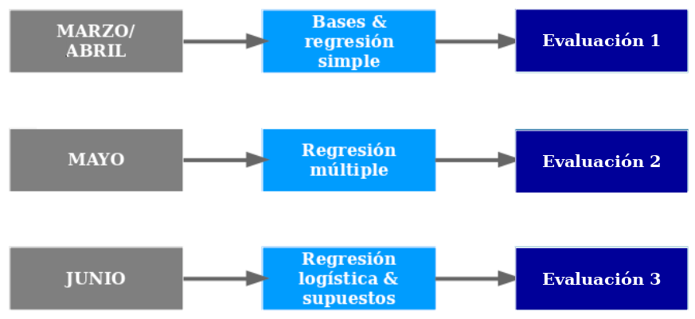

class: front

```{r eval=FALSE, include=FALSE}
# Correr esto para que funcione el infinite moonreader, el root folder debe ser static para si dirigir solo "bajndo" en directorios hacia el bib y otros

xaringan::inf_mr('/static/docpres/02_bases/2mlmbases.Rmd')
```


```{r setup, include=FALSE, cache = FALSE}
require("knitr")
options(htmltools.dir.version = FALSE)
pacman::p_load(RefManageR)
# bib <- ReadBib("../../bib/electivomultinivel.bib", check = FALSE)
opts_chunk$set(warning=FALSE,
             message=FALSE,
             echo=TRUE,
             cache = TRUE,fig.width=7, fig.height=5.2)
```


```{r xaringanExtra, echo=FALSE}
xaringanExtra::use_xaringan_extra(c("tile_view", "animate_css"))
xaringanExtra::use_share_again()
xaringanExtra::use_scribble()
xaringanExtra::style_share_again(
  share_buttons = c("none")
)


```

<!---
Para correr en ATOM
- open terminal, abrir R (simplemente, R y enter)
- rmarkdown::render('static/docpres/07_interacciones/7interacciones.Rmd', 'xaringan::moon_reader')

About macros.js: permite escalar las imágenes como [scale 50%](path to image), hay si que grabar ese archivo js en el directorio.
--->


.pull-left-narrow[
# Estadística Multivariada
## Juan Carlos Castillo
## Sociología FACSO - UChile
## 1er Sem 2021 
## [.white[multivariada.netlify.app]](https://multivariada.netlify.com)
]

.pull-right-wide[
.right[


<br>
<br>


##.red[Sesión 1: Presentación & organización]

]
]

---
class: roja, bottom, center


# 1.Presentación

---
class: inverse, middle, center

# ¿Dónde estamos?


---
# Ciclo de formación en métodos cuantitativos


--

### Descripción --------- Asociación --------- Explicación/predicción 

---
class: inverse middle center

# Este curso

---

# Encuesta ...

<br>
<br>

# Ir a [https://www.menti.com/jmasfc4qfd](https://www.menti.com/jmasfc4qfd) (link directo)

...o  a [menti.com](https://www.menti.com/) e introducir código 7645 6449


---

<iframe src="https://www.mentimeter.com/s/38e390612910ed2287d9ba31316974d4/20834cd3c4a5" height="500" width=100% allowfullscreen="true">
</iframe>

---
class: inverse middle center

# ¿Cómo llegamos desde la teoría sociológica a la estadística?

---
class: center, middle



???

???
- ¿Cuál es su principal tema de interés social o preocupación actual en términos de la sociedad?
- ¿Por qué esto podría ser un problema?
- ¿Por que podría ser un problema de investigación?


Dar un par de pasos hacia atrás para llegar hasta la la explicación de fenómenos sociales, y conectar con intereses de la audiencia

---

- Hacia la **explicación** de los fenómenos o problemas sociales: **teoría**
.center[
]

---

- Hacia la **explicación** de los fenómenos o problemas sociales: **teoría**, multicausalidad y contexto

.center[

]

???

"Todo tiene que ver con todo ... " ,  "La realidad social es compleja ..." ... o, somos capaces de decir algo más como cieníficos sociales.

---
class: inverse, middle, center

## ¿Podemos decir algo más que _"depende", "la realidad social es compleja"_ o que _"los fenómenos sociales son multicausales"_?

---
# Estadística multivariada

- provee de **herramientas** estadísticas para el contraste de teorías relacionadas con problemas de investigación en .blue[contextos sociales complejos].

--

- para ello se centra en la estimación y análisis de un **modelo** estadístico (probabilístico) que permite comparar la influencia de distintos factores en un fenómeno social de .red[manera simultánea].

--

- esta pretensión se acompaña siempre del supuesto del **error**


---
# ... y énfasis transversales en 

.pull-left[
<br>

- reporte y comunicación de resultados

- apertura y reproducibilidad
]


.pull-right[


]

---
class: roja bottom right


# 2. Organización 

---
# Estructura general del curso



---
# Clases y prácticas


---
# _Prácticas_

- Se basa en el desarrollo autónomo de una **guía de trabajo** relacionada a los contenidos de la clase

- En el espacio simultáneo de revisión de práctica se revisa la guía en grupos pequeños bajo la supervisión de apoyo docente y profesor

- Se completa el **reporte de progreso** respectivo (para monitoreo y retroalimentación)

---
class: inverse, middle, center

# Sitio web del curso:

----

# [.red[multivariada.netlify.app]](https://multivariada.netlify.com/)

Objetivo: eficiencia, toda la información en un solo lugar

---
# Desarrollo del Práctico 1: Preparación de datos

- disponible en sitio web - marcha blanca

- repaso de contenidos anteriores y propuesta de trabajo (reproducible) en el análisis de datos

- realizar durante la semana 

- dudas: **Disqus**, foros UCursos, ayudantes, apoyo docente, profesor


---
class: roja, middle, center

# ¡ Bienvenid_s !


---
class: front

.pull-left[
# Estadística Multivariada
## Juan Carlos Castillo
## Sociología FACSO - UChile
## 1er Sem 2021
## [multivariada.netlify.app](https://multivariada.netlify.com)
]


.pull-right[
.right[
<br>

]

]
