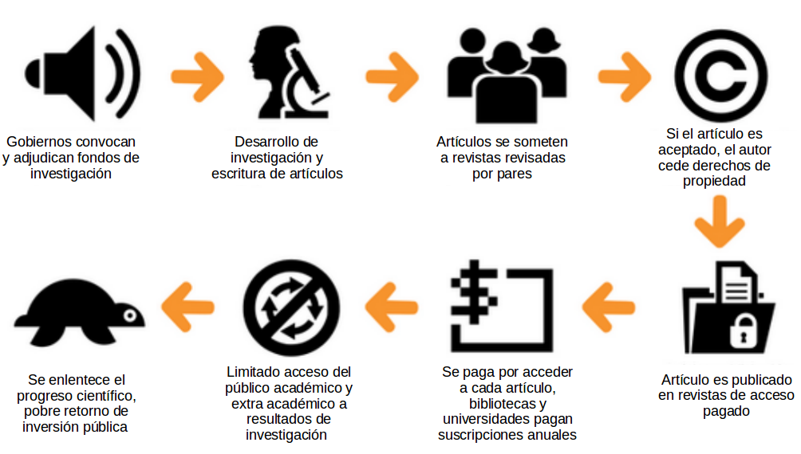
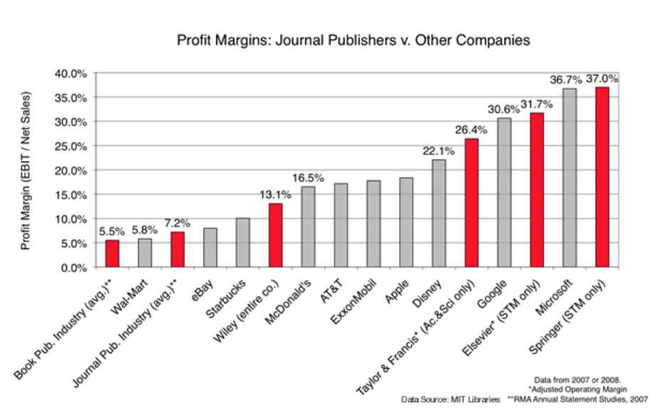
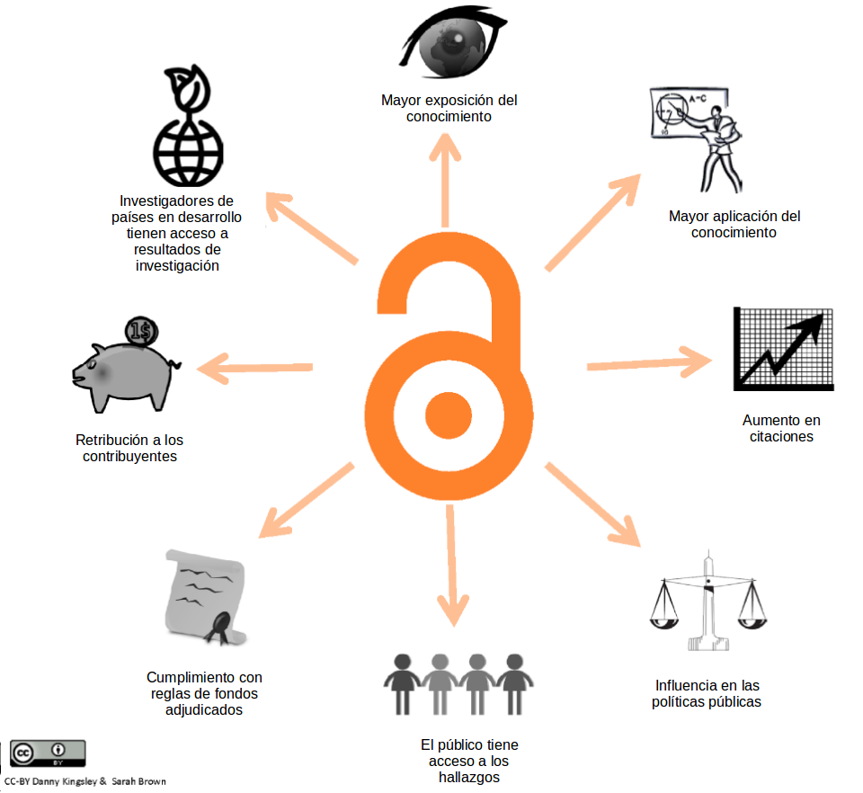
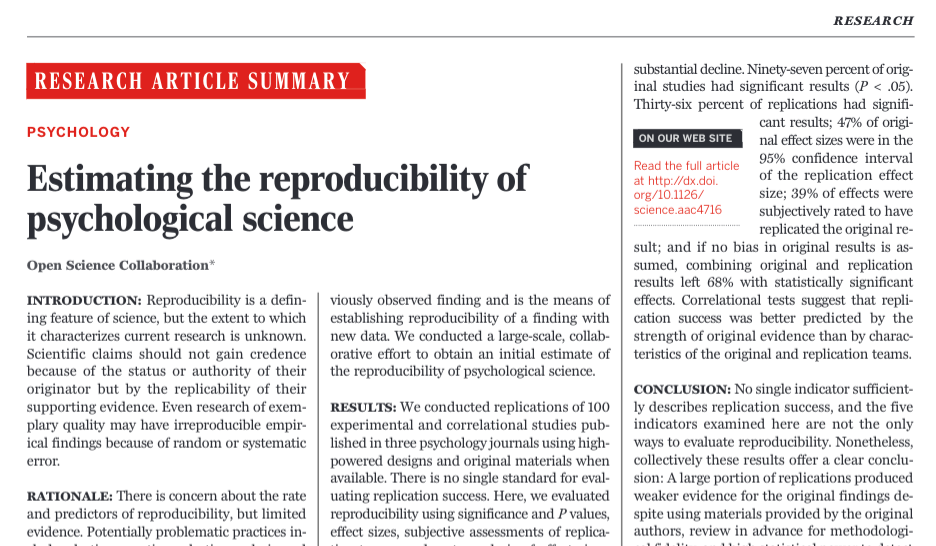

class: bottom, right, inverse

```{r eval=FALSE, include=FALSE}
# Correr esto para que funcione el infinite moonreader, el root folder debe ser static para si dirigir solo "bajndo" en directorios hacia el bib y otros

xaringan::inf_mr('/static/docpres/02_bases/2mlmbases.Rmd')
```

```{r setup, include=FALSE, cache = FALSE}
require("knitr")
options(htmltools.dir.version = FALSE)
pacman::p_load(RefManageR)
# bib <- ReadBib("../../bib/electivomultinivel.bib", check = FALSE)
opts_chunk$set(warning=FALSE,
             message=FALSE,
             echo=TRUE,
             cache = TRUE,fig.width=7, fig.height=5.2)
```

<!---
Para correr en ATOM
- open terminal, abrir R (simplemente, R y enter)
- rmarkdown::render('static/docpres/07_interacciones/7interacciones.Rmd', 'xaringan::moon_reader')

About macros.js: permite escalar las imágenes como [scale 50%](path to image), hay si que grabar ese archivo js en el directorio.
--->

.pull-left[.center[
<br>
<br>
<br>
<br>
<br>
<br>
<br>
<br>
]]

.pull-right[
# Ciencia Social Abierta
### Juan Carlos Castillo
### Sociología FACSO - UChile
### 1er Sem 2020
### [cienciasocialabierta.netlify.com](https://cienciasocialabierta.netlify.com)


<br>

## Sesión 1: Programa e introducción

]

---
class: roja, middle, center


# Motivación:

## Crisis de apertura en ciencia: 
## Acceso y reproducibilidad

---
class: inverse, middle, center

# 1. Crisis de acceso

---
class: middle

### El ciclo actual de publicación científica


.small[
(Adaptado de: [https://creativecommons.org/about/program-areas/open-access/](https://creativecommons.org/about/program-areas/open-access/))
]

---
class: middle, center

.pull-left[
## Barreras de pago
]
.pull-right[
.left[

]
]


---
### Márgenes de ganancia





---
## Beneficios acceso abierto

.center[

]
.small[
(Adaptado de: [http://whyopenresearch.org/#](http://whyopenresearch.org/#))
]

---
class: inverse, middle, center

# 2. Crisis de reproducibilidad

---

¿Qué porcentaje de los estudios publicados son reproducibles?



... alrededor de un 40% (varía por disciplina)

---
# ¿Por qué se ocurre la crisis de reproducibilidad?

Algunas razones:

- pobre documentación metodológica

- sesgo hacia búsqueda y publicación de resultados significativos (p hacking), atribuido a la presión por publicar

- en algunos casos, falseamiento de datos/análisis

---
class: roja, middle, center

# Este curso

---
## Enfrentando la crisis

- tema de **ética** científica y también de **eficiencia**

--

- por ahora en Chile, la apertura depende de la **voluntad de los investigadores**, pero revistas se hacen más exigentes y gobiernos extranjeros ya han implementado políticas de acceso y reproducibilidad.

--

- requiere de una serie de **herramientas metodológicas** que permitan reproducibilidad y acceso de la información científica

--
- En este curso, vamos a organizar los contenidos en base a dos sets de herramientas relacionadas con la crisis de apertura:

 - herramientas de **acceso**
 - herramientas de **reproducibilidad**

 
-> al [programa](https://cienciasocialabierta.netlify.com/)

---
class: inverse

.pull-left[.center[
<br>
<br>
<br>
<br>
<br>
]]

.pull-right[
<br>
<br>
<br>

# Ciencia Social Abierta
### Juan Carlos Castillo
### Sociología FACSO - UChile
### 1er Sem 2020
### [cienciasocialabierta.netlify.com](https://cienciasocialabierta.netlify.com)
]


