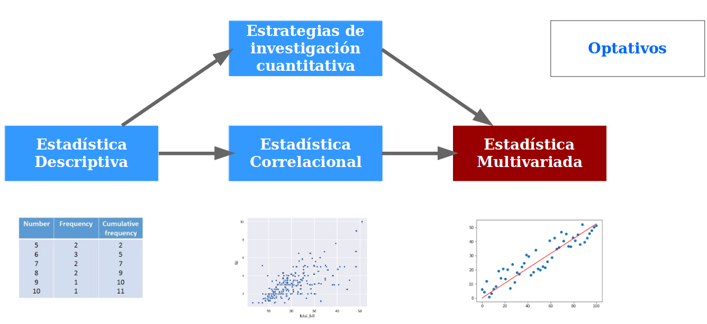
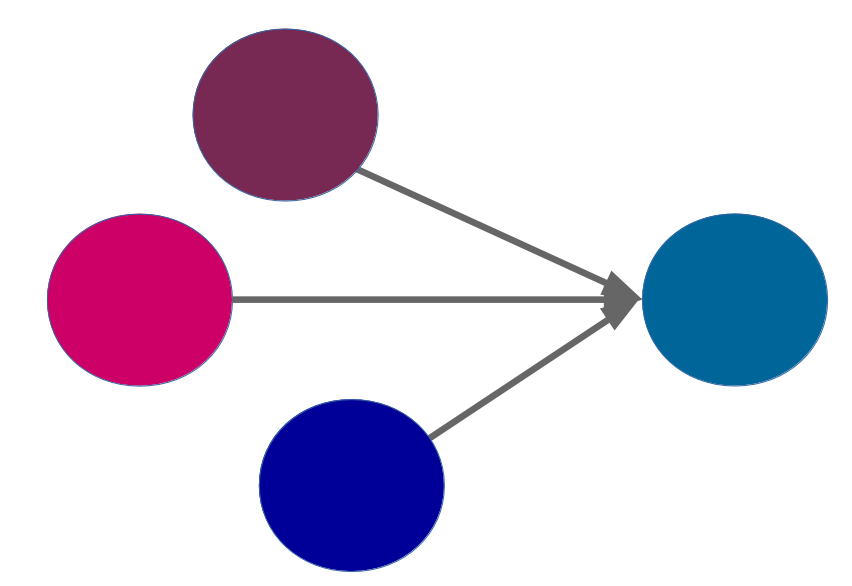

class: bottom, right, inverse

```{r eval=FALSE, include=FALSE}
# Correr esto para que funcione el infinite moonreader, el root folder debe ser static para si dirigir solo "bajndo" en directorios hacia el bib y otros

xaringan::inf_mr('/static/docpres/02_bases/2mlmbases.Rmd')
```

```{r setup, include=FALSE, cache = FALSE}
require("knitr")
options(htmltools.dir.version = FALSE)
pacman::p_load(RefManageR)
# bib <- ReadBib("../../bib/electivomultinivel.bib", check = FALSE)
opts_chunk$set(warning=FALSE,
             message=FALSE,
             echo=TRUE,
             cache = TRUE,fig.width=7, fig.height=5.2)
```

<!---
Para correr en ATOM
- open terminal, abrir R (simplemente, R y enter)
- rmarkdown::render('static/docpres/07_interacciones/7interacciones.Rmd', 'xaringan::moon_reader')

About macros.js: permite escalar las imágenes como [scale 50%](path to image), hay si que grabar ese archivo js en el directorio.
--->

.pull-left[.center[
<br>
<br>
<br>
<br>
<br>
<br>
<br>
<br>
]]

.pull-right[
# Estadística Multivariada
### Juan Carlos Castillo
### Sociología FACSO - UChile
### 1er Sem 2020
### [multivariada.netlify.com](https://multivariada.netlify.com)


<br>

## Sesión 1: Programa e introducción

]

---
class: roja, middle, center


# Presentación


---
# Ciclo de formación en métodos cuantitatativos



--
### --- Descripción ------------- Asociación -------------- Explicación ---

---
class: inverse middle center

# Este curso

---
# Estadística multivariada

- Hacia la **explicación** de los fenómenos sociales


---
# Estadística multivariada

- Hechos sociales: **multicausales**



---

# Estadística multivariada

### - Intentando dar cuenta de la complejidad: **modelos matemáticos**

--

.center[

]
### - A partir de un modelo matemático denominado **regresión**, este curso busca entregar herramientas de análisis de datos que permitan aproximarse a la **explicación de fenómenos sociales multicausales**.


---
class: roja, middle, center

# Equipo
---
class: middle center


---


class: inverse

.pull-left[.center[
<br>
<br>
<br>
<br>
<br>
<br>

]]

.pull-right[
<br>
<br>
<br>
# Estadística Multivariada
<br>
### Sociología FACSO - UChile
### 1er Sem 2020
### [multivariada.netlify.com](https://multivariada.netlify.com)
]

