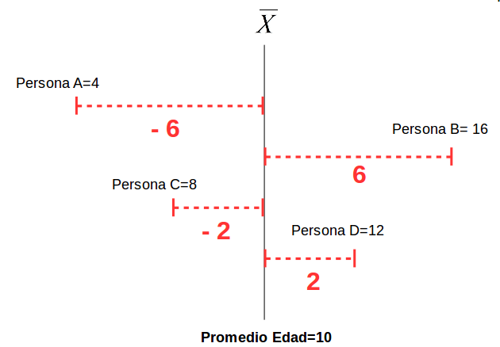
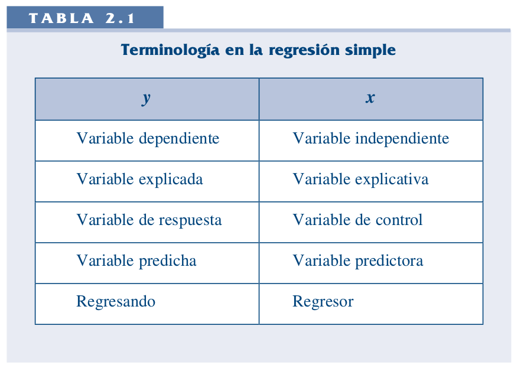
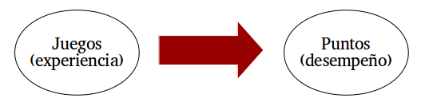
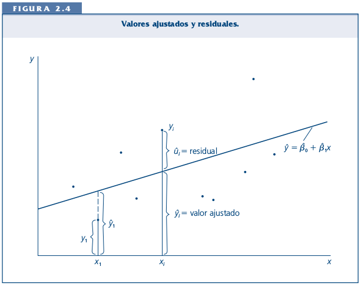
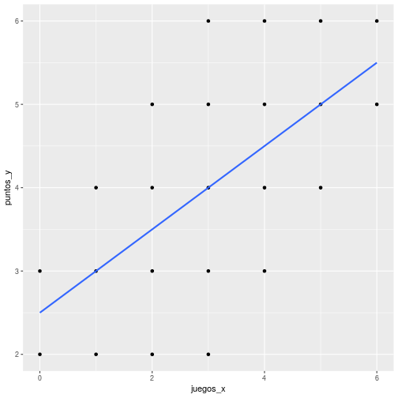

class: front


<!---
Para correr en ATOM
- open terminal, abrir R (simplemente, R y enter)
- rmarkdown::render('static/docpres/07_interacciones/7interacciones.Rmd', 'xaringan::moon_reader')

About macros.js: permite escalar las imágenes como [scale 50%](path to image), hay si que grabar ese archivo js en el directorio.
--->


.pull-left[
# Estadística Multivariada
## Juan Carlos Castillo
## Sociología FACSO - UChile
## 1er Sem 2020
## [multivariada.netlify.com](https://multivariada.netlify.com)
]


.pull-right[
.right[

<br>
## Sesión 3: Regresión simple (1)
]

]
---
class: inverse

## Contenidos

1. Repaso de sesión anterior

2. Varianza, covarianza y correlación

3. Regresión simple 1

---
class: roja, middle, center

# 1. Repaso sesión anterior
---
# Base de Datos

* Forma "rectangular" de almacenamiento de datos:

.center[]

---
# Variables

- Categóricas o discretas (Rango finito de valores):

      - Dicotómicas (1. Universidad Pública, 2. Universidad Privada)
      - Politómicas (1. Chile 2. Argentina 3. Perú ...)

- Continuas:

      - Rango (teóricamente) infinito de valores (ej: Edad).


---
.pull-left-narrow[
# Dispersión:
## Varianza
]

.pull-right-wide[


]

---
# Dispersión


---
class: inverse, middle, center

#La VARIANZA equivale al promedio de la suma de las diferencias del promedio al cuadrado
 
---
class: roja, bottom, right

# 2. Varianza, covarianza y correlación

---
# Varianza & desviación estándar
.pull-left[

.small[

| ID   | Pje (x) | $$x-\bar{x}$$ | $$(x-\bar{x})^{2}$$ |
|------|---------|----------|-----------|
| 1    | 6       | 0.4      | 0.16      |
| 2    | 4       | -1.6     | 2.56      |
| 3    | 7       | 1.4      | 1.96      |
| 4    | 2       | -3.6     | 12.96     |
| 5    | 9       | 3.4      | 11.56     |
| Sum  | 28      | 0        | 29.2      |
| Prom | 5.6     |          |           |

]
]

.pull-right[

\begin{align*}
Varianza =\sigma^{2} &={\sum_{i=1}^{N}(x_{i}-\bar{x})^{2}\over {N - 1}}\\
\sigma^{2} &={(29.2)\over {5 - 1}}\\
\sigma^{2} &= 7.3 \\
Desv.est=\sigma &=\sqrt(7.3) \\
\sigma &= 2,7
\end{align*}
]

---
# Asociación: covarianza / correlación

.pull-left[
_¿Se relaciona la variación de una variable, con la variación de otra variable?_
]
.pull-right[
.center[]
]
---
# Asociación: covarianza / correlación (II)

\begin{align*}
Covarianza = cov(x,y) &= \frac{\sum_{i=1}^{n}(x_i - \bar{x})(y_i - \bar{y})} {n-1}\\
\\
Correlación=r &= \frac{\sum_{i=1}^{n}(x_i - \bar{x})(y_i - \bar{y})} {(n-1)\sigma_x \sigma_y }\\ \\
alternativamente=r &= \frac{\sum(x-\bar{x})(y-\bar{y})}{\sqrt{\sum(x-\bar{x})^{2} \sum(y-\bar{y})^{2}}}
\end{align*}


---

.pull-left-narrow[
.left[
### Ejemplo de correlación 
$r= \frac{\sum(x-\bar{x})(y-\bar{y})}{\sqrt{\sum(x-\bar{x})^{2} \sum(y-\bar{y})^{2}}}$
$$=\frac{-63}{\sqrt{210*68}}$$
$$=-0.5272$$
]
]


.pull-right-wide[
.tiny[
<br>

| id| x  | y  | (A) $$x-\bar{x}$$ | (B) $$y-\bar{y}$$ | A*B | $$(x-\bar{x})^{2}$$ | $$(y-\bar{y})^{2}$$ |
|---:|---:|---:|--------:|--------:|---------:|---------:|---------:|
| 1    | 17 | 24 | -3      | 3       | -9       | 9        | 9        |
| 2    | 19 | 23 | -1      | 2       | -2       | 1        | 4        |
| 3    | 14 | 22 | -6      | 1       | -6       | 36       | 1        |
| 4    | 22 | 17 | 2       | -4      | -8       | 4        | 16       |
| 5    | 15 | 23 | -5      | 2       | -10      | 25       | 4        |
| 6    | 26 | 21 | 6       | 0       | 0        | 36       | 0        |
| 7    | 23 | 18 | 3       | -3      | -9       | 9        | 9        |
| 8    | 21 | 17 | 1       | -4      | -4       | 1        | 16       |
| 9    | 28 | 21 | 8       | 0       | 0        | 64       | 0        |
| 10   | 15 | 24 | -5      | 3       | -15      | 25       | 9        |
| **Sum**  |    |    |         |         | -63      | 210      | 68       |
| Prom | 20 | 21 |         |         |          |          |          |

]
]

---
# Nube de puntos (scatterplot) y correlación

.center[]

---
class: roja, bottom

# 2. Modelo de regresión simple

---
# Objetivos centrales del modelo de regresión:

1. **Conocer**= la variación de la variable dependiente de acuerdo a la variación de otra(s) variable(s) independiente(s)

2. **Predecir**: estimar el valor de una variable (dependiente) de acuerdo al valor de otra(s)

3. **Inferir:** Establecer en que medida esta asociación es estadísticamente significativa


---
# Objetivos centrales del modelo de regresión: Ejemplo

1. Conocer: Ej: En qué medida el puntaje PSU influye en el éxito académico en la universidad?

--

2. Predecir: Ej: Si una persona obtiene 600 puntos en la PSU, que promedio de notas en la universidad es probable que obtenga? (Atención: predicción no implica explicación)

--

3. Inferir: ¿Se puede generalizar a la población? ¿Con qué nivel de confianza?


---
# Terminología variables

.center[]

---
# Ejemplo

### _¿En qué medida la experiencia previa jugando un juego predice el nivel de puntos (en juego posterior)?_


.center[]


---
.left-column[
# Datos
]
.pull-left-narrow[

]

.pull-right[
.small[


```r
ggplotly(ggplot(datos, aes(x=juegos_x, y=puntos_y)) +
  geom_point() +
  expand_limits(x=c(0,6), y=c(0,7)) + coord_fixed() +
  scale_x_continuous(breaks = seq(min(0), max(6), by = 1)) +
  scale_y_continuous(breaks = seq(min(0), max(6), by = 1)) )
```

<!--html_preserve--><div id="htmlwidget-86d4f6157efa14afc98e" style="width:396px;height:396px;" class="plotly html-widget"></div>
<script type="application/json" data-for="htmlwidget-86d4f6157efa14afc98e">{"x":{"data":[{"x":[0,0,1,1,1,2,2,2,2,3,3,3,3,3,4,4,4,4,5,5,5,6,6],"y":[2,3,2,3,4,2,3,4,5,2,3,4,5,6,3,4,5,6,4,5,6,5,6],"text":["juegos_x: 0<br />puntos_y: 2","juegos_x: 0<br />puntos_y: 3","juegos_x: 1<br />puntos_y: 2","juegos_x: 1<br />puntos_y: 3","juegos_x: 1<br />puntos_y: 4","juegos_x: 2<br />puntos_y: 2","juegos_x: 2<br />puntos_y: 3","juegos_x: 2<br />puntos_y: 4","juegos_x: 2<br />puntos_y: 5","juegos_x: 3<br />puntos_y: 2","juegos_x: 3<br />puntos_y: 3","juegos_x: 3<br />puntos_y: 4","juegos_x: 3<br />puntos_y: 5","juegos_x: 3<br />puntos_y: 6","juegos_x: 4<br />puntos_y: 3","juegos_x: 4<br />puntos_y: 4","juegos_x: 4<br />puntos_y: 5","juegos_x: 4<br />puntos_y: 6","juegos_x: 5<br />puntos_y: 4","juegos_x: 5<br />puntos_y: 5","juegos_x: 5<br />puntos_y: 6","juegos_x: 6<br />puntos_y: 5","juegos_x: 6<br />puntos_y: 6"],"type":"scatter","mode":"markers","marker":{"autocolorscale":false,"color":"rgba(0,0,0,1)","opacity":1,"size":5.66929133858268,"symbol":"circle","line":{"width":1.88976377952756,"color":"rgba(0,0,0,1)"}},"hoveron":"points","showlegend":false,"xaxis":"x","yaxis":"y","hoverinfo":"text","frame":null},{"visible":false,"showlegend":false,"xaxis":"x","yaxis":"y","hoverinfo":"text","frame":null}],"layout":{"margin":{"t":23.3059360730594,"r":7.30593607305936,"b":37.2602739726027,"l":31.4155251141553},"plot_bgcolor":"rgba(235,235,235,1)","paper_bgcolor":"rgba(255,255,255,1)","font":{"color":"rgba(0,0,0,1)","family":"","size":14.6118721461187},"xaxis":{"domain":[0,1],"automargin":true,"type":"linear","autorange":false,"range":[-0.3,6.3],"tickmode":"array","ticktext":["0","1","2","3","4","5","6"],"tickvals":[0,1,2,3,4,5,6],"categoryorder":"array","categoryarray":["0","1","2","3","4","5","6"],"nticks":null,"ticks":"outside","tickcolor":"rgba(51,51,51,1)","ticklen":3.65296803652968,"tickwidth":0.66417600664176,"showticklabels":true,"tickfont":{"color":"rgba(77,77,77,1)","family":"","size":11.689497716895},"tickangle":-0,"showline":false,"linecolor":null,"linewidth":0,"showgrid":true,"gridcolor":"rgba(255,255,255,1)","gridwidth":0.66417600664176,"zeroline":false,"anchor":"y","title":{"text":"juegos_x","font":{"color":"rgba(0,0,0,1)","family":"","size":14.6118721461187}},"scaleanchor":"y","scaleratio":1,"hoverformat":".2f"},"yaxis":{"domain":[0,1],"automargin":true,"type":"linear","autorange":false,"range":[-0.35,7.35],"tickmode":"array","ticktext":["0","1","2","3","4","5","6"],"tickvals":[0,1,2,3,4,5,6],"categoryorder":"array","categoryarray":["0","1","2","3","4","5","6"],"nticks":null,"ticks":"outside","tickcolor":"rgba(51,51,51,1)","ticklen":3.65296803652968,"tickwidth":0.66417600664176,"showticklabels":true,"tickfont":{"color":"rgba(77,77,77,1)","family":"","size":11.689497716895},"tickangle":-0,"showline":false,"linecolor":null,"linewidth":0,"showgrid":true,"gridcolor":"rgba(255,255,255,1)","gridwidth":0.66417600664176,"zeroline":false,"anchor":"x","title":{"text":"puntos_y","font":{"color":"rgba(0,0,0,1)","family":"","size":14.6118721461187}},"scaleanchor":"x","scaleratio":1,"hoverformat":".2f"},"shapes":[{"type":"rect","fillcolor":null,"line":{"color":null,"width":0,"linetype":[]},"yref":"paper","xref":"paper","x0":0,"x1":1,"y0":0,"y1":1}],"showlegend":false,"legend":{"bgcolor":"rgba(255,255,255,1)","bordercolor":"transparent","borderwidth":1.88976377952756,"font":{"color":"rgba(0,0,0,1)","family":"","size":11.689497716895}},"hovermode":"closest","barmode":"relative"},"config":{"doubleClick":"reset","showSendToCloud":false},"source":"A","attrs":{"41b72c3ab800":{"x":{},"y":{},"type":"scatter"},"41b74a66ee34":{"x":{},"y":{}}},"cur_data":"41b72c3ab800","visdat":{"41b72c3ab800":["function (y) ","x"],"41b74a66ee34":["function (y) ","x"]},"highlight":{"on":"plotly_click","persistent":false,"dynamic":false,"selectize":false,"opacityDim":0.2,"selected":{"opacity":1},"debounce":0},"shinyEvents":["plotly_hover","plotly_click","plotly_selected","plotly_relayout","plotly_brushed","plotly_brushing","plotly_clickannotation","plotly_doubleclick","plotly_deselect","plotly_afterplot","plotly_sunburstclick"],"base_url":"https://plot.ly"},"evals":[],"jsHooks":[]}</script><!--/html_preserve-->
]
]

---
# Descriptivos


```r
stargazer(datos, type = "html")
```


<table style="text-align:center"><tr><td colspan="8" style="border-bottom: 1px solid black"></td></tr><tr><td style="text-align:left">Statistic</td><td>N</td><td>Mean</td><td>St. Dev.</td><td>Min</td><td>Pctl(25)</td><td>Pctl(75)</td><td>Max</td></tr>
<tr><td colspan="8" style="border-bottom: 1px solid black"></td></tr><tr><td style="text-align:left">id</td><td>23</td><td>12.000</td><td>6.782</td><td>1</td><td>6.5</td><td>17.5</td><td>23</td></tr>
<tr><td style="text-align:left">juegos_x</td><td>23</td><td>3.000</td><td>1.758</td><td>0</td><td>2</td><td>4</td><td>6</td></tr>
<tr><td style="text-align:left">puntos_y</td><td>23</td><td>4.000</td><td>1.382</td><td>2</td><td>3</td><td>5</td><td>6</td></tr>
<tr><td colspan="8" style="border-bottom: 1px solid black"></td></tr></table>


---
.left-column[
# **Medias condicionales**
]
.center[]

???
Ejemplo para los sujetos con 1 en X hay 3 valores de Y: 2, 3 y 4. Por lo tanto, la media condicional de Y dado X=1 es 3

---
.left-column[
# Idea de distribución condicional
]
.center[]

---
.left-column[
# La recta de regresión
]

.right-column[
.center[]

.small[
La (co) variación general de Y respecto a X se puede expresar en una  ecuación de la recta = **modelo de regresión**
]
]
---
class: inverse, right

## Para obtener la “mejor recta” se utiliza la estimación de mínimos cuadrados (EMC, o **OLS** – Ordinary Least Squares)

--

## OLS minimiza la suma de los **residuos** = distancias entre las observaciones y la recta en el eje vertical

---
# Componentes de la ecuación de la recta de regresión

$$\widehat{Y}=b_{0} +b_{1}X$$

Donde

- $\widehat{Y}$ es el valor estimado de $Y$

- $b_{0}$ es el intercepto de la recta (el valor de Y cuando X es 0)

- $b_{1}$ es el coeficiente de regresión, que nos dice cuánto aumenta Y por cada punto que aumenta X

---
# Estimación de los coeficientes de la ecuación:

$$b_{1}=\frac{Cov(XY)}{VarX}$$

$$b_{1}=\frac{\frac{\sum_{i=1}^{n}(x_i - \bar{x})(y_i - \bar{y})} {n-1}}{\frac{\sum_{i=1}^{n}(x_i - \bar{x})(x_i - \bar{x})} {n-1}}$$

Y simplificando

$$b_{1}=\frac{\sum_{i=1}^{n}(x_i - \bar{x})(y_i - \bar{y})} {\sum_{i=1}^{n}(x_i - \bar{x})(x_i - \bar{x})}$$

---
# Estimación de los coeficientes de la ecuación:

Luego despejando el valor de $b_{0}$

$$b_{0}=\bar{Y}-b_{1}\bar{X}$$

---
# Cálculo de coeficientes

La base para todos estos calculos es la diferencia de cada valor menos su promedio. Para ello:

1. Vamos a crear los siguientes vectores (variables) en nuestra base de datos $$difx=x-\bar{x}$$ $$dify=y-\bar{y}$$


---
# Cálculo basado en el ejemplo

2.Con la información anterior podemos obtener la diferencia de productos cruzados
$$difcru=(x-\bar{x})*(y-\bar{y})$$
3.También obtenemos las diferencias del promedio al cuadrado de X= $$difx2=(x-\bar{x})^2$$

---

class: split-40
count: false
 

 
.column[.content[

```r
*datos_b <-datos
 
datos_b
```
]]
.column[.content[

```
##    id juegos_x puntos_y
## 1   1        0        2
## 2   2        0        3
## 3   3        1        2
## 4   4        1        3
## 5   5        1        4
## 6   6        2        2
## 7   7        2        3
## 8   8        2        4
## 9   9        2        5
## 10 10        3        2
## 11 11        3        3
## 12 12        3        4
## 13 13        3        5
## 14 14        3        6
## 15 15        4        3
## 16 16        4        4
## 17 17        4        5
## 18 18        4        6
## 19 19        5        4
## 20 20        5        5
## 21 21        5        6
## 22 22        6        5
## 23 23        6        6
```
]]
---
class: split-40
count: false
 

 
.column[.content[

```r
datos_b <-datos  
*datos$p_x <- mean(datos$juegos_x)
 
datos_b
```
]]
.column[.content[

```
##    id juegos_x puntos_y
## 1   1        0        2
## 2   2        0        3
## 3   3        1        2
## 4   4        1        3
## 5   5        1        4
## 6   6        2        2
## 7   7        2        3
## 8   8        2        4
## 9   9        2        5
## 10 10        3        2
## 11 11        3        3
## 12 12        3        4
## 13 13        3        5
## 14 14        3        6
## 15 15        4        3
## 16 16        4        4
## 17 17        4        5
## 18 18        4        6
## 19 19        5        4
## 20 20        5        5
## 21 21        5        6
## 22 22        6        5
## 23 23        6        6
```
]]
---
class: split-40
count: false
 

 
.column[.content[

```r
datos_b <-datos  
datos$p_x <- mean(datos$juegos_x)  
*datos$difx <-datos$juegos_x-datos$p_x
 
datos_b
```
]]
.column[.content[

```
##    id juegos_x puntos_y p_x
## 1   1        0        2   3
## 2   2        0        3   3
## 3   3        1        2   3
## 4   4        1        3   3
## 5   5        1        4   3
## 6   6        2        2   3
## 7   7        2        3   3
## 8   8        2        4   3
## 9   9        2        5   3
## 10 10        3        2   3
## 11 11        3        3   3
## 12 12        3        4   3
## 13 13        3        5   3
## 14 14        3        6   3
## 15 15        4        3   3
## 16 16        4        4   3
## 17 17        4        5   3
## 18 18        4        6   3
## 19 19        5        4   3
## 20 20        5        5   3
## 21 21        5        6   3
## 22 22        6        5   3
## 23 23        6        6   3
```
]]
---
class: split-40
count: false
 

 
.column[.content[

```r
datos_b <-datos  
datos$p_x <- mean(datos$juegos_x)  
datos$difx <-datos$juegos_x-datos$p_x  
*datos$p_y <- mean(datos$puntos_y)
 
datos_b
```
]]
.column[.content[

```
##    id juegos_x puntos_y p_x difx
## 1   1        0        2   3   -3
## 2   2        0        3   3   -3
## 3   3        1        2   3   -2
## 4   4        1        3   3   -2
## 5   5        1        4   3   -2
## 6   6        2        2   3   -1
## 7   7        2        3   3   -1
## 8   8        2        4   3   -1
## 9   9        2        5   3   -1
## 10 10        3        2   3    0
## 11 11        3        3   3    0
## 12 12        3        4   3    0
## 13 13        3        5   3    0
## 14 14        3        6   3    0
## 15 15        4        3   3    1
## 16 16        4        4   3    1
## 17 17        4        5   3    1
## 18 18        4        6   3    1
## 19 19        5        4   3    2
## 20 20        5        5   3    2
## 21 21        5        6   3    2
## 22 22        6        5   3    3
## 23 23        6        6   3    3
```
]]
---
class: split-40
count: false
 

 
.column[.content[

```r
datos_b <-datos  
datos$p_x <- mean(datos$juegos_x)  
datos$difx <-datos$juegos_x-datos$p_x  
datos$p_y <- mean(datos$puntos_y)  
*datos$dify <-datos$puntos_y-datos$p_y
 
datos_b
```
]]
.column[.content[

```
##    id juegos_x puntos_y p_x difx p_y
## 1   1        0        2   3   -3   4
## 2   2        0        3   3   -3   4
## 3   3        1        2   3   -2   4
## 4   4        1        3   3   -2   4
## 5   5        1        4   3   -2   4
## 6   6        2        2   3   -1   4
## 7   7        2        3   3   -1   4
## 8   8        2        4   3   -1   4
## 9   9        2        5   3   -1   4
## 10 10        3        2   3    0   4
## 11 11        3        3   3    0   4
## 12 12        3        4   3    0   4
## 13 13        3        5   3    0   4
## 14 14        3        6   3    0   4
## 15 15        4        3   3    1   4
## 16 16        4        4   3    1   4
## 17 17        4        5   3    1   4
## 18 18        4        6   3    1   4
## 19 19        5        4   3    2   4
## 20 20        5        5   3    2   4
## 21 21        5        6   3    2   4
## 22 22        6        5   3    3   4
## 23 23        6        6   3    3   4
```
]]
---
class: split-40
count: false
 

 
.column[.content[

```r
datos_b <-datos  
datos$p_x <- mean(datos$juegos_x)  
datos$difx <-datos$juegos_x-datos$p_x  
datos$p_y <- mean(datos$puntos_y)  
datos$dify <-datos$puntos_y-datos$p_y  
*datos$dif_cru <-datos$difx*datos$dify
 
datos_b
```
]]
.column[.content[

```
##    id juegos_x puntos_y p_x difx p_y dify
## 1   1        0        2   3   -3   4   -2
## 2   2        0        3   3   -3   4   -1
## 3   3        1        2   3   -2   4   -2
## 4   4        1        3   3   -2   4   -1
## 5   5        1        4   3   -2   4    0
## 6   6        2        2   3   -1   4   -2
## 7   7        2        3   3   -1   4   -1
## 8   8        2        4   3   -1   4    0
## 9   9        2        5   3   -1   4    1
## 10 10        3        2   3    0   4   -2
## 11 11        3        3   3    0   4   -1
## 12 12        3        4   3    0   4    0
## 13 13        3        5   3    0   4    1
## 14 14        3        6   3    0   4    2
## 15 15        4        3   3    1   4   -1
## 16 16        4        4   3    1   4    0
## 17 17        4        5   3    1   4    1
## 18 18        4        6   3    1   4    2
## 19 19        5        4   3    2   4    0
## 20 20        5        5   3    2   4    1
## 21 21        5        6   3    2   4    2
## 22 22        6        5   3    3   4    1
## 23 23        6        6   3    3   4    2
```
]]
---
class: split-40
count: false
 

 
.column[.content[

```r
datos_b <-datos  
datos$p_x <- mean(datos$juegos_x)  
datos$difx <-datos$juegos_x-datos$p_x  
datos$p_y <- mean(datos$puntos_y)  
datos$dify <-datos$puntos_y-datos$p_y  
datos$dif_cru <-datos$difx*datos$dify  
*datos$difx2 <-datos$difx^2
 
datos_b
```
]]
.column[.content[

```
##    id juegos_x puntos_y p_x difx p_y dify dif_cru
## 1   1        0        2   3   -3   4   -2       6
## 2   2        0        3   3   -3   4   -1       3
## 3   3        1        2   3   -2   4   -2       4
## 4   4        1        3   3   -2   4   -1       2
## 5   5        1        4   3   -2   4    0       0
## 6   6        2        2   3   -1   4   -2       2
## 7   7        2        3   3   -1   4   -1       1
## 8   8        2        4   3   -1   4    0       0
## 9   9        2        5   3   -1   4    1      -1
## 10 10        3        2   3    0   4   -2       0
## 11 11        3        3   3    0   4   -1       0
## 12 12        3        4   3    0   4    0       0
## 13 13        3        5   3    0   4    1       0
## 14 14        3        6   3    0   4    2       0
## 15 15        4        3   3    1   4   -1      -1
## 16 16        4        4   3    1   4    0       0
## 17 17        4        5   3    1   4    1       1
## 18 18        4        6   3    1   4    2       2
## 19 19        5        4   3    2   4    0       0
## 20 20        5        5   3    2   4    1       2
## 21 21        5        6   3    2   4    2       4
## 22 22        6        5   3    3   4    1       3
## 23 23        6        6   3    3   4    2       6
```
]]


---
# Cálculo basado en el ejemplo


Y con esto podemos obtener la suma de productos cruzados y la suma de cuadrados de X


```r
sum(datos$dif_cru)
```

```
## [1] 34
```

```r
sum(datos$difx2)
```

```
## [1] 68
```

---
# Reemplazando en la fórmula

$$b_{1}=\frac{\sum_{i=1}^{n}(x_i - \bar{x})(y_i - \bar{y})} {\sum_{i=1}^{n}(x_i - \bar{x})(x_i - \bar{x})}=\frac{34}{68}=0.5$$

---
# Cálculo basado en el ejemplo

Reemplazando podemos obtener el valor de $b_{0}$

$$b_{0}=\bar{Y}-b_{1}\bar{X}$$
$$b_{0}=4-(3 * 0.5)=2.5$$

Completando la ecuación:

$$\widehat{Y}=2.5+0.5X$$

---
# Cálculo basado en el ejemplo


$$\widehat{Y}=2.5+0.5X$$


Esto nos permite estimar el valor de $Y$ (o su media condicional) basado en el puntaje $X$.
Por ejemplo, cuál es el valor estimado de $Y$ dado $X=3$?


$$\widehat{Y}=2.5+(0.5*3)$$


$$\widehat{Y}=2.5+(3*0.5)=4$$

El valor estimado de puntos para una persona que ha jugado 3 veces es 4. 

---

.left-column[
## Cálculo basado en el ejemplo
]
.small[
.center[

```r
ggplot(datos, aes(x=juegos_x, y=puntos_y)) + geom_point() +
  geom_smooth(method=lm, se=FALSE) 
```

<!-- -->
]
]
---
class: inverse, middle, center

# Regresión simple en R

---
# Estimación del modelo de regresión simple en `R`

La función para estimar regresión en `R` es `lm` (linear model):
.small[
```
objeto=lm(dependiente ~ independiente, data=datos)
```]

Donde

- *objeto*: el nombre (cualquiera) que le damos al objeto donde se guardan los resultados de la estimación
- *dependiente / independiente*: los nombres de las variables en los datos
- *datos* = el nombre del objeto de nuestros datos en R

---
# Estimación del modelo de regresión simple en `R`

En nuestro ejemplo:


```r
reg1 <-lm(puntos_y ~ juegos_x, data = datos)
```

`reg1` es el objeto que almacena la información de nuestra estimación. Para un reporte simple:


```r
reg1
```

---


```r
reg1
```

```
## 
## Call:
## lm(formula = puntos_y ~ juegos_x, data = datos)
## 
## Coefficients:
## (Intercept)     juegos_x  
##         2.5          0.5
```


---
.left-column[
## Y en formato publicable
]

.center[
.tiny[

```r
stargazer(reg1, type = "html")
```


<table style="text-align:center"><tr><td colspan="2" style="border-bottom: 1px solid black"></td></tr><tr><td style="text-align:left"></td><td><em>Dependent variable:</em></td></tr>
<tr><td></td><td colspan="1" style="border-bottom: 1px solid black"></td></tr>
<tr><td style="text-align:left"></td><td>puntos_y</td></tr>
<tr><td colspan="2" style="border-bottom: 1px solid black"></td></tr><tr><td style="text-align:left">juegos_x</td><td>0.500<sup>***</sup></td></tr>
<tr><td style="text-align:left"></td><td>(0.132)</td></tr>
<tr><td style="text-align:left"></td><td></td></tr>
<tr><td style="text-align:left">Constant</td><td>2.500<sup>***</sup></td></tr>
<tr><td style="text-align:left"></td><td>(0.458)</td></tr>
<tr><td style="text-align:left"></td><td></td></tr>
<tr><td colspan="2" style="border-bottom: 1px solid black"></td></tr><tr><td style="text-align:left">Observations</td><td>23</td></tr>
<tr><td style="text-align:left">R<sup>2</sup></td><td>0.405</td></tr>
<tr><td style="text-align:left">Adjusted R<sup>2</sup></td><td>0.376</td></tr>
<tr><td style="text-align:left">Residual Std. Error</td><td>1.091 (df = 21)</td></tr>
<tr><td style="text-align:left">F Statistic</td><td>14.280<sup>***</sup> (df = 1; 21)</td></tr>
<tr><td colspan="2" style="border-bottom: 1px solid black"></td></tr><tr><td style="text-align:left"><em>Note:</em></td><td style="text-align:right"><sup>*</sup>p<0.1; <sup>**</sup>p<0.05; <sup>***</sup>p<0.01</td></tr>
</table>
]
]
---
class: roja, right
# Próxima semana:

## - Ajuste

## - Residuos

## - Lectura: [Moore: 2. Análisis de relaciones](../../docs/lecturas/moore_analisisderelaciones1.pdf) 


---
class: front

.pull-left[
# Estadística Multivariada
## Juan Carlos Castillo
## Sociología FACSO - UChile
## 1er Sem 2020
## [multivariada.netlify.com](https://multivariada.netlify.com)
]


.pull-right[
.right[
<br>

]

]
