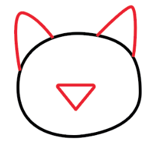
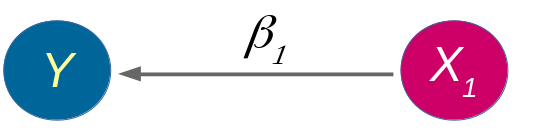
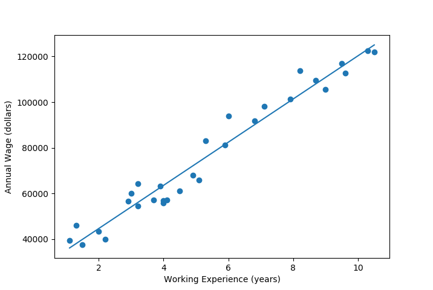
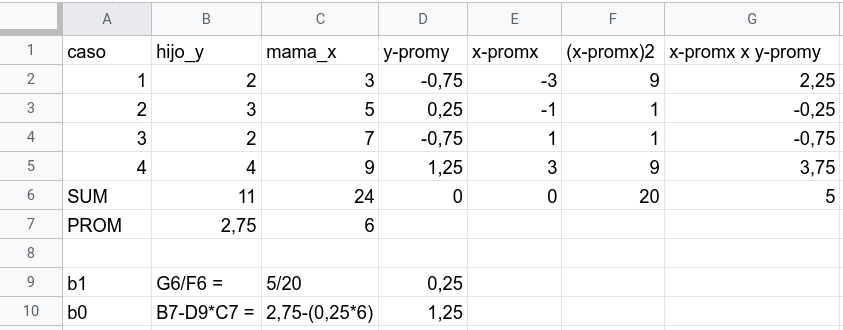
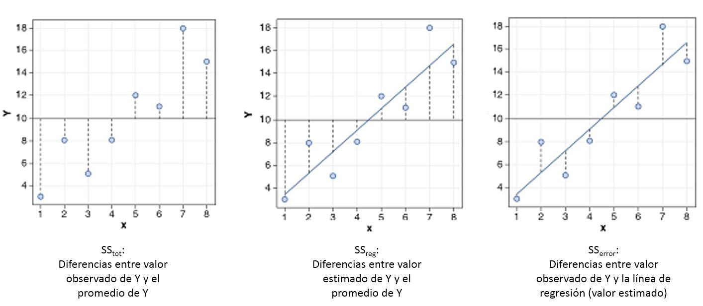

class: front

```{r eval=FALSE, include=FALSE}
# Correr esto para que funcione el infinite moonreader, el root folder debe ser static para si dirigir solo "bajndo" en directorios hacia el bib y otros

xaringan::inf_mr('/static/docpres/02_bases/2mlmbases.Rmd')

o en RStudio:
  - abrir desde carpeta root del proyecto
  - Addins-> infinite moon reader 
```


```{r setup, include=FALSE, cache = FALSE}
require("knitr")
options(htmltools.dir.version = FALSE)
pacman::p_load(RefManageR)
# bib <- ReadBib("../../bib/electivomultinivel.bib", check = FALSE)
opts_chunk$set(warning=FALSE,
             message=FALSE,
             echo=TRUE,
             cache = FALSE,fig.width=7, fig.height=5.2)
library(flipbookr)
library(tidyverse)
```


```{r xaringanExtra, include=FALSE}
xaringanExtra::use_xaringan_extra(c("tile_view", "animate_css"))
# xaringanExtra::use_share_again()
xaringanExtra::use_scribble()
```


```{r style-share-again, echo=FALSE}
xaringanExtra::style_share_again(
  share_buttons = c("none")
)
```


<!---
Para correr en ATOM 
- open terminal, abrir R (simplemente, R y enter)
- rmarkdown::render('static/docpres/07_interacciones/7interacciones.Rmd', 'xaringan::moon_reader')

About macros.js: permite escalar las imágenes como [scale 50%](path to image), hay si que grabar ese archivo js en el directorio.
--->


.pull-left[
# Estadística Multivariada
## Juan Carlos Castillo
## Sociología FACSO - UChile
## 1er Sem 2022
## [multivariada.netlify.com](https://multivariada.netlify.com)
]


.pull-right[
.right[

<br>
<br>
## Sesión 4: Regresión simple 2
] 
]

]
---

layout: true
class: animated, fadeIn

---
class: inverse


##.red[Contenidos]

### .red[1.] Siguiendo con regresión simple

### .red[2.]  Ajuste y residuos

### .red[3.] Notas sobre regresión y correlación


---
class: roja, bottom, right

# 1. Regresión simple


---
class: inverse, center

# .yellow[¿Qué buscamos?]
--
.content-box-red[
## .red[Contrastar empíricamente teorías sociológicas
]
]
.medium[(con datos cuantitativos)]


---
# Hechos sociales son multideterminados

.pull-left[
.center[

]]

.pull-right[
- Limitaciones de herramientas bivariadas (tablas de contingencia, coeficiente de correlación)

- Necesidad de contar con herramientas más eficientes que incluyan múltiples determinantes

- -> .red[MODELO DE REGRESIÓN]

]
???

- por qué "modelo"
- por qué "regresión"
- partir por un determinante y luego se expande a múltiples determinantes

---
# ¿MODELO?= representación simplificada


.pull-left[

]

.pull-right[
.center[
<br>

]]
---
# ¿Regresión?


.pull-left[

- el **modelo de regresión** busca representar matemáticamente la relación entre una variable dependiente (Y) y una o más independientes (X)
]

.pull-right[

]

---
# ¿Regresión?


.pull-left[

- el **modelo de regresión** busca representar matemáticamente la relación entre una variable dependiente (Y) y una o más independientes (X)

- esta relación se expresa en un parámetro $\beta$  o "beta de regresión"
]

.pull-right[

]

---
# Regresión simple

- esta primera parte del curso veremos modelos con solo 1 variable independiente (X) o .red[regresión simple]
.center[
]

$$\widehat{Y}=\beta_{0} +\beta_{1}X_{1}$$
- con este modelo podemos saber el valor de $Y$ si conocemos el valor de $X$ usando el valor de los parámetros $\beta_{0}$ y $\beta_{1}$

---
# Componentes de la ecuación de la recta de regresión

.pull-left-narrow[

$$\widehat{Y}=\beta_{0} +\beta_{1}X_{1}$$


]

.pull-right-wide[


Donde

- $\widehat{Y}$ es el valor estimado de $Y$

- $\beta_{0}$ es el intercepto de la recta (el valor de Y cuando X es 0)

- $\beta_{1}$ es el coeficiente de regresión, que nos dice .red[cuánto aumenta Y por cada punto que aumenta X]
]
---
# Estimación de los coeficientes de la ecuación:

$$b_{1}=\frac{Cov(XY)}{VarX}$$

$$b_{1}=\frac{\frac{\sum_{i=1}^{n}(x_i - \bar{x})(y_i - \bar{y})} {n-1}}{\frac{\sum_{i=1}^{n}(x_i - \bar{x})(x_i - \bar{x})} {n-1}}$$

Y simplificando

$$b_{1}=\frac{\sum_{i=1}^{n}(x_i - \bar{x})(y_i - \bar{y})} {\sum_{i=1}^{n}(x_i - \bar{x})(x_i - \bar{x})}$$

---
# Estimación de los coeficientes de la ecuación: 

Luego despejando el valor de $b_{0}$

$$b_{0}=\bar{Y}-b_{1}\bar{X}$$
---

.pull-left-narrow[
**Ejemplo**: 
¿Cuántos pasos da un hijo (Y) por cada paso que da su mamá (x)?


]

.pull-right-wide[

.small[
```{r echo=FALSE}
pasos_mama_x=c(3,5,7,9)
pasos_hijo_y=c(2,3,2,4)
datos1 <-as.data.frame(cbind(pasos_mama_x,pasos_hijo_y))
options(scipen=3)
```

```{r echo=FALSE, results='markup'}
print(datos1)
```

]

```{r echo=FALSE}
names(datos1)
ggplot(datos1, aes(pasos_mama_x, pasos_hijo_y)) + geom_point()+   ylim(0, 5) +
  scale_x_continuous(limits = c(0,10),
                     breaks = seq(0,10,1))
```


]

---
class: middle center

$$b_{1}=\frac{\sum_{i=1}^{n}(x_i - \bar{x})(y_i - \bar{y})} {\sum_{i=1}^{n}(x_i - \bar{x})(x_i - \bar{x})};b_{0}=\bar{Y}-b_{1}\bar{X}$$



---

$$\widehat{Y}=\beta_{0} +\beta_{1}X_{1}$$
Reemplazando:

$$\widehat{Y}=1.25 +0.25X$$
Entonces:

- por cada paso que da la mamá (X), un hij_ (Y) avanza en promedio 0.25 pasos

- si una mamá da (por ej) .blue[4] pasos, entonces la cantidad de pasos estimada para su hijo sería 1.25+0.25*.blue[4]=.red[2.25]

---

.pull-left[

$$\widehat{Y}=1.25 +0.25X$$

```{r echo=FALSE}
ggplot(datos1, aes(pasos_mama_x, pasos_hijo_y)) + 
  geom_point() +
  ylim(0, 5) +
  scale_x_continuous(limits = c(0,10),
                     breaks = seq(0,10,1)) +
  stat_smooth(method = "lm", se = FALSE, fullrange = T)
```
]

.pull-right[
<br>
- la ecuación del modelo de regresión se puede expresar en una .red[recta de regresión]

- esta recta representa la predicción de los valores de $Y$ a partir de $X$
]


---
# Estimación del modelo de regresión simple en `R`

La función para estimar regresión en `R` es `lm` (linear model):

`objeto <- lm(dependiente ~ independiente, data=datos)`

--

Donde
.medium[
- **objeto**: el nombre (cualquiera) que le damos al objeto donde se guardan los resultados de la estimación
- **dependiente / independiente**: los nombres de las variables en los datos
- **datos** = el nombre del objeto de nuestros datos en R
]

---

```{r}
lm(pasos_hijo_y ~ pasos_mama_x, data = datos1)
```


---
class: inverse, middle, center
# INTERPRETACIÓN

#por cada unidad que aumenta .red[X], .yellow[Y] aumenta en .orange[*Beta*]


---
.pull-left[
# Ejemplo

<br>
Si tenemos

- Y = ingreso al egresar de la universidad  

- X = puntaje PSU

<br>
$$Ingreso=200.000+400(puntajePSU)$$
<br>
<br>

]

--

.pull-right[
**1 - ¿Cuál es el valor estimado de Ingreso para un puntaje PSU de 500?**
{{content}}
]

--

- 400.000
{{content}}

--

**2 - ¿Cuál es el valor estimado de Ingreso para un puntaje (hipotético) de PSU=0?**
{{content}}

--

- 200.000
{{content}}

---
class: inverse

## Hasta ahora deberíamos saber:

--

1- Modelo de regresión como una **representación simplificada** de la relación compleja entre variables

--

2- El $\beta$ de regresión nos dice **cuanto aumenta $Y$ ** (variable dependiente) *en promedio* por ** cada punto que aumenta** $X$ (variable independiente).

--

3- El modelo nos permite **estimar** el puntaje de $Y$ para cada valor de $X$

---
class: roja, bottom, right

# 2. Ajuste y residuos

---
.pull-left-wide[

]


.pull-right-narrow[
<br>
# El cuarteto de Anscombe (1973)
.small[
Podemos tener un mismo modelo de regresión para relaciones distintas entre datos
]
]

---
# ¿Qué tan bueno es nuestro modelo?

- El cálculo del $\beta$ busca minimizar los residuos (de ahí "mínimos cuadrados ordinarios")

- Una vez minimizados los residuos, se puede evaluar el ajuste
  - qué tan bien representa nuestro modelo la realidad
  
  - cuánto error (de predicción) estamos cometiendo con nuestro modelo


---

.medium[
```{r, echo=FALSE}
library(tweetrmd)
tweet_embed("https://twitter.com/jorge_pacheco/status/1327398681239314434")
```
]


---
class: inverse, right

## Un modelo es mejor mientras **mejor refleje** lo que sucede con los datos

--

## En otras palabras, cuando se parece o **ajusta** mejor a los datos

--

## ... y en otras: cuando los **residuos** son menores
---
# Observado, estimado & residuo

.pull-left-wide[

]

.pull-right-narrow[


- observado: $Y$  

- estimado: $\widehat{Y}$

- residuo: $Y-\widehat{Y}$
]

---
# Varianza explicada de Y

¿Qué parte de la varianza de ingreso (Y) se asocia a educación? 

.center[]

---
# Varianza explicada de Y: $R^2$

- ¿Cuánto de los ingresos puedo predecir con educación (regresión) y cuánto me estoy equivocando (residuos)?

--

- el $R^2$
  - es la proporción de la varianza de Y que se asocia a X
  - varía entre 0 y 1, y se puede expresar en porcentaje

--

- Entonces, podemos descomponer la varianza de Y en 2: aquella asociada a X (regresión) y la que no se asocia a X (residuos) 


---
# ¿Cómo se calcula el $R^2$? 

- para saber qué porcentaje de $Y$ se asocia a $X$ vamos a considerar los siguientes valores de $Y$: 


$Y$ = Valor observado de Y

$\widehat{Y}$ = estimación de Y a partir de X

$\bar{Y}$ = promedio de Y

---
# Descomponiendo Y

Conceptualmente:

$$SS_{tot}=SS_{reg} + SS_{error}$$
.center[

]


---
.pull-left-wide[
]

.pull-right-narrow[
.right[
## Descomponiendo Y
]]

.pull-left-wide[
$$Y=\bar{Y}+(\widehat{Y}-\bar{Y}) + (Y-\widehat{Y})$$

$$ \Sigma(y_i - \bar{y})^2=\Sigma (\hat{y}_i-\bar{y})^2 +\Sigma(y_i-\hat{y}_i)^2$$
]

---
# Varianza explicada

Por lo tanto:

$$SS_{tot}=SS_{reg} + SS_{error}$$

--

$$\frac{SS_{tot}}{SS_{tot}}=\frac{SS_{reg}}{SS_{tot}} + \frac{SS_{error}}{SS_{tot}}$$

--

$$1=\frac{SS_{reg}}{SS_{tot}}+\frac{SS_{error}}{SS_{tot}}$$

$$\frac{SS_{reg}}{SS_{tot}}= 1- \frac{SS_{error}}{SS_{tot}}=R^2$$

<br>

### .center[¿Qué quiere decir esto?]


---
# Directamente en R

.pull-left[

.medium[
```{r}
reg1 <-lm(pasos_hijo_y ~ 
              pasos_mama_x, 
              data = datos1)
```
]
]


.pull-right[
.medium[
```{r, echo=FALSE}
sjPlot::tab_model(reg1,
        show.se=FALSE,
        show.ci=FALSE,
        digits=3,
        dv.labels = c("Modelo 1"),
        string.pred = "Predictores",
        string.est = "β")
```
]

Un 45.5% de la varianza de Y se relaciona con X
]
---
class:roja, right, bottom


# 3. Correlación y regresión

---
## Equivalencias en regresión y correlación

```{r}
cor(datos1$pasos_mama_x,datos1$pasos_hijo_y)
```

Correlación entre juegos y puntos **al cuadrado**

```{r}
(cor(datos1$pasos_mama_x,datos1$pasos_hijo_y))^2
```

  - Es decir: correlación de Pearson al cuadrado ( $r^2$ ) es $R^2$
---
## Diferencias en regresión y correlación

.pull-left-narrow[

- La correlación entre X e Y es la misma que entre Y e X

]

.pull-right-wide[

.small[
```{r}
cor(datos1$pasos_mama_x,datos1$pasos_hijo_y)
cor(datos1$pasos_hijo_y,datos1$pasos_mama_x)
```
]
]


---
## Diferencias en regresión y correlación

.pull-left-narrow[

- La regresión entre X e Y **no** es la misma que entre Y y X
]

.pull-right-wide[

.small[
```{r}
lm(datos1$pasos_hijo_y ~ datos1$pasos_mama_x)$coefficients
lm(datos1$pasos_mama_x ~ datos1$pasos_hijo_y)$coefficients
```
]
]

---
class: inverse

##RESUMEN

### - .red[Ajuste] del modelo de regresión (R2): porcentaje de la varianza de la variable dependiente (Y) que se asocia a la independiente (X) 

### - .red[Correlación y regresión]: primos cercanos, principalmente en regresión simple.


---
class: roja, right
# Próximas semanas:

## Práctica 3: Regresión simple
## Práctica 4: Ajuste y residuos
## Preparar Evaluación 1
 
Lectura: [Moore: Residuos (144-154)](https://multivariada.netlify.app/docs/lecturas/moore_residuos.pdf)


---
class: front

.pull-left-narrow[
# Estadística Multivariada

## multivariada.netlify.com

## Sociología FACSO 
## UChile
## 1er Sem 2022

]

 
.pull-right-wide[
.right[


]
]
