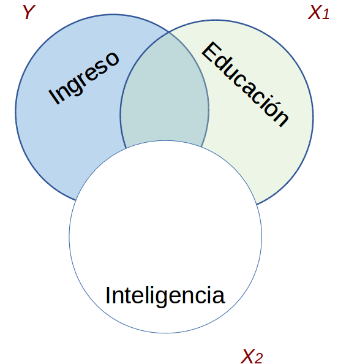

class: front

```{r eval=FALSE, include=FALSE}
# Correr esto para que funcione el infinite moonreader, el root folder debe ser static para si dirigir solo "bajndo" en directorios hacia el bib y otros

xaringan::inf_mr('/static/docpres/02_bases/2mlmbases.Rmd')

o en RStudio:
  - abrir desde carpeta root del proyecto
  - Addins-> infinite moon reader
```


```{r setup, include=FALSE, cache = FALSE}
require("knitr")
options(htmltools.dir.version = FALSE)
pacman::p_load(RefManageR)
# bib <- ReadBib("../../bib/electivomultinivel.bib", check = FALSE)
opts_chunk$set(warning=FALSE,
             message=FALSE,
             echo=FALSE,
             cache = TRUE, fig.width=7, fig.height=5.2)
library(flipbookr)
library(tidyverse)
```

```{r xaringanExtra, include=FALSE}
xaringanExtra::use_xaringan_extra(c("tile_view", "animate_css"))
xaringanExtra::use_share_again()
xaringanExtra::use_scribble()
```


```{r style-share-again, echo=FALSE}
xaringanExtra::style_share_again(
  share_buttons = c("none")
)
```


<!---
Para correr en ATOM
- open terminal, abrir R (simplemente, R y enter)
- rmarkdown::render('static/docpres/07_interacciones/7interacciones.Rmd', 'xaringan::moon_reader')

About macros.js: permite escalar las imágenes como [scale 50%](path to image), hay si que grabar ese archivo js en el directorio.
--->


.pull-left[
# Estadística Multivariada
## Juan Carlos Castillo
## Sociología FACSO - UChile
## 1er Sem 2022
## [.yellow[multivariada.netlify.com]](https://multivariada.netlify.com)
]


.pull-right[
.right[
<br>
## Sesión 6: .yellow[Regresión múltiple (2) & predictores categóricos]


]

]
---

layout: true
class: animated, fadeIn


---
class: inverse, bottom, animated, slideInRight

.pull-left-narrow[
## .red[Contenidos]
]

.pull-right-wide[
### 1. Repaso de sesión anterior
### 2. Bases de control y parcialización
### 3. Demostración parcialización
### 4. Predictores categóricos ]

---
class: roja, middle, right

# 1. Repaso sesión anterior

---

.pull-left-narrow[

## Base: Modelo de regresión (simple)

<br>
$$\widehat{Y}=b_{0} +b_{1}X$$ 

.center[
]
]

.pull-right-wide[

- Se estima mediante el método de mínimos cuadrados ordinarios (OLS)

- Permite estimar el valor de una variable ( $\widehat{Y}$ ) a partir del valor conocido de otra variable ( $X$ )

- La estimación se expresa en el coeficiente de regresión $b_{1}$, también llamado "beta" o pendiente

- Este coeficiente se interpreta de la siguiente manera: Por cada unidad que aumenta X, Y aumenta en $b_{1}$ unidades
]

---
# Regresión múltiple

.pull-left[
<br>
### - Más de un predictor (x)
### - Modelo sumativo
]

.pull-right[

.center[

]
]

$$\widehat{Y}=\beta_{0} +\beta_{1}X_{1} + \beta_{2}X_{2}+ \beta_{3}X_{3}+...+\beta_{k}X_{k}$$

---
# Regresión múltiple y predictores correlacionados 

.center[

]


---
.pull-left-wide[
## Control estadístico
- ¿Qué efecto posee el nivel educacional en ingreso, _controlando por_ inteligencia?
]
.pull-right-narrow[

]

**Conceptualmente:**
.small[
- aislar el efecto de educación en ingreso, manteniendo la inteligencia _constante_.

- estimar el efecto de educación en ingreso independiente del efecto de la inteligencia

- estimación del efecto de educación en ingreso _ceteris paribus_ (manteniendo el efecto del resto de los predictores constante)
]


---
class: inverse

### RESUMEN

- Los coeficientes de regresión (X) no alteran su valor en los modelos en ausencia de correlación entre ellos

--

- Si hay correlación entre predictores, el valor de los coeficientes de regresión será distinto en modelos simples y en modelos múltiples

--

- Por ello, en regresión múltiple se habla de coeficientes de regresión **parciales**

---
class: roja, middle, center


# 2. Bases de control y parcialización
---

# Ejemplo (mínimo): Datos

.medium[
```{r echo=FALSE, results='hide'}
pacman::p_load(dplyr,
               corrplot,
               ggplot2,
               scatterplot3d,
               texreg,
              stargazer
)
datos=read.csv("ingedexp.csv", sep=",")
```
 
```{r}
datos
```
]

---
# Ejemplo: Descriptivos

<br>
.medium[
```{r message=FALSE, results='asis'}
stargazer(datos %>% select(-ID), type = "html", digits=0)
```
]
---
# Ejemplo: correlaciones

.pull-left[.medium[
```{r}
cormat=datos %>% select(ingr,educ,intelig) %>% cor()
round(cormat, digits=2)
```
]
]
--

.pull-right[
```{r}
corrplot.mixed(cormat, number.cex=2, tl.cex=1.5)
```
]

---
.pull-left[
**Ingreso <- educación ( $X_1$ )**

```{r echo=FALSE}
ggplot(datos, aes(x=educ, y=ingr)) + geom_point() +
  geom_smooth(method=lm, se=FALSE)
```
]

.pull-right[
**Ingreso <- intelig ( $X_2$ )**

```{r echo=FALSE}
ggplot(datos, aes(x=intelig, y=ingr)) + geom_point() +
  geom_smooth(method=lm, se=FALSE)
```
]

---
# Ejemplo: scatter X1 X2

.pull-left[
```{r echo=FALSE}
ggplot(datos, aes(x=intelig, y=educ)) + geom_point() +
  geom_smooth(method=lm, se=FALSE)
```
]

.pull-right[
.medium[
- presencia de correlación entre predictores

- idea de control estadístico: ¿Cuál es la influencia de educación en ingreso, independiente de la inteligencia?

- **controlando por** inteligencia

]]

---
# Regresión

.small[
```{r}
reg_y_x1=lm(ingr ~ educ, data=datos)
reg_y_x2=lm(ingr ~ intelig, data=datos)
reg_y_x1_x2=lm(ingr ~ educ + intelig , data=datos)
```
]
.small[
```{r echo=FALSE, results='asis'}
htmlreg(list(reg_y_x1,reg_y_x2,reg_y_x1_x2), booktabs = TRUE, dcolumn = TRUE, doctype = FALSE, caption=" ")
```
]

---
class: inverse 
## RESUMEN

- Regresión múltiple: más de un predictor

- No es equivalente a realizar regresiones múltiples por separado con cada predictor y luego simplemente "sumarlas"

- Predictores correlacionados: requiere consideración, ya que de otra manera se estaría sobreestimando el efecto de $X$ en $Y$

---
class: inverse 

## RESUMEN (2)


- Además de ser una corrección estadística, el control se relaciona con preguntas sustantivas basadas en teoría

- El output de regresión múltiple realiza automáticamente el control estadístico vía parcialización de coeficientes.

- ¿Cuál es el cálculo detrás de la parcialización / control estadístico? 

 ... a continuación.


---
class: roja, center, middle

# 3. Demostración parcialización

---
# Antecedentes

- la **parcialización** que permite el control estadístico es un calculo de mediana complejidad

- su complejidad aumenta a medida que aumenta el número de predictores

- por ello, los softwares lo realizan de manera automática, no es necesario realizarlo por cuenta propia

- **PERO**  ... vale la pena demostrarlo, para entender de qué se trata


---
# Parcialización 1

_¿Cómo se despeja la regresión de $Y$ en $X_1$ del efecto de $X_2$?_

.pull-left[
.center[]
]

--

.pull-right[
.center[]
]

---
class: center middle

# Implica despejar $X_1$ de su correlación con $X_2$, o **parcializar** $X_1$ de $X_2$

---
.pull-left[
# Parcialización 3

.medium[
¿Como obtenemos una variable $X_1$ parcializada de $X_2$?
]

.center[
]
]
--

.pull-right[

<br>
<br>

.medium[
- Pensemos en que $X_1$ parcializada (de $X_2$ ) es todo lo de $X_1$ (varianza) que no tiene que ver con $X_2$

- En otras palabras, en un modelo donde $X_1$ es la variable dependiente y $X_2$ la independiente, $X_1$ parcializada equivale al **residuo** de esta regresión
]
]
---
# Parcialización 4

Por lo tanto, para **demostrar** el concepto de parcialización en el ejemplo, los pasos son:

1. Regresión entre predictores

2. Obtención del residuo de la regresión

3. Regresión de $Y$ en el residuo (=la variable parcializada)

---
# Parcialización 5

.pull-left[
**1.Regresión entre predictores **

```{r echo=TRUE}
reg_x1_x2=lm(educ ~ intelig, data=datos)
coef(reg_x1_x2)
```
]

.pull-right[
.medium[
Por lo tanto, tenemos que nuestro modelo de regresión entre predictores, con educación como dependiente es:

$$\widehat{educacion}=2.66+0.541_{inteligencia}$$]]

---
class: center, middle

$$\widehat{educacion}=2.66+0.541_{inteligencia}$$

```{r echo=FALSE}
ggplot(datos, aes(x=intelig, y=educ)) + geom_point() +
  geom_smooth(method=lm, se=FALSE)
```

---
# Parcialización 6

**2.Obtención de residuo (valor estimado - observado)**

.small[
```{r}
x1_fit_x2=fitted.values(reg_x1_x2)
resx1_2=residuals(reg_x1_x2)
datos=cbind(datos, x1_fit_x2,resx1_2); datos
```
]
---

Ejemplo caso 1: inteligencia=1

Estimando valor predicho según nuestro modelo:

$$\widehat{educacion}=2.66+0.541*1=3.196$$

- **3.196** es el valor predicho de educación para una persona de inteligencia = 1

- sabemos que el valor observado de educación para el caso 1 es igual a **2**

- por lo tanto, el residuo para este caso (valor observado - valor estimado $=2-3.196=-1.196$


---
### Parcialización 7: Regresión de Y en variable $X_1$ parcializada = $X_{1.2}$

```{r}
regy_resx1_2=lm(datos$ingr ~ resx1_2)
```
.small[
```{r echo=FALSE, results='asis'}
htmlreg(list(reg_y_x1,reg_y_x2,reg_y_x1_x2,regy_resx1_2), booktabs = TRUE, dcolumn = TRUE, doctype = FALSE, caption=" ")
```
]


---
# Parcialización 8

Ahora, lo mismo pero parcializando inteligencia ( $X_2$ ) de educación ( $X_1$ )


**1.Regresión de $X_2$ (inteligencia) en $X_1$ (educación)**

```{r}
reg_x2_x1=lm(intelig ~ educ, data=datos)
```

**2. Obtención del residuo de la regresión (inteligencia parcializada de educación)** 

```{r}
resx2_1=residuals(reg_x2_x1)
```

**3. Regresión de $Y$ (ingreso) en la variable parcializada $X_{2.1}$**

```{r}
regy_resx2_1=lm(datos$ingr ~ resx2_1)
regfin=lm(datos$ingr ~ resx1_2 + resx2_1 )
```

---
### Comparación final modelos

.small[
```{r echo=FALSE, results='asis'}
htmlreg(list(reg_y_x1,reg_y_x2,reg_y_x1_x2,regy_resx1_2,regy_resx2_1), booktabs = TRUE, dcolumn = TRUE, doctype = FALSE, caption=" ")
```
]


---
# Comparando pendientes

.pull-left[
**Ingreso <- educ $X_1$**

```{r echo=FALSE}
ggplot(datos, aes(x=educ, y=ingr)) + geom_point() +
  geom_smooth(method=lm, se=FALSE)
```
]

.pull-right[
**Ingreso <- educ.parcial $X_{1.2}$**

```{r echo=FALSE}
ggplot(datos, aes(x=resx2_1, y=ingr)) + geom_point() +
  geom_smooth(method=lm, se=FALSE)
```
]

---
## Matriz de correlaciones con variables parcializadas

```{r results='hide'}
datcor= cbind(datos, resx2_1)
datcor <- datcor %>% select(-x1_fit_x2,-ID)
cormat2= cor(datcor)
round(cormat2, digits=2)
```

.center[
```{r}
corrplot.mixed(cormat2, number.cex=2, tl.cex=1.5)
```
]

---
# Fórmulas directas de regresores parciales:

$$b_1=\biggl(\frac{s_y}{s_1}\biggr)\biggl(\frac{r_{y1}-r_{y2}r_{12}}{1-r^2_{12}}\biggr)$$

$$b_2=\biggl(\frac{s_y}{s_2}\biggr)\biggl(\frac{r_{y2}-r_{y1}r_{12}}{1-r^2_{12}}\biggr)$$

---
class: roja

## RESUMEN

- El control estadístico es central en regresión múltiple

--

- Pregunta: ¿Es la relación entre _X_ e _Y_ _realmente_ debida a _X_, o hay otras variables que podrían dar cuenta de esta relación?

--

- El control se implementa agregando predictores en el modelo que por razones teóricas se presume pueden afectar la relación del regresor principal en _Y_

---
class: roja

## RESUMEN (2)

- En términos técnicos, el control estadístico opera mediante *parcialización*: los predictores se parcializan mutuamente, generando coeficientes de regresión parciales.

--

- El regresor parcial entonces es un regresor ajustado por la presencia de otro(s) regresore(s)

--

- Por lo tanto, ahora los betas de regresión se pueden sumar apropiadamente, sin distorsionar la predicción


---
class: roja, middle, right, slideInRight

# 4. Predictores Categóricos


---

.pull-left[
## Variables categóricas
- Hasta el momento sólo hemos considerado variables como **continuas/intervalares**.

- A menudo, las variables explicativas son de naturaleza **categórica**.
]

--
.pull-right[
###Variables binarias / dicotómicas
- Hombre, Mujer
- Vivo, Muerto
- Votó, No Votó.


###Variables politómicas:
- Básica, Medía, Técnica, Universitaria
- Frente Amplio, Nueva Mayoría, Chile Vamos, No interesado.
]

---

.pull-left[
## Predictores categóricos


- Ej, Y=ingreso, X= sexo


$$X=1(Mujer)$$
$$X=0(Hombre)$$

- Las variables 1/0 usualmente son llamadas variables **dummy**
]


--
<br>
<br>

.pull-right[

Para las mujeres: $Y=\alpha +\beta X= \alpha+\beta$

Para los hombres: $Y=\alpha +\beta X= \alpha$

### El coeficiente $\beta$ es la **diferencia** esperada de $Y$ (ingreso) entre hombres y mujeres.


]

---

## Variables categóricas: Ejemplo (ELSOC)

### Variable dependiente
.medium[
*En nuestra sociedad, hay grupos que tienden a ubicarse en los niveles más altos y grupos que tienden a ubicarse en los niveles más bajos de la sociedad.  ¿Dónde se ubicaría usted en la sociedad chilena?*

  -Likert de 0 a 10 donde 0 "El nivel más bajo" y 10 "El nivel más alto"

### Variables independientes

- Ingreso
- Edad
- Sexo (Hombre=0; Mujer=1)
]

---

.pull-left-narrow[

# Sexo / estatus subjetivo
]

.pull-right-wide[
.small[
```{r}
pacman::p_load(dplyr, #Manipulacion de datos
              stargazer, #Tablas
              sjmisc, # Tablas
              summarytools, # Tablas
              kableExtra, #Tablas
              sjPlot, #Tablas y gráficos
              corrplot, # Correlaciones
              sjlabelled,
              sessioninfo) # Información de la sesión de trabajo

load(url("https://multivariada.netlify.app/assignment/data/proc/ELSOC_ess.RData")) # Cargar base de datos

sjt.xtab(elsoc_18$ess, elsoc_18$sexo)
```
]
]

---
# Promedio de estatus subjetivo según sexo

```{r echo=TRUE}

elsoc_18 %>%
  group_by(as_label(sexo)) %>%
  summarise(mean_ess=mean(ess,na.rm = T))

```


---
## Ejemplo estimación
.small[
.pull-left[
```{r, echo=TRUE}
reg1<- lm(ess ~ sexo, data=elsoc_18)
```

```{r, echo = F, include = T}
sjPlot::tab_model(list(reg1), show.ci=FALSE, p.style = "stars",string.pred = "Predictores", string.est = "β",digits = 3,
                  dv.labels = c("Modelo 1"))
```
]
]

--

.pull-right[
Las mujeres (sexo=1) obtienen en promedio 0.133 puntos más   **en relación** a los hombres (sexo=0) en la variable de estatus social subjetivo.
]


---
# Predicción


Para el caso de los **hombres** tenemos:

$$\widehat{Y}_\text{estatus} = 4.339 + 0.133 \times 0 = 4.339$$
<br>
En cambio, para las **mujeres** tenemos:

$$\widehat{Y}_\text{estatus} = 4.339 + 0.133 \times 1 = 4.472$$


---
# Más de dos categorías (politómicas)

- ¿Qué sucede cuando quiero predecir el estatus social subjetivo en base una variable catégorica con **más de dos valores**? (ej. Educación, Clase Social, Posición política).

- La solución estándar es convertir esta variable en un conjunto de variables binarias 1/0 o variables **dummy**.

- El conjunto de éstas variables dummy representan a la variable categórica completa.

---

## Especificando el conjunto de variables dummy Educación.

<br>

.medium[


|                 | $X_{básica}$ | $X_{media}$ | $X_{tecnica}$ | $X_{universitaria}$ |
|------------------|---------|------------|-----------------|
| Básica           |1 |  0       | 0          | 0               |
| Media            |0 |1       | 0          | 0               |
| Técnica Superior |0| 0       | 1          | 0               |
| Universitaria    | 0|0       | 0          | 1               |

]

--

$$Y_{ingreso} = \beta_{0}+\beta_{1}X_{media}+\beta_{2}X_{tecnica}+\beta_{3}X_{universitaria}$$


---

## Politómicas como predictores

- Se ingresan **todas las categorías menos una** al modelo

--

- La categoría ausente en el modelo es la **categoría de referencia** para la intepretación

--

- El *coeficiente* de la variable dummy corresponde a su **diferencia** respecto de la categoría de referencia (en relación a la variable dependiente $Y$) 

--

- La decisión de qué categoría es la referencia obedece a la mejor **interpretación**, pero por defecto es la categoría con el valor más bajo

---
# Variable educación en ELSOC

.small[
```{r}
frq(elsoc_18$edcine)
```
]

---
.pull-left[
# Ejemplo

<br>
.small[
```{r echo=F, warning=FALSE, message=FALSE,results='asis'}
reg2<-lm(ess ~ sexo + edcine, data=elsoc_18)
sjPlot::tab_model(list(reg1, reg2), show.ci=FALSE, p.style = "stars",string.pred = "Predictores", string.est = "β",digits = 3, dv.labels = c("Modelo 1", "Modelo 2"))
```
]
]


.pull-right[
- **¿Qué sucedió?** el predictor educación se tomó como continuo, y nos dice que hay un aumento de **0.331 puntos** en la escala de estatus social subjetivo por cada aumento de nivel educacional.

- Para poder trabajar correctamente los predictores categóricos en la regresión, en R la manera más simple es definirlos como un **factor**.
]

---
# Factores en R

- en R la información de las variables (vectores) se puede almacenar de distintas maneras

--

- las variables **numéricas** son aquellas que permiten realizar operaciones como promedios, sumas, etc.

--

- las variables se pueden también definir como categóricas (nominales/ordinales), bajo la denominación de **factor**

---
# Factores y regresión en R

- si una variable está definida como **factor** en un modelo de regresión, entonces R automáticamente ingresa al modelo **todos los niveles de la variable menos uno**

- el nivel que no aparece en el modelo sirve como **categoría de referencia**

- para transformar a factor se utiliza la función general `as.factor`, pero se recomienda mejor **`as_factor`** de la librería **`sjlabelled`** que conserva mejor las etiquetas


---
# Factores y regresión en R

  - crear variable educación como factor (**`edcine_fac`**)y luego ingresarla al modelo de regresión:


```{r, echo=TRUE, eval=FALSE}
library(sjlabelled)

elsoc_18$edcine_fac <- as_factor(elsoc_18$edcine)

reg3<-lm(ess ~ sexo + edcine_fac, data=elsoc_18)

```

---

.small[
```{r, echo=FALSE}
library(sjlabelled)
elsoc_18$edcine_fac <- as_factor(elsoc_18$edcine)
reg3<-lm(ess ~ sexo + edcine_fac, data=elsoc_18)
sjPlot::tab_model(list(reg1, reg2, reg3), show.ci=FALSE, p.style = "stars",string.pred = "Predictores", string.est = "β",digits = 3, dv.labels = c("Modelo 1", "Modelo 2", "Modelo 3"))
```
]

---
# Interpretación

- $\beta$ de nivel educacional secundaria alta: 0.472 

  - las personas con nivel secundario alto tienen en promedio un nivel de estatus subjetivo 0.472 puntos mayor que aquellos con educación primaria incompleta (categoría de referencia)


---
class: inverse

## Resumen predictores categóricos

- Predictores categóricos se especifican como variables dicotoḿicas o dummy (valores 1/0, presencia/ausencia del atributo)

--

- La variable que no ingresa al modelo es la **categoría de referencia**

--

- El *coeficiente* de la variable dummy corresponde a su **diferencia** respecto de la categoría de referencia (en relación a la variable dependiente $Y$) 


---
class: inverse, middle, center

## PROXIMA CLASE:

# INFERENCIA EN REGRESIÓN


---
class: front

.pull-left[
# Estadística Multivariada
## Juan Carlos Castillo
## Sociología FACSO - UChile
## 1er Sem 2022
## [multivariada.netlify.com](https://multivariada.netlify.com)
]


.pull-right[
.right[
<br>

]

]


