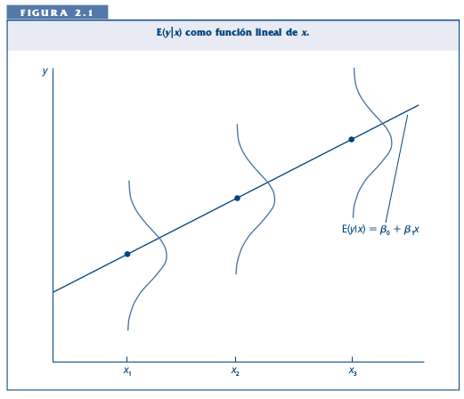

para clase 5, Inferencia

# Repaso global de inferencia estadística

REVISAR CLASES DE JCC

---

#Supuestos para la inferencia estadística

+ El estudio es representativo (muestra aleatoria simple en una encuesta).

+ La media de y está relacionada a x por una relación lineal

+ la desviación estándar \sigma es identica para cada valor de x.

+ la distribución de y por cada nivel de x es normal,

---

#Supuestos de la Inferencia estadística.

.center[]

---
# Inferencia Estadística

A partir de lo anterior podemos evaluar las siguientes pruebas de hipótesis

$$H_{0}: \beta=0$$
usualmente en contraste con la hipotesis alternativa:

$$H_{a}: \beta \neq 0$$
Donde:

$H_{0}$ : No hay asociación lineal entre $X$ e $Y$ en la población.

$H_{a}$ : Hay una asociación lineal entre $X$ e $Y$ en la población.

---

# Prueba de hipotesis para $\beta \neq 0$

Utilizamos la prueba T, la cual se expresa como

$$t=\frac{b}{se} $$

donde **se** es el error estándar de la pendiente **b**. Tomamos la estimacion de *b* del parametro $\beta$. Bajos los supuestos establecidos, el estadístico t tiene una distribución muestal con grados de libertad igual a $n-2$.

La formula del error estandard de *b* es

$$se=\frac{s}{\sqrt{\sum{x-\hat{x}}}} $$

donde **s** expresa la desviación estándar de los residuos o formalmente:

$$s= \sqrt{\frac{SS_{error}}{n-2}}= \sqrt{\frac{\sum(y-\hat{y})^2}{n-2}} $$

---

# Inferencia Estadística

Entre más pequeña es la desviación estándar de la distribución condicional y o **s**, más precison **b** estimará a $\beta$.

Valores reducidos de **s** ocurren cuando en los datos existe poca variabilidad en la predicción de la ecuación.

El valor p para $H_{a}: \beta \neq 0$ tiene una probabilidad de dos colas provenientes de una distribución t.
