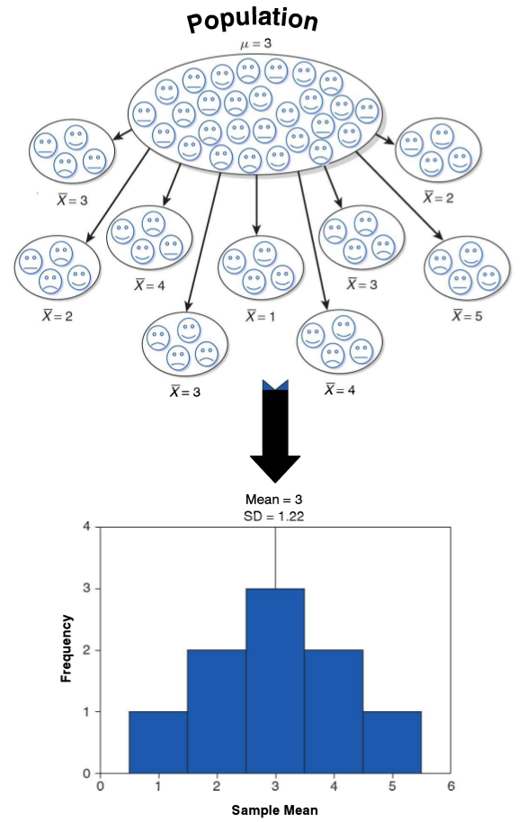
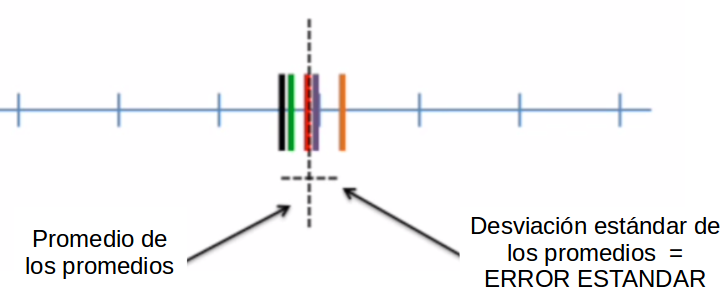

class: front

```{r eval=FALSE, include=FALSE}
# Correr esto para que funcione el infinite moonreader, el root folder debe ser static para si dirigir solo "bajndo" en directorios hacia el bib y otros

xaringan::inf_mr('/static/docpres/02_bases/2mlmbases.Rmd')

o en RStudio:
  - abrir desde carpeta root del proyecto
  - Addins-> infinite moon reader
```


```{r setup, include=FALSE, cache = FALSE}
require("knitr")
options(htmltools.dir.version = FALSE)
pacman::p_load(RefManageR)
# bib <- ReadBib("../../bib/electivomultinivel.bib", check = FALSE)
opts_chunk$set(warning=FALSE,
             message=FALSE,
             echo=FALSE,
             cache = TRUE, fig.width=7, fig.height=5.2)
library(flipbookr)
library(tidyverse)
```

<!---
Para correr en ATOM
- open terminal, abrir R (simplemente, R y enter)
- rmarkdown::render('static/docpres/07_interacciones/7interacciones.Rmd', 'xaringan::moon_reader')

About macros.js: permite escalar las imágenes como [scale 50%](path to image), hay si que grabar ese archivo js en el directorio.
--->


.pull-left[
# Estadística Multivariada
## Juan Carlos Castillo
## Sociología FACSO - UChile
## 1er Sem 2020
## [multivariada.netlify.com](https://multivariada.netlify.com)
]


.pull-right[
.right[

<br>
<br>
## Sesión 7: Predictores categóricos e inferencia (1)
]

]
---

layout: true
class: animated, fadeIn


---
class: inverse, bottom, right, animated, slideInRight


# Contenidos

## 1. Repaso de sesión anterior

## 2. Predictores Categóricos

## 3. Inferencia Estadística (1)

---
class: roja bottom right slideInRight

# 1. Repaso sesión anterior


---
# Regresión múltiple: más de 1 predictor


.pull-left[
.center[]
.small[
$$\widehat{Ingreso}=b_0+b_1(Educ)$$
]
]

--

.pull-right[
.center[]
.small[
$$\widehat{Ingreso}=b_0+b_1(Educ)+b_2(Int)$$
]]


---
# Control estadístico

- Característico de análisis de datos secundarios (ej: encuestas)

- Se incluyen en el modelo variables que teóricamente podrían dar cuenta o afectar la relación entre X e Y.

- Esto despeja o "controla" la asociación de $X_1$ e $Y$, aislando el efecto conjunto de $X_1$ y $X_2$ (... y $X_n$)


---
# Regresión simple vs múltiple

```{r echo=FALSE, results='hide'}
pacman::p_load(dplyr,
               corrplot,
               ggplot2,
               scatterplot3d,
               texreg,
              stargazer
)
datos=read.csv("ingedexp.csv", sep=",")
```

.small[
```{r}
reg_y_x1=lm(ingr ~ educ, data=datos)
reg_y_x2=lm(ingr ~ intelig, data=datos)
reg_y_x1_x2=lm(ingr ~ educ + intelig , data=datos)
```
]
.small[
```{r echo=FALSE, results='asis'}
htmlreg(list(reg_y_x1,reg_y_x2,reg_y_x1_x2), booktabs = TRUE, dcolumn = TRUE, doctype = FALSE, caption=" ")
```
]


---
# Parcialización

_¿Cómo se despeja la regresión de $Y$ en $X_1$ del efecto de $X_2$?_

.pull-left[
.center[]
]

--

.pull-right[
.center[]
]

---
.pull-left[
# Parcialización

.medium[
¿Como obtenemos una variable $X_1$ parcializada de $X_2$?
]

.center[
]
]
--

.pull-right[

<br>
<br>

.medium[
- Pensemos en que $X_1$ parcializada (de $X_2$ ) es todo lo de $X_1$ (varianza) que no tiene que ver con $X_2$

- En otras palabras, en un modelo donde $X_1$ es la variable dependiente y $X_2$ la independiente, $X_1$ parcializada equivale al **residuo** de esta regresión
]
]

---
class: inverse

## RESUMEN

- Si hay correlación entre predictores, el valor de los coeficientes de regresión será **distinto** en modelos simples y en modelos múltiples

- Esta diferencia se relaciona con el concepto de  **parcialización**: se extrae la varianza común entre predictores

- La parcialización permite el **control estadístico**: *limpiar* o despejar los efectos de la influencia de otras variables 


---
class: roja, bottom, right, slideInRight

# 2. Predictores Categóricos


---

.pull-left[
## Variables categóricas
- Hasta el momento sólo hemos considerado variables como **continuas/intervalares**.

- A menudo, las variables explicativas son de naturaleza **categórica**.
]

--
.pull-right[
###Variables binarias / dicotómicas
- Hombre, Mujer
- Vivo, Muerto
- Votó, No Votó.


###Variables politómicas:
- Básica, Medía, Técnica, Universitaria
- Frente Amplio, Nueva Mayoría, Chile Vamos, No interesado.
]

---

.pull-left[
## Predictores categóricos


- Ej, Y=ingreso, X= sexo


$$X=1(Mujer)$$
$$X=0(Hombre)$$

- Las variables 1/0 usualmente son llamadas variables **dummy**
]


--
<br>
<br>

.pull-right[

Para las mujeres: $Y=\alpha +\beta X= \alpha+\beta$

Para los hombres: $Y=\alpha +\beta X= \alpha$

### El coeficiente $\beta$ es la **diferencia** esperada de $Y$ (ingreso) entre hombres y mujeres.


]

---

## Variables categóricas: Ejemplo (ELSOC)

### Variable dependiente
.medium[
*En nuestra sociedad, hay grupos que tienden a ubicarse en los niveles más altos y grupos que tienden a ubicarse en los niveles más bajos de la sociedad.  ¿Dónde se ubicaría usted en la sociedad chilena?*

  -Likert de 0 a 10 donde 0 "El nivel más bajo" y 10 "El nivel más alto"

### Variables independientes

- Ingreso
- Edad
- Sexo (Hombre=0; Mujer=1)
]
---
## Ejemplo estimación
<br>
.small[
.pull-left[

```{r echo=F, warning=FALSE, message=FALSE,results='asis' }
library(haven)
library(sjmisc)
library(car)
library(texreg)

elsoc <- read_dta("ELSOC_W01_v2.00_Stata13.dta")
elsoc[elsoc==-999 | elsoc==-888] <- NA

elsoc$sexo<- as.factor(car::recode(elsoc$m0_sexo, "1='Hombre'; 2='Mujer'"))
elsoc$ed<- as.factor(elsoc$m01)
elsoc$edu<- car::recode(elsoc$ed, "10 ='Universitaria';1:3='Básica'; 4:5='Media'; 6:7='Tecnica Superior'; 8:9 ='Universitaria'")
elsoc$edu<- as.factor(elsoc$edu)

#
modelo1<- lm(d01_01 ~ m0_edad+m29+sexo, data=elsoc)
modelo2<- lm(d01_01 ~ m0_edad+m29+sexo+edu, data=elsoc)


htmlreg(modelo1, custom.model.names = "Estatus Social Subjetivo", # Cambiar nombre del título
       custom.coef.names = c("Intercepto", "Edad", "Ingreso", "Mujer"),   #Cambiar nombre de las variables
       custom.note = "Elaboración propia en base a Elsoc", #Agregar una nota
       single.row = T, #para que la DS este en una linea
       booktabs = TRUE, dcolumn = TRUE, doctype = FALSE)
#

```
]
]

--

.pull-right[
Las mujeres (sexo=1) obtienen 0.13 puntos promedio menos **en relación** a los hombres (sexo=0) en la variable de estatus social subjetivo, manteniendo las otras variables constantes.
]


---
# Más de dos categorías (politómicas)

- ¿Qué sucede cuando quiero predecir el estatus social subjetivo en base una variable catégorica con **más de dos valores**? (ej. Educación, Clase Social, Posición política).

- La solución estándar es convertir esta variable en un conjunto de variables binarias 1/0 o variables **dummy**.

- El conjunto de éstas variables dummy representan a la variable categórica completa.

---

## Especificando el conjunto de variables dummy.

<br>
<br>

.medium[


|                 | $X_{básica}$ | $X_{media}$ | $X_{tecnica}$ | $X_{universitaria}$ |
|------------------|---------|------------|-----------------|
| Básica           |1 |  0       | 0          | 0               |
| Media            |0 |1       | 0          | 0               |
| Técnica Superior |0| 0       | 1          | 0               |
| Universitaria    | 0|0       | 0          | 1               |

]

--

$$Y_{ingreso} = \beta_{0}+\beta_{1}X_{media}+\beta_{2}X_{tecnica}+\beta_{3}X_{universitaria}$$


---

## Politómicas como predictores

- Se ingresan **todas las categorías menos una** al modelo

--

- La categoría ausente en el modelo es la **categoría de referencia** para la intepretación

--

- El *coeficiente* de la variable dummy corresponde a su **diferencia** respecto de la categoría de referencia (en relación a la variable dependiente $Y$) 

--

- La decisión de qué categoría es la referencia obedece a la mejor **interpretación**


---

.pull-left[
# Ejemplo
]


.pull-right[
### Modelo de regresión lineal:

.small[
```{r echo=F, warning=FALSE, message=FALSE,results='asis'}
htmlreg(list(modelo1, modelo2), #custom.model.names = "Estatus Social Subjetivo", # Cambiar nombre del título
       #custom.coef.names = c("Intercepto", "Edad", "Ingreso", "Mujer"),   #Cambiar nombre de las variables
       custom.note = "Elaboración propia en base a Elsoc", #Agregar una nota
       single.row = T, #para que la DS este en una linea
       booktabs = TRUE, dcolumn = TRUE, doctype = FALSE)
#
```
]
]

---
class: inverse

## Resumen predictores categóricos

- Predictores categóricos se especifican como variables dicotoḿicas o dummy (valores 1/0, presencia/ausencia del atributo)

--

- La variable que no ingresa al modelo es la **categoría de referencia**

--

- El *coeficiente* de la variable dummy corresponde a su **diferencia** respecto de la categoría de referencia (en relación a la variable dependiente $Y$) 


---
class: roja, bottom, right, slideInRight


# 3. Inferencia Estadística (1)

---


---
# Diferencias y diferencias **significativas**

- en el ejemplo anterior estimamos que la diferencia en status subjetivo entre hombres y mujeres era 0.13, inferior para las mujeres.

- es esta diferencia *relevante*?
  - es algo que podemos extrapolar de nuestra muestra a la población?
  
  - ... o es algo que se deba simplemente al azar?


---
.pull-left[
.medium[
## Conceptos claves de inferencia
- La **inferencia** en estadística se refiere a la relación que existe entre los resultados obtenidos basados en nuestra muestra y la población


- **¿En qué medida podemos hacer inferencias desde nuestra muestra a la población?**

- Un concepto central es el la probabilidad de **ERROR**
]]


.pull-right[
.center[

]
]

---
# Parámetros y estadísticos

<br>

|                     	| Población (parámetro)  	| Muestra (estadístico)  	|
|---------------------	|------------------------	|------------------------	|
| Promedio            	|       $\mu$           	|   $\bar{x}$           	|
| Varianza            	|        $\sigma²$      	|  $s²$                  	|
| Desviación estándar 	|        $\sigma$        	| $s$                    	|


---
# Inferencia y regresión

- en regresión la inferencia se relaciona con la significación estadística de los coeficientes beta ( $\beta$ )

- ¿Es significativo un coeficiente de -.13?

- La significación en este caso si el coeficiente es **estadísticamente** distinto de 0

- La estadística hace referencia a la noción de **probabilidad**; por lo tanto se trata de establecer qué tan probable es que nuestro coeficiente sea distinto de 0.

---
# Bases de inferencia:

- dispersión: varianza y desviación estandar

- curva normal

- error estándar

---
.pull-left-narrow[
# Dispersión:
## Varianza
]

.pull-right-wide[


]


---
# Medidas de Dispersión

.pull-left[

## Varianza
<br>

<br>
 
<br>

## Desviación estándar
]

.pull-right[

$$s^2=\frac{\Sigma(x-\bar{x})²}{N-1}$$

<br>

$$s=\sqrt \frac{\Sigma(x-\bar{x})²}{N-1}$$]
---
## Desviación estándar y curva normal

.center[]

---
# Desviación estándar y error estándar

.pull-left[


]


- más que el promedio de la variable en nuestra **muestra**, en inferencia nos interesa estimar en qué medida ese promedio da cuenta del promedio de la **población**

- contamos con **una muestra**, pero sabemos que otras muestras podrían haber sido extraídas, probablemente con distintos resultados.

---
# Error estándar


---
# Error estándar


---
# Error estándar


---

# Error estándar

- ¿Cómo calculamos el error estándar a partir de **una** muestra?

- Basados en el **teorema del límite central**, en muestras mayores a 30 la desviación estándar de los promedios (error estándar) equivale a:

$$\sigma_{\bar{X}}=SE(error estándar)=\frac{s}{\sqrt{N}}$$


---
# Error, rangos y probabilidad


.pull-left[
.medium[

- Nuestro promedio muestral $\bar{x}$ posee una distribución normal con una desviación estandar = SE (error estándar)

- Esto nos permite calcular una probabilidad de error basados en los valores de la curva normal

]
]
.pull-right[
.center[]]

---
# Error, rangos y probabilidad


.pull-left[
.medium[

- Por ejemplo, $\bar{x}$ +/- 2 SE abarca aproximadamente el 95% de los valores probables

- De otra manera, puedo dar un rango de valores donde se encuentra el promedio(+- 2 SE), con un nivel de confianza de 95%

- ... o con una probabilidad de error p<0.05

]
]
.pull-right[
.center[]]

---
# Inferencia y significación estadística

- ¿Con qué nivel de **probabilidad** estamos dispuest_s a aceptar que las diferencias son distintas de 0?

- Por convención, una probabilidad de error (o valor *p*) de menos de 0.05 (1 de 20 veces)

- Esto significa una probabilidad de acierto/nivel de confianza de 95% (2 SE)

---
## Volviendo a regresión

- el error estándar del promedio nos sirve como referencia cálculo de significación estadística de los coeficientes de regresión

- en regresión, las variables independientes poseen distintos niveles/valores, y queremos saber si las diferencias en Y de los valores de X son significativas = **estadísticamente distintas de 0**.

- ej: diferencias de ingreso (Y) entre hombres y mujeres (X)

---

.center[]


---
# Inferencia y prueba de hipótesis

- La hipótesis nula (o $H_0$ ) se refiere a que las diferencias son = 0

- Por eso, queremos rechazar $H_0$ y para eso tenemos que establecer un nivel de probabilidad aceptable (al menos p<0.05)

- En términos gráficos, si los intervalos de +/- 2 SE de los grupos no se tocan, entonces se puede rechazar $H_0$ con un p<0.05  

---
## Prueba de hipótesis en regresión

Contrastamos la *hipótesis nula* (no hay asociación entre el predictor y la variable dependiente):

$$H_{0}: \beta_{j} = 0$$

En relación a la siguiente hipótesis alternativa:

$$H_{a}: \beta_{j} \neq 0$$

---
# Prueba de hipótesis en regresión

- Se basa en el cálculo de un **intervalo de confianza** para $\beta$, de (app) +/- 2 SE 

- Si este intervalo no pasa por 0, entonces se rechaza $H_0$

- Por lo tanto, la inferencia se basa en saber si el $\beta$ es mayor que su error (el doble).

---
# Prueba de hipótesis en regresión


- Ej, para $\beta$=10, error=6; 

  - intervalo: 10+/-12=[22 / -2], pasa por 0 al 95% de confianza

  - alternativamente: 10/6 < 2 

- La división de $\beta$ por el error estándar es la **prueba t:**

.center[]

---
class: inverse, middle, center


# Más de inferencia y prueba t: próxima semana

---
class: inverse, middle

# RESUMEN

- Predictores categóricos, dummies y referencias

- Inferencia estadística: de la muestra a la población

- Error estándar

- En regresión: $\beta_j/SE=t$ , donde _t_ se asocia a un nivel de probabilidad que luego permite decidir sobre el rechazo a la hipótesis nula


---
class: front

.pull-left[
# Estadística Multivariada
## Juan Carlos Castillo
## Sociología FACSO - UChile
## 1er Sem 2020
## [multivariada.netlify.com](https://multivariada.netlify.com)
]


.pull-right[
.right[
<br>

]

]
