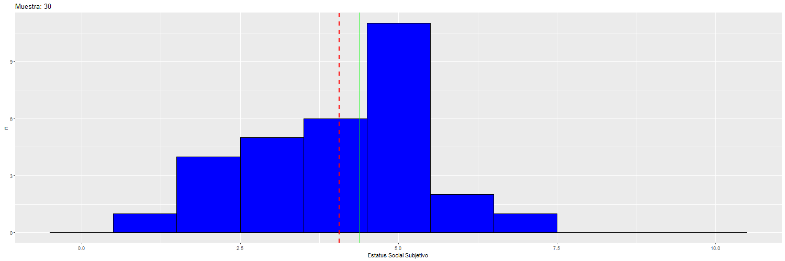
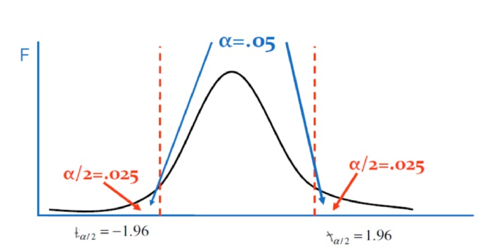

class: front


<!---
Para correr en ATOM
- open terminal, abrir R (simplemente, R y enter)
- rmarkdown::render('static/docpres/07_interacciones/7interacciones.Rmd', 'xaringan::moon_reader')

About macros.js: permite escalar las imágenes como [scale 50%](path to image), hay si que grabar ese archivo js en el directorio.
--->


.pull-left[
# Estadística Multivariada
## Juan Carlos Castillo
## Sociología FACSO - UChile
## 1er Sem 2020
## [multivariada.netlify.com](https://multivariada.netlify.com)
]


.pull-right[
.right[

<br>
<br>
## Sesión 8: Inferencia (2)
]

]
---

layout: true
class: animated, fadeIn


---
class: inverse, bottom, right, animated, slideInRight


# Contenidos

## 1. Repaso de sesión anterior 

## 2. Inferencia Estadística (2)


---
class: roja bottom right slideInRight

# 1. Repaso sesión anterior


---
.pull-left[
## Predictores categóricos


- Ej, Y=ingreso, X= sexo


$$X=1(Mujer)$$
$$X=0(Hombre)$$

- Las variables 1/0 usualmente son llamadas variables **dummy**
]


--
<br>
<br>

.pull-right[

Para las mujeres: $Y=\alpha +\beta X= \alpha+\beta$

Para los hombres: $Y=\alpha +\beta X= \alpha$

### El coeficiente $\beta$ es la **diferencia** esperada de $Y$ (ingreso) entre hombres y mujeres.


]

---
## Especificando el conjunto de variables dummy.

<br>
<br>

.medium[


|                 | $X_{básica}$ | $X_{media}$ | $X_{tecnica}$ | $X_{universitaria}$ |
|------------------|---------|------------|-----------------|
| Básica           |1 |  0       | 0          | 0               |
| Media            |0 |1       | 0          | 0               |
| Técnica Superior |0| 0       | 1          | 0               |
| Universitaria    | 0|0       | 0          | 1               |

]

--

$$Y_{ingreso} = \beta_{0}+\beta_{1}X_{media}+\beta_{2}X_{tecnica}+\beta_{3}X_{universitaria}$$


---
.pull-left[
.medium[
## Conceptos claves de inferencia
- La **inferencia** en estadística se refiere a la relación que existe entre los resultados obtenidos basados en nuestra muestra y la población


- **¿En qué medida podemos hacer inferencias desde nuestra muestra a la población?**

- Un concepto central es el la probabilidad de **ERROR**
]]


.pull-right[
.center[

]
]


---
# Desviación estándar y error estándar

.pull-left[


]


- más que el promedio de la variable en nuestra **muestra**, en inferencia nos interesa estimar en qué medida ese promedio da cuenta del promedio de la **población**

- contamos con **una muestra**, pero sabemos que otras muestras podrían haber sido extraídas, probablemente con distintos resultados.


---


.small[

* Las desviaciones estándar ( $s$ ) del promedio muestral ( $\bar{x}$ ) nos permiten hablar de **Error**, dado que asumimos la existencia de un parámetro poblacional ( $\mu$ ).

* Si tenemos muestras distintas, tenemos distinos valores de $\bar{x}$, y por tanto, distintos valores de $s$.
]

---
class: inverse middle center

# El **error estándar** (del promedio) es la desviación estándar de los promedios de distintas muestras

---

# Error estándar

- Pero ... ¿cómo calculamos el error estándar a partir de **una** sola muestra?

- Basados en el **teorema del límite central**, en muestras mayores a 30 la desviación estándar de los promedios (error estándar) equivale a:

$$\sigma_{\bar{X}}=SE(error estándar)=\frac{s}{\sqrt{N}}$$


---
# Error, rangos y probabilidad


.pull-left[
.medium[

- Nuestro promedio muestral $\bar{x}$ posee una distribución normal con una desviación estandar = SE (error estándar)

- Esto nos permite calcular una probabilidad de error basados en los valores de la curva normal

- +/- 1SE: intervalo de confianza que abarca al 68%

- +/- 2SE: 95% de confianza  


]
]
.pull-right[
.center[]]


---
## Volviendo a regresión

- el error estándar del promedio nos sirve como referencia cálculo de significación estadística de los coeficientes de regresión

- en regresión, nos interesa declarar con qué probabilidad podemos decir que nuestro $\beta$ existe en la población

- noción minimalista de existencia= **estadísticamente distinto de 0**.

- ej: diferencias de ingreso (Y) entre hombres y mujeres (X)


---
# Prueba de hipótesis en regresión

- Se basa en el cálculo de un **intervalo de confianza** para $\beta$, de (app) +/- 2 SE (para un nivel de confianza de 95%)

- Si este intervalo no pasa por 0, entonces se rechaza $H_0$

- Por lo tanto, la inferencia se basa aproximadamente en saber si el $\beta$ es mayor que su error (el doble) 

---
# Prueba de hipótesis en regresión


- Ej, para $\beta$=10, error=6; 

  - intervalo: 10+/-12=[22 / -2], pasa por 0 al 95% de confianza

  - alternativamente: 10/6 < 2 

---
# Prueba de hipótesis en regresión

- La división de $\beta$ por el error estándar es la **prueba t:**

.center[]

---
class: roja, bottom, right


# Inferencia en regresión (2)= prueba t

---
# Prueba de hipótesis y error

.center[


]

---
# Errores


---
# Error e inferencia

- La inferencia se asocia a establecer un nivel de probabilidad de error asociado a cometer el error de **Tipo 1**.

--

- Ej: mis resultados me indican que los hombres ganan en promedio 300.000 pesos más que las mujeres, con un nivel de probabilidad de error menor al 5% (p<0.05)

--

- = puedo equivocarme (cometer error **Tipo I**) un 5% 

--

- = esta diferencia entre hombres y mujeres existe en la población con un 95% de confianza.


---
# Prueba de hipótesis y regresión

- El $\beta$ de regresión puede entenderse como una estimación de **diferencia de promedios**

--

  - *Categóricas*: $\beta$ expresa diferencias entre la variable y la categoría de referencia
  - *Continuas*: $\beta$ expresa niveles de cambio promedio en Y a medida que aumenta X

--

- Por lo tanto, la hipótesis nula en regresión es:

$$H_{0}: \beta_{j} = 0$$
---
class: inverse middle center

# ¿Cómo saber si rechazamos H0 y cuál es la probabilidad de error?

---
# Prueba de hipótesis

*hipótesis nula*: 
$H_{0}: \beta_{j} = 0$

  - $H_{0}$: **No** hay asociación lineal entre el predictor $X$ y la variable $Y$ en la población.


hipótesis alternativa: $H_{a}: \beta_{j} \neq 0$

- $H_{a}$: **existe** asociación lineal entre el predictor $X$ y la variable $Y$ en la población.

... con una probabilidad de error *p*


---
# Prueba T

- para **mayor precisión**, la prueba T nos permite establecer de manera exacta el nivel de error que estamos cometiendo al rechazar $H_0$

- para ello, T se ajusta por la cantidad de sujetos en la muestra (N), pero para un N>120 se aproxima a la distribución normal.


---
## Inferencia, diferencias y prueba _t_

.medium[
- La prueba _t_ se utiliza para inferencias sobre diferencias entre grupos, ( $\beta$ ) y básicamente es una razón entre

.center[]

.center[]

- Ya que la diferencia esperada si $H_0$ es verdadera es 0, entonces:

$$t=\frac{b_j}{SE(b_j)}$$
]


---
# Pasos

1. obtener $\beta$

2. obtener SE (error estándar) de $\beta$

3.  calcular t: $t=\frac{b_j}{SE(b_j)}$

4. determinar la probabilidad de error asociada al valor t
---
## En R

- A pesar de los distintos pasos que hay que realizar para llegar al valor t, en R se calcula directamente *summary(model)$coefficients*

.center[

]
---
## $SE(b_j)$

- Ej: para el caso simple de una variable dicotómica:

$$SE=\sqrt{\frac{\sigma_{diff}}{n_a}+\frac{\sigma_{diff}}{n_b}}$$

- Para lo cual se requiere calcular la desviación estandar de la diferencia:

$$\sigma_{diff}=\frac{\sigma^2_{a}(n_a-1)+\sigma^2_{b}(n_b-1)}{n_a+n_b-2}$$

- Al dividir el coeficiente por el error estándar se obtiene el valor t, que luego se contrasta con el valor crítico según los grados de libertad N-k-1 (siendo k el número de regresores)

---
# ¿Cómo utilizamos el valor T?

- La prueba T nos va a dar un número, que luego debemos asociar a un determinado nivel de confianza para rechazar $H_0$.

- Para ello comparamos con un **valor crítico de T** para un nivel de error $\alpha$ (tabla de valores T)

- Y consideramos para ello los **grados de libertad**

- Si nuestro T observado > valor crítico de T, entonces rechazamos $H_0$ 

---
# Calcular valor crítico de T

En consecuencia necesitamos las siguientes cosas

1. **Alpha** ( $\alpha$ ): nivel de error (nivel de significación) que estamos dispuestos a aceptar en la decisión del rechazo o no de la hipotesis nula. De este podemos obtener el:

  - Confianza ( $1 -  \alpha$): grado de seguridad que tenemos de no rechazar (aceptar) una hipótesis nula cuando es cierta

---
# Calcular valor crítico de T

2.**Grados de libertad** ( $gl$ ): es un valor que se calcula a partir de el n de la muestra y el número de regresores/predictores. Este nos permite un ajuste más preciso del valor crítico.

- $gl= N-k-1$, donde

  - $N$ = tamaño de la muestra
  
  - $k$ = número de regresores

---
# Valor crítico de T




---
# Valor crítico de T

Imaginemos que nuestro $T=\frac{\beta}{SE}=\frac{10}{4}=2.5$ 

a) Nivel de confianza 95%

b) N= 300 y dos regresores (k=2)

En consecuencia tenemos un $\alpha = 0.05$ y $gl = 300 -2 - 1 = 297$

---
# Valor crítico de T
.medium[
- Con un $\alpha = 0.05$ al ser una $H_0$ de dos colas este será $0.05/1 = 0.025$. En la distribución t la cola inferior será 0.025 y la superior 0.975. ]

.center[

]

---
# Valor crítico de T
.medium[

  - Para un 95% de confianza ( $\alpha$ =0.05; 0.025 dos colas) y grados de libertad 297, se busca en alguna [tabla de valores críticos de T](https://people.richland.edu/james/lecture/m170/tbl-t.html) ... o directamente en R:


```r
qt(0.975, 297)
```

```
## [1] 1.967984
```

- Nuestro T (2.5) es mayor que el T crítico (1.96), por lo tanto podemos rechazar $H_0$ con un 95% de confianza.]

---
# Valor crítico de T

Lo mismo pero para un $\alpha=0.01$ que equivale a un percentil = 0.995


```r
qt(0.995, 297)
```

```
## [1] 2.592484
```

En este caso, no podemos rechazar $H_0$ con un 99% de confianza.

---
## En R


- Valor p: probabilidad (0 a 1) de que la hipótesis nula sea cierta (ver probabilidad de T)

---
## Intervalos de confianza

Los **Intervalos de Confianza** proporcionan un rango de valores posibles para el parámetro poblacional y no sólo una estimación puntual.

- Para los coeficientes de regresión, 

$$IC=\beta_{j}\pm c*SE(\hat{\beta{j}})$$

donde $c$ representa el valor crítico de t


---
## Intervalos de confianza

$$IC=\beta_{j}\pm c*SE(\hat{\beta{j}})$$

.medium[
Calculamos el intervalo de confianza del $\beta$ del ejemplo anterior (10, SE=5)

- al 95% de confianza: 

$$LimiteSuperior= 10 + 1.96*4=17.84$$
$$LimiteInferior= 10 - 1.96*4=2.16$$
Como se puede observar en ninguno de los límites el $\beta$ "atraviesa" el cero, por lo que se puede rechazar con el 95% de confianza que $\beta = 0$]

---
class: inverse
# Resumen

- La **inferencia** en estadística se refiere a la relación que existe entre los resultados obtenidos basados en nuestra muestra y la población. La inferencia se asocia a establecer un nivel de probabilidad de error asociado a la estimación de $\beta$

- La prueba T nos permite establecer de manera exacta el nivel de error que estamos cometiendo al rechazar $H_0$ 

- Conceptos claves: hipótesis nula, hipótesis alternativa, nivel de error, nivel de significancia, intervalo de confianza, valor p.

---
class: front

.pull-left[
# Estadística Multivariada
## Juan Carlos Castillo
## Sociología FACSO - UChile
## 1er Sem 2020
## [multivariada.netlify.com](https://multivariada.netlify.com)
]


.pull-right[
.right[
<br>

]

]
