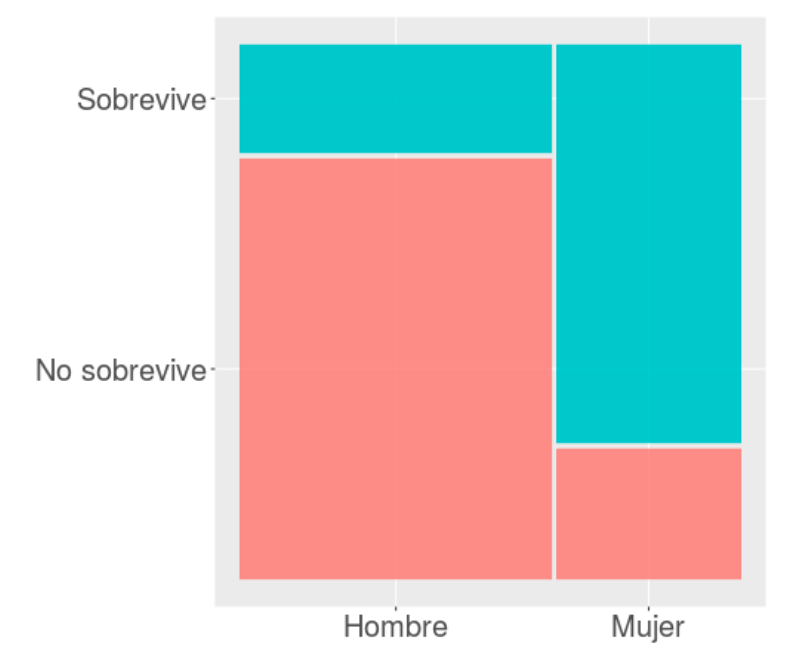

class: front

```{r eval=FALSE, include=FALSE}
# Correr esto para que funcione el infinite moonreader, el root folder debe ser static para si dirigir solo "bajndo" en directorios hacia el bib y otros

xaringan::inf_mr('/static/docpres/02_bases/2mlmbases.Rmd')

o en RStudio:
  - abrir desde carpeta root del proyecto
  - Addins-> infinite moon reader
```


```{r setup, include=FALSE, cache = FALSE}
require("knitr")
options(htmltools.dir.version = FALSE)
pacman::p_load(RefManageR)
# bib <- ReadBib("../../bib/electivomultinivel.bib", check = FALSE)
opts_chunk$set(warning=FALSE,
             message=FALSE,
             echo=FALSE,
             cache = FALSE, fig.width=7, fig.height=5.2)
pacman::p_load(flipbookr, tidyverse)
```

<!---
Para correr en ATOM
- open terminal, abrir R (simplemente, R y enter)
- rmarkdown::render('static/docpres/07_interacciones/7interacciones.Rmd', 'xaringan::moon_reader') 

About macros.js: permite escalar las imágenes como [scale 50%](path to image), hay si que grabar ese archivo js en el directorio.
--->


.pull-left[
# Estadística Multivariada
## Juan Carlos Castillo
## Sociología FACSO - UChile
## 1er Sem 2021
## [.purple[multivariada.netlify.com]](https://multivariada.netlify.com)
]


.pull-right[
.right[
<br>
## .purple[Sesión 8: Regresión Logística (1)]

<br>


]

]
---

layout: true
class: animated, fadeIn


---
class: inverse, bottom, right, animated, slideInRight


# Contenidos

## 1. Repaso de sesión anterior 

## 2. Introducción a regresión logística


---
class: roja bottom right slideInRight

# 1. Repaso sesión anterior


---
# Conceptos centrales

- población - muestra

- parámetro - estadístico

- **error estándar**: permite expresar un rango de variación probable de un parámetro, con un cierto nivel de probabilidad

---
# Distribución normal


---
# Inferencia

- $H_0$: hipótesis nula (en general: no hay diferencias en la población)

- Establecer un nivel de significación $\alpha$, convencionalmente 0.05 o inferior para rechazar $H_0$ -> 95% de confianza

- Calcular error estándar 

- Calcular prueba estadística que permita relacionar el error estándar con los niveles de significación

---
# Inferencia en regresión

- Se calcula el error estándar del $\beta$

- Se divide el $\beta$ por el error estándar -> prueba $t$

- Se compara el $t$ con el $t_{crítico}$ en la tabla de valores $t$, asociada a un nivel de confianza y grados de libertad $n-k-1$

- Si $t$ > $t_{crítico}$ = se rechaza $H_0$ con una probabilidad de error _p_.

---
# Ejemplo:

- ver interpretación paso a paso de tabla de regresión en [Práctica 7](https://multivariada.netlify.app/assignment/07-code/) 

---
class: roja bottom right


# Regresión logística (1)


## Para variables dependientes dicotómicas

---
## Variables

- discretas (Rango finito de valores):

      - Dicotómicas
      - Politómicas

- continuas:

      - Rango (teóricamente) infinito de valores.

---
## Niveles de medición de variables 

- NOIR: Nominal, Ordinal, Intervalar, Razón

.small[
| Tipo       	| Características                     	        | Propiedad de números 	| Ejemplo|
|------------	|----------------------------------------------|---------------	|-----------	|
| *Nominal*    	| Uso de números en lugar de palabras 	| Identidad            	| Nacionalidad      	|
| *Ordinal*    	| Números se usan para ordenar series 	| + ranking            	| Nivel educacional 	|
| *Intervalar* 	| Intervalos iguales entre números    	| + igualdad           	| Temperatura       	|
| *Razón*      	| Cero real                           	| + aditividad         	| Distancia         	|
]

???

  - Nominal: Números empleados como etiquetas (ej. sexo, raza)

  - Ordinales: Distintas categorías puede sen ordenados en serie. Posición, no distancia. (ej. cargos en una empresa)

  - Intervalares: Escalas de unidades iguales. Diferencia entre dos número consecuntivos refleja diferencia empírica. (ej. Horas del día)

  - Razón: caracterizados por la presencia de un cero absoluto. (ej. frecuencias de eventos)

---
## Tipos de datos en relación a escalas de medición.

* *Datos categóricos*: pueden ser medidos sólo mediante escalas nominales, u ordinales en caso de orden de rango

* *Datos continuos*:
    - Medidos en escalas intervalares o de razón
    - Pueden ser transformados a datos categóricos

???
Conversión de continuo a categórico: estatura (cm) a categorías bajo – mediano – alto


---
## Descriptivos según tipo de variable

<br>
.small[
|             	| Categórica                      	| Continua                      	| Categ.(y)/Categ.(x)                    	| Cont.(y)/Categ.(x)                	|
|-------------	|---------------------------------	|-------------------------	|------------------------------------------------	|------------------------------------------	|
| **Ejemplo**     	| **Estatus Ocupacional**             	| **Ingreso**                       	| **Estatus Ocupacional (Y) / Género (X)**           	| **Ingreso (Y) / Género (X)**                 	|
| Tabla       	| Frecuencias / porcentajes                  	| Necesidad de recodificar      	| Tabla de Contingencia                          	| Clasificar Y                             	|
| Gráfico     	| Barras                          	| Histograma / boxplot          	| Gráfico de barras condicionado                 	| Histograma, box plot condicionado        	|
]

---
## Análisis estadístico según tipos de variables

- Variable dependiente (y) : lo que quiero explicar

- Variable independiente (x): lo que me permite explicar la dependiente

.small[
| Variable independiente x 	| Variable dependiente Categórica   	| Variable dependiente Continua        	|
|--------------------------	|-----------------------------------	|--------------------------------------	|
| Categórica               	| Análisis de tabla de Contigencia, Chi2	| Análisis de Varianza ANOVA, Prueba T 	|
| Continua                 	| Regresión Logística 	| Correlación / Regresión Lineal                     	|
]
???


---
class: inverse, center, bottom

.pull-left[

]

## ¿Se puede anticipar el final?

???

Si vas al cine a ver esta película, y si antes conoces los datos sobre el Titanic, puedes anticipar el final?

---
# Titanic data


```{r echo=FALSE}
pacman::p_load(sjmisc, descr,tidyverse, scales, xtable, ggmosaic, stargazer, summarytools, sjPlot)

load("titanic.Rdata")

```

.small[

```{r echo=FALSE}
tt2 <- tt %>% select(survived,sex,age )  
print(dfSummary(tt2, headings = FALSE), method = "render")
```
]

---
# Sobrevivientes
.pull-left[
.small[

```{r, echo=TRUE, fig.height=6}

plot1 <-ggplot(tt, 
     aes(survived, fill=survived)) + 
  geom_bar() + 
  geom_text(
     aes(label = scales::percent((..count..)/sum(..count..))),
     stat='count',size=10, vjust = 3) + 
  theme(legend.position="none", 
        text = element_text(size = 30),
        axis.title=element_blank())

```
]
]
.pull-right[
```{r echo=FALSE}
plot1
```


]


---
# Sexo

.center[
```{r, echo=FALSE, fig.height=6}

(ggplot(tt, aes(sex, fill=sex))
 + geom_bar()
 + geom_text(
     aes(label = scales::percent((..count..)/sum(..count..))),
     stat='count',
      size=10,
    vjust = 3)
+ theme(legend.position="none", text = element_text(size = 30),axis.title=element_blank())
)
```
]
---
## Sobrevivencia / sexo

.pull-left[

]


.pull-right[
.medium[
```{r message=FALSE,warning=FALSE}
round(prop.table(table(tt$survived,tt$sex),2),2)
```
El 75% de las mujeres sobrevive, mientras el 25% no sobrevive.
]
]

---
class: inverse, middle, center

## ¿En qué medida la probabilidad de sobrevivir depende del sexo?

## ¿Es esta probabilidad estadísticamente significativa?

---
# Alternativas:

- tabla de contingencia, $\chi^2$

  - análisis de tendencia general, significación estadística
  - pero ... poco parsimoniosa, y no hay control estadístico
  
- ¿Aprovechar las ventajas del modelo de regresión?
  - expresar la relación en un número ( $\beta$ )
  - inferencia
  - control estadístico

---
# Regresión

### Modelando la probabilidad de sobrevivir con regresión OLS

```{r echo=FALSE, results='hide'}
# Generar dummy sexo
str(tt$sex)

# tt$sex_f<-tt$sex

#str(tt$sex_f)

# tt <- tt %>% mutate(sex=recode(sex, "Hombre"=0, "Mujer"=1), label="Mujer")
#str(tt$sex)
```

.small[
```{r warning=TRUE, echo=TRUE}
reg_tit=lm(survived ~ sex, data= tt)
```

]


-> Advertencia de R

---
## Modelo de probabilidad lineal

.pull-left[
.small[
Se da este nombre a los modelos de regresión donde una variable dependiente dicotómica se estima de manera tradicional (mínimos cuadrados ordinarios)

```{r echo=TRUE}
str(tt$survived)
tt <- tt %>% mutate(survived_n=recode(survived,
"No sobrevive"=0, "Sobrevive"=1))
str(tt$survived_n)

```
]
]

.pull-right[
.small[

```{r echo=TRUE}
reg_tit=lm(survived_n ~ sex, data=tt)
```


```{r results='asis', echo=FALSE}
sjPlot::tab_model(reg_tit,
        show.se=TRUE,
        show.ci=FALSE,
        digits=3,
        p.style = "stars",
        dv.labels = c("Modelo 1"),
        string.pred = "Predictores",
        string.est = "β")
```
]
]

---
## Significado coeficientes modelo probabilidad lineal

.pull-left[
**Promedio de supervivencia por sexo**
```{r results='asis', echo=FALSE}
print(xtable(compmeans(tt$survived_n,tt$sex, plot=FALSE), digits=c(0,3,0,2)),type="html")
```
]

.pull-right[
- El valor del intercepto=0.205 (0.21 aproximado) es el valor predicho para la categoría de referencia "hombre".

- El $\beta$ de sexo (mujer) =0.547 sumado al intercepto equivale al porcentaje de supervivencia de mujeres]

---
class: roja, middle

# funciona ... .yellow[PERO]

---
## Limitaciones modelo de regresión lineal para dependientes dicotómicas

.center[
```{r echo=FALSE,fig.height=6}
ggplot(data = tt, aes(x = as.numeric(sex), y = survived_n)) +
  geom_point(aes(color = as.factor(survived_n)), shape = 1) +
  geom_smooth(method = "lm", color = "gray20", se = FALSE) +
  theme_bw()  +
  labs(title = "Regresión lineal por mínimos cuadrados",
       y = "Sobrevive") +
  theme(legend.position = "none", text = element_text(size = 20))
```
]

---
## Problemas ....
.center[
```{r echo=FALSE,fig.width=12, fig.height=7}
ggplot(data = tt, aes(x = age, y = survived_n)) +
  geom_point(aes(color = as.factor(survived_n)), shape = 1) +
  geom_smooth(method = "lm", color = "gray20", se = FALSE) +
  theme_bw()  +
  labs(title = "Regresión lineal por mínimos cuadrados",
       y = "Sobrevive") +
  theme(legend.position = "none", text = element_text(size = 20))
```
]

---
# Problemas ...

.pull-left[
Si hubieran sobrevivido todos los menores de 20 y muerto todos los mayores de 40 ...
```{r echo=FALSE}
tt$survived_n2 <-tt$survived_n
tt$survived_n2[tt$age>40]<-0
tt$survived_n2[tt$age<20]<-1
```
]

.pull-right[
```{r echo=FALSE, fig.height=6}
ggplot(data = tt, aes(x = age, y = survived_n2)) +
  geom_point(aes(color = as.factor(survived_n2)), shape = 1) +
  geom_smooth(method = "lm", color = "gray20", se = FALSE) +
  theme_bw()  +
  labs(title = "Regresión lineal por mínimos cuadrados",
       y = "Sobrevive") +
theme(legend.position = "none", text = element_text(size = 20))
```
]


---
class: inverse

## Problemas regresión tradicional (OLS) para dependientes dicotómicas

- ### Eventuales predicciones fuera del rango de probabilidades posibles
- ### Ajuste a los datos / residuos: ¿Es la mejor aproximación una recta?

---
class: roja, right

## La regresión .yellow[logística] ofrece una solución a los problemas del rango de predicciones y de ajuste a los datos del modelo de probabilidad lineal

--

## Se logra mediante una _transformación_ de lo(s) beta(s)  a .yellow[coeficientes  *LOGIT*]
]

---
class: middle center


---
## OLS vs Logit

.pull-left[
```{r echo=FALSE}
ggplot(data = tt, aes(x = age, y = survived_n2)) +
  geom_point(aes(color = as.factor(survived_n2)), shape = 1) +
  geom_smooth(method = "lm", color = "gray20", se = FALSE) +
  theme_bw()  +
  labs(title = "Regresión lineal por mínimos cuadrados",
       y = "Sobrevive") +
  theme(legend.position = "none", text = element_text(size = 20))
```
]

.pull-right[

```{r, echo=FALSE}
modelo_logistico2 <- glm(survived_n2 ~ age, data = tt, family = "binomial")
```

```{r echo=FALSE}
ggplot(data = tt, aes(x = age, y = survived_n2)) +
  geom_point(aes(color = as.factor(survived_n2)), shape = 1) +
  stat_function(fun = function(x){predict(modelo_logistico2,
                                          newdata = data.frame(age = x),
                                          type = "response")}) +
  theme_bw() +
  labs(title = "Regresión logística",
       y = "Probabilidad sobrevivir") +
  theme(legend.position = "none", text = element_text(size = 20))

```
]


---
# ¿Qué es el logit?

--


## Es el logaritmo de los odds

--

# ... qué son los odds?

--

## Una razón de *probabilidades*


--
## Para llegar hasta regresión logística, hay que pasar por los odds (chances), y los odds-ratio (proporción de chances)

---
# Odds 

- **odds** (chances): probabilidad de que algo ocurra dividido por la probabilidad de que no ocurra

$$Odds=\frac{p}{1-p}$$

--

.medium[
Ej. Titanic:
  - 427 sobrevivientes (41%), 619 muertos (59%)
$$Odds_{sobrevivir}=427/619=0.41/0.59=0.69$$

**Es decir, las chances de sobrevivir son de 0.69**]
---
# Odds

- Odds de 1 significan chances iguales, menores a 1 son negativas y mayores a 1 son positivas

- _Propiedad simétrica_: 
  - un $Odd=4$ es una asociación positiva proporcional a la asociación negativa $Odd=1/4=0.25$

---
.pull-left[
## Odds de superviviencia para los hombres
.medium[
```{r message=FALSE,warning=FALSE}
table(tt$survived,tt$sex)
```
]

.medium[
```{r message=FALSE,warning=FALSE}
round(prop.table(table(tt$survived,tt$sex),2),2)
```
El 21% de los hombres sobrevive mientras el 79% no sobrevive.
]
]
--
.pull-right[
.medium[

$$Odds_{hombres}=\frac{0.21}{0.79}=0.27$$

*La probabilidad de sobrevivencia en los hombres es 0.27 veces a la no sobrevivencia*

... o en otros términos

*Hay 0.27 hombres que sobreviven por cada uno que no sobrevive*

*Hay 27 hombres que sobreviven por cada 100 hombres que no sobreviven*
]
]

---
## Odds de superviviencia para las mujeres

.pull-left[
.medium[
```{r message=FALSE,warning=FALSE}
round(prop.table(table(tt$survived,tt$sex),2),2)
```
El 75% de las mujeres sobrevive, mientras el 25% no sobrevive.


]
]
--
.pull-right[
.medium[
$$Odds_{mujeres}=\frac{0.75}{0.25}=3$$
*La probabilidad de sobrevivencia en las mujeres es 3 veces a la no sobrevivencia*


*Hay 3 mujeres que sobreviven por cada mujer que no sobrevive*

o en otros términos

*Hay 300 mujeres que sobreviven al titanic por cada 100 mujeres que no sobreviven*
]
]


---
## Odds ratio (OR)

.pull-left[
- los odds-ratio (o razón de chances) permiten reflejar la asociación entre las chances de dos variables dicotómicas


**¿Tienen las mujeres más chances de sobrevivir que los hombres?**
]

--
.pull-right[
.medium[
```{r}
sjt.xtab(tt$survived, tt$sex,
        show.col.prc=TRUE,
        show.summary=FALSE
)
```
]
]

---
# Odds Ratio

**¿Cuantas más chances de sobrevivir tienen las mujeres respecto de los hombres?**

- OR supervivencia mujeres / OR supervivencia hombres

.medium[
$$OR=\frac{p_{m}/(1-p_{m})}{p_{h}/(1-p_{h})}=\frac{0.753/(1-0.753)}{0.205/(1-0.205)}=\frac{3.032}{0.257}=11.78$$
]

--

### Las chances de sobrevivir de las mujeres son **11.78** veces más que las de los hombres.

---
class: inverse, middle, center

## El Odds-Ratio (OR) nos permite expresar **en un número** la relación entre dos variables categóricas

## Por lo tanto, es una versión del $\beta$ para dependientes categóricas


---
class: inverse, middle, center

## Pero ... el **OR** tiene algunas limitaciones que requieren una transformación adicional, tema de la .yellow[próxima clase] 


---
class: inverse

## Resumen

- limitaciones de OLS para dependientes dicotómicas

- requiere de ajustes y transformaciones para que la estimación tenga sentido

- regresión logística: ajusta el modelo para dependientes dicotómicas

- pasa por el cálculo de los odds-ratio, que resumen en 1 número la relación entre dos variables categóricas

---
# Próxima semana

- logit

- estimación e interpretación regresión logística

- ajuste regresión logística

---
class: front

.pull-left[
# Estadística Multivariada
## Juan Carlos Castillo
## Sociología FACSO - UChile
## 1er Sem 2021
## [multivariada.netlify.com](https://multivariada.netlify.com)
]


.pull-right[
.right[
<br>

]

]
