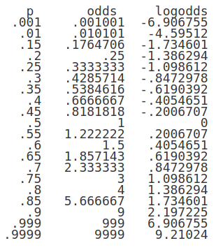

class: front

```{r eval=FALSE, include=FALSE}
# Correr esto para que funcione el infinite moonreader, el root folder debe ser static para si dirigir solo "bajndo" en directorios hacia el bib y otros

xaringan::inf_mr('/static/docpres/02_bases/2mlmbases.Rmd')

o en RStudio:
  - abrir desde carpeta root del proyecto
  - Addins-> infinite moon reader
```


```{r setup, include=FALSE, cache = FALSE}
require("knitr")
options(htmltools.dir.version = FALSE)
pacman::p_load(RefManageR)
# bib <- ReadBib("../../bib/electivomultinivel.bib", check = FALSE)
opts_chunk$set(warning=FALSE,
             message=FALSE,
             echo=FALSE,
             cache = FALSE, fig.width=7, fig.height=5.2)
pacman::p_load(flipbookr, tidyverse)
```

<!---
Para correr en ATOM
- open terminal, abrir R (simplemente, R y enter)
- rmarkdown::render('static/docpres/07_interacciones/7interacciones.Rmd', 'xaringan::moon_reader')

About macros.js: permite escalar las imágenes como [scale 50%](path to image), hay si que grabar ese archivo js en el directorio.
--->


.pull-left[
# Estadística Multivariada
## Juan Carlos Castillo
## Sociología FACSO - UChile
## 1er Sem 2020
## [multivariada.netlify.com](https://multivariada.netlify.com)
]


.pull-right[
.right[

<br>
<br>
## Sesión 10: Regresión Logística (2)

]

]
---

layout: true
class: animated, fadeIn


---
class: inverse, bottom, right, animated, slideInRight


# Contenidos

## 1. Repaso de sesión anterior 

## 2. Estimación y ajuste regresión logística


---
class: roja bottom right slideInRight

# 1. Repaso sesión anterior

---
## Variables

- discretas (Rango finito de valores):

      - Dicotómicas
      - Politómicas

- continuas:

      - Rango (teóricamente) infinito de valores.

---
## Tipos de análisis estadístico bivariado

- Variable dependiente (y) : lo que quiero explicar

- Variable independiente (x): lo que me permite explicar la dependiente

.small[
| Variable independiente x 	| Variable dependiente Categórica   	| Variable dependiente Continua        	|
|--------------------------	|-----------------------------------	|--------------------------------------	|
| Categórica               	| Análisis de tabla de Contigencia, Chi2	| Análisis de Varianza ANOVA, Prueba T 	|
| Continua                 	| Regresión Logística 	| Correlación / Regresión Lineal                     	|
]
???


---
class: inverse, center, middle

.pull-left[

]

## ¿Se puede anticipar el final?

???

Si vas al cine a ver esta película, y si antes conoces los datos sobre el Titanic, puedes anticipar el final?

---
# Titanic data


```{r echo=FALSE}
pacman::p_load(sjmisc, descr,tidyverse, scales, xtable, ggmosaic, stargazer, summarytools, sjPlot)

load("titanic.Rdata")

```

.small[

```{r echo=FALSE}
tt2 <- tt %>% select(survived,sex,age )  
print(dfSummary(tt2, headings = FALSE), method = "render")
```
]

---
# Sobrevivientes & Sexo

```{r, echo=FALSE, fig.height=6}

plot1 <-ggplot(tt, 
     aes(survived, fill=survived)) + 
  geom_bar() + 
  geom_text(
     aes(label = scales::percent((..count..)/sum(..count..))),
     stat='count',size=10, vjust = 3) + 
  theme(legend.position="none", 
        text = element_text(size = 30),
        axis.title=element_blank())

```


.pull-left[
.small[
```{r echo=FALSE, fig.height=6}
plot1
```
]

]
.pull-right[
```{r, echo=FALSE, fig.height=6}

(ggplot(tt, aes(sex, fill=sex))
 + geom_bar()
 + geom_text(
     aes(label = scales::percent((..count..)/sum(..count..))),
     stat='count',
      size=10,
    vjust = 3)
+ theme(legend.position="none", text = element_text(size = 30),axis.title=element_blank())
)


```
]

---
## Sobrevivencia / sexo

.center[

]

---
## Limitaciones modelo de regresión lineal para dependientes dicotómicas (= modelo de probabilidad lineal) 

.pull-left[
```{r echo=FALSE, results='hide'}
str(tt$survived)
tt <- tt %>% mutate(survived_n=recode(survived,
"No sobrevive"=0, "Sobrevive"=1))
str(tt$survived_n)
```


```{r echo=FALSE,fig.height=6}
ggplot(data = tt, aes(x = as.numeric(sex), y = survived_n)) +
  geom_point(aes(color = as.factor(survived_n)), shape = 1) +
  geom_smooth(method = "lm", color = "gray20", se = FALSE) +
  theme_bw()  +
  labs(title = "Regresión lineal por mínimos cuadrados",
       y = "Sobrevive") +
  theme(legend.position = "none", text = element_text(size = 20))
```
]

.pull-right[

```{r echo=FALSE}
tt$survived_n2 <-tt$survived_n
tt$survived_n2[tt$age>40]<-0
tt$survived_n2[tt$age<20]<-1
```


```{r echo=FALSE, fig.height=6}
ggplot(data = tt, aes(x = age, y = survived_n2)) +
  geom_point(aes(color = as.factor(survived_n2)), shape = 1) +
  geom_smooth(method = "lm", color = "gray20", se = FALSE) +
  theme_bw()  +
  labs(title = "Regresión lineal por mínimos cuadrados",
       y = "Sobrevive") +
theme(legend.position = "none", text = element_text(size = 20))
```
]


---
class: roja, right

## La regresión logística ofrece una solución a los problemas del rango de predicciones y de ajuste a los datos del modelo de probabilidad lineal

--

## Se logra mediante:
### (a) expresión de coeficientes como odds-ratio
### (b) _transformación_ de lo(s) coeficientes a *LOGIT*

---
## Curvando la recta ...

.pull-left[
```{r echo=FALSE}
ggplot(data = tt, aes(x = age, y = survived_n2)) +
  geom_point(aes(color = as.factor(survived_n2)), shape = 1) +
  geom_smooth(method = "lm", color = "gray20", se = FALSE) +
  theme_bw()  +
  labs(title = "Regresión lineal por mínimos cuadrados",
       y = "Sobrevive") +
  theme(legend.position = "none", text = element_text(size = 20))
```
]

.pull-right[

```{r, echo=FALSE}
modelo_logistico2 <- glm(survived_n2 ~ age, data = tt, family = "binomial")
```

```{r echo=FALSE}
ggplot(data = tt, aes(x = age, y = survived_n2)) +
  geom_point(aes(color = as.factor(survived_n2)), shape = 1) +
  stat_function(fun = function(x){predict(modelo_logistico2,
                                          newdata = data.frame(age = x),
                                          type = "response")}) +
  theme_bw() +
  labs(title = "Regresión logística",
       y = "Probabilidad sobrevivir") +
  theme(legend.position = "none", text = element_text(size = 20))

```
]


---
# Odds 

- **odds** (chances): probabilidad de que algo ocurra dividido por la probabilidad de que no ocurra

$$Odds=\frac{p}{1-p}$$

--

.medium[
Ej. Titanic:
  - 427 sobrevivientes (41%), 619 muertos (59%)
$$Odds_{sobrevivir}=427/619=0.41/0.59=0.69$$

**Es decir, las chances de sobrevivir son de 0.69**]

---
## Odds ratio (OR)

.pull-left[
- los odds-ratio (o razón de chances) permiten reflejar la asociación entre las chances de dos variables dicotómicas


**¿Tienen las mujeres más chances de sobrevivir que los hombres?**
]

--
.pull-right[
.medium[
```{r}
sjt.xtab(tt$survived, tt$sex,
        show.col.prc=TRUE,
        show.summary=FALSE
)
```
]
]

---
# Odds Ratio
 
**¿Cuantas más chances de sobrevivir tienen las mujeres respecto de los hombres?**

- OR supervivencia mujeres / OR supervivencia hombres

.medium[
$$OR=\frac{p_{m}/(1-p_{m})}{p_{h}/(1-p_{h})}=\frac{0.753/(1-0.753)}{0.205/(1-0.205)}=\frac{3.032}{0.257}=11.78$$
]

--

### Las chances de sobrevivir de las mujeres son **11.78** veces más que las de los hombres.


---
class: roja bottom right

# Regresión logística 2: 
## Estimación y ajuste

---
# Regresión logística y odds


.pull-left[
```{r echo=FALSE}
ggplot(data = tt, aes(x = age, y = survived_n2)) +
  geom_point(aes(color = as.factor(survived_n2)), shape = 1) +
  stat_function(fun = function(x){predict(modelo_logistico2,
                                          newdata = data.frame(age = x),
                                          type = "response")}) +
  theme_bw() +
  labs(title = "Regresión logística",
       y = "Probabilidad sobrevivir") +
  theme(legend.position = "none", text = element_text(size = 20))

```
]


.pull-right[
Una de las transformaciones que permite realizar una estimación de regresión con variables dependientes dicotómicas es el **logit**, que es logaritmo de los odds.
]

---
# Logit

$$Logit=ln(Odd)=ln(\frac{p}{1-p})$$
---
## Comparación logit y odds según distintas probabilidades

.center[]


---
# Estimación en R: `glm`

```
modelo <- glm(dependiente ~ indep 1 + indep2 + ...,
          data=datos,
          family="binomial")
```

- `glm` (general lineal model) es la función para variables dependientes categóricas


- `family="binomial"` indica que la dependiente es dicotómica


---
# Ejemplo Titanic

.pull-left[

```{r echo=TRUE}
modelo_titanic <-
glm(survived ~ sex,
data = tt,
family = "binomial")

```

]

.pull-right[.small[

```{r results='asis', echo=FALSE}

# Para crear un modelo con OR y agregar a la tabla // luego no funciona (?)
or <- texreg::extract(modelo_titanic)
or@coef <- exp(or@coef)
or@se <- numeric()

texreg::htmlreg(list(modelo_titanic,or ), doctype = FALSE, caption=" ", custom.coef.names = c("Intercepto", "Mujer (Ref=Hombre)"), custom.model.names = c("Logit", "OR"), digits = 3)
```

]
]


---
## Interpretación de asociaciones y contraste de hipótesis

### - Coeficiente logit asociado a sexo (mujer) = +2.467 :

  - El log-odds de sobrevivencia aumenta para las mujeres en 2.467 en comparación con los hombres. 

--

### Contraste de hipótesis

- La diferencia de las probabilidades de sobrevivir entre hombres y mujeres son estadísticamente significativas, por lo que se rechaza la hipótesis nula (de ausencia de diferencias entre hombres y mujeres) con un nivel de probabilidad $p<0.001$.


---
## Interpretación de coeficientes logit


- Sustantivamente no nos dice mucho, ya que el logit es una transformación de la escala original.

- Por lo tanto, para poder interpretar el sentido del coeficiente se requiere volver a la métrica de odds mediante una transformación inversa o **exponenciación**


---
## De logits a odds 

.pull-left[
$$logit_x=log(Odds)$$
$$e^{logit}=Odds_X$$
$$e^{2.467}=11.78$$
]

.pull-right[
```{r echo=TRUE}
exp(2.467)
```
### Las chances (odds) de sobrevivir siendo mujer son **11.78** veces más que las de un hombre.
]

---
## De logits a odds

$$Odds_X=e^{\beta_0 + \beta_jX_j}$$
<br>
--
- Predicción para **mujeres**= -1.354 + (2.467 * Sexo=1) = 1.113

-  Predicción para **hombres**= -1.354 + (2.467 * Sexo=0) = -1.354

--

<br>

$$Odds_{mujer}=e^{1.113}=3.032$$
$$Odds_{hombre}=e^{-1.354}=0.257$$

---
## Transformación a probabilidades predichas

$$p_{mujeres}=\frac{e^{1.113}}{1+e^{1.113}}=\frac{3.04}{4.04}=0.752$$
$$p_{hombres}=\frac{e^{-1.354}}{1+e^{-1.354}}=\frac{0.258}{1.258}=0.205$$


---
# Regresión logística multiple

.pull-left[

```{r echo=TRUE}
modelo_titanic2 <-
glm(survived_n2 ~ sex + age,
data = tt,
family = "binomial")
```

]

.pull-right[.small[

```{r results='asis', echo=FALSE}
or2 <- texreg::extract(modelo_titanic2)
or2@coef <- exp(or2@coef)
or2@se <- numeric()

texreg::htmlreg(list(modelo_titanic2,or2 ), doctype = FALSE, caption=" ", custom.coef.names = c("Intercepto", "Mujer (Ref=Hombre)", "Edad"),        custom.model.names = c("Logit", "OR"))
```

]
]


---
class: inverse, middle, center

# Ajuste

---
## Ajuste: ¿Qué tan bueno es nuestro modelo?

- El ajuste de los modelos logísticos se evalúa en general en términos comparativos con otros modelos con más/menos predictores

- Estas medidas de comparación se basan en la log verosimilitud (log-likelihood) del modelo, que es una magnitud que se obtiene dado el procedimiento de estimación en regresión logística.


---
## Ajuste: ¿Qué tan bueno es nuestro modelo?

- Entre las medidas de ajuste usualmente se consideran:

  - Devianza (deviance)
  - Test de razón de verosimilitud (likelihood ratio test)
  - R2s
  - Criterio de información de Akaike

---
## Devianza
.medium[
- Devianza =-2*log likelihood: Se utiliza como una medida de los residuos generados por el modelo, comparando con el modelo nulo (sin predictores). En general si disminuye, el modelo es mejor

```{r echo=TRUE}
modelo_titanic$null.deviance # devianza modelo sin predictores
modelo_titanic$deviance # devianza modelo con predictores
```
]
---
## Test de devianza

Compara las verosimilitudes del modelo con otro con menos predictores

.small[
```{r}
null_titanic=glm(survived~1, data=tt, family=binomial)

anova(modelo_titanic, null_titanic, test ="Chisq")

```

La diferencia entre los modelos es estadísticamente significativa con una probabilidad $p<0.001$. Por lo tanto el modelo con predictores (sexo) ofrece un mejor ajuste a los datos que un modelo sin predictores.
]
---
#  McFadden (pseudo) R2

Se define como: $1−[LL(LM)/LL(L0)]$, donde
.small[
- LL es el log likelihood del modelo
- LM es el modelo posterior (con predictores)
- L0 es el modelo nulo

```{r echo=TRUE}
logLik(modelo_titanic); logLik(null_titanic)
1-(-551/-707)
```

]

---
#  McFadden (pseudo) R2

También se puede obtener con la función `PseudoR2` de la librería `DescTools`, junto a otras versiones de pseudo R2s, como "Nagelkerke", "CoxSnell" y "Effron".


---
## Akaike (AIC)
.medium[
**AIC - Akaike information criteria**, evalua la calidad del modelo a través de la comparación con otros modelos penalizando por la inclusión de predictores (análogo al R2 ajustado):

$$AIC=-2(log-likelihood)+2K$$

Donde K= número de parámetros del modelo (regresores + intercepto)

]
---
## Akaike (AIC)

```{r echo=TRUE}
logLik(modelo_titanic)

2*551

```
$$AIC=-2(-551)+2(2)=1102+4=1106$$


---
# Resumen Ajuste

- diferentes aproximaciones

- utilizar más de una forma

- en general: devianza y algún tipo de R2


---
class: inverse, left

## RESUMEN

-  Limitaciones de regresión tradicional (OLS) para variables dependientes dicotómicas

- Logit permite implementar regresión (coeficientes e inferencia) con dependientes dicotómicas

- En regresión logística la interpretación sustantiva se realiza mediante la exponenciación de los odds

- Ajuste: medidas comparativas basadas en la log-verosimilitud de los modelos


???
Remember, though, just like in logistic regression, the difference in the probability isn’t equal for each 1-unit change in the predictor. The sigmoidal relationship between a predictor and probability is nearly identical in probit and logistic regression. A 1-unit difference in X will have a bigger impact on probability in the middle than near 0 or 1.

---
class: roja right middle

### Próxima semana

## Revisión de supuestos del modelo de regresión

---
class: front

.pull-left[
# Estadística Multivariada
## Juan Carlos Castillo
## Sociología FACSO - UChile
## 1er Sem 2020
## [multivariada.netlify.com](https://multivariada.netlify.com)
]


.pull-right[
.right[
<br>

]

]
