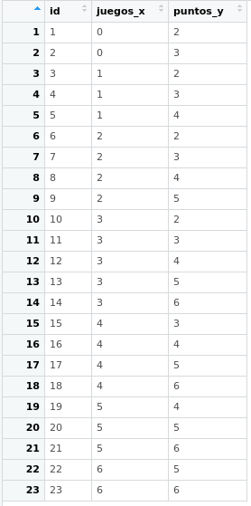

class: front

```{r eval=FALSE, include=FALSE}
# Correr esto para que funcione el infinite moonreader, el root folder debe ser static para si dirigir solo "bajndo" en directorios hacia el bib y otros

xaringan::inf_mr('/static/docpres/02_bases/2mlmbases.Rmd')

o en RStudio:
  - abrir desde carpeta root del proyecto
  - Addins-> infinite moon reader
```


```{r setup, include=FALSE, cache = FALSE}
require("knitr")
options(htmltools.dir.version = FALSE)
pacman::p_load(RefManageR)
# bib <- ReadBib("../../bib/electivomultinivel.bib", check = FALSE)
opts_chunk$set(warning=FALSE,
             message=FALSE,
             echo=TRUE,
             cache = FALSE,fig.width=7, fig.height=5.2)
library(flipbookr)
library(tidyverse)
```

<!---
Para correr en ATOM
- open terminal, abrir R (simplemente, R y enter)
- rmarkdown::render('static/docpres/07_interacciones/7interacciones.Rmd', 'xaringan::moon_reader')

About macros.js: permite escalar las imágenes como [scale 50%](path to image), hay si que grabar ese archivo js en el directorio.
--->


.pull-left[
# Estadística Multivariada
## Juan Carlos Castillo
## Sociología FACSO - UChile
## 1er Sem 2020
## [multivariada.netlify.com](https://multivariada.netlify.com)
]


.pull-right[
.right[

<br>
<br>
## Sesión 3: Regresión simple (1)
]

]
---
class: inverse

## Contenidos

1. Repaso de sesión anterior

2. Varianza, covarianza y correlación

3. Regresión simple 1

---
class: roja, middle, center

# 1. Repaso sesión anterior
---
# Base de Datos

* Forma "rectangular" de almacenamiento de datos:

.center[]

---
# Variables

- Categóricas o discretas (Rango finito de valores):

      - Dicotómicas (1. Universidad Pública, 2. Universidad Privada)
      - Politómicas (1. Chile 2. Argentina 3. Perú ...)

- Continuas:

      - Rango (teóricamente) infinito de valores (ej: Edad).


---
.pull-left-narrow[
# Dispersión:
## Varianza
]

.pull-right-wide[


]

---
# Dispersión


---
class: inverse, middle, center

#La VARIANZA equivale al promedio de la suma de las diferencias del promedio al cuadrado
 
---
class: roja, bottom, right

# 2. Varianza, covarianza y correlación

---
# Varianza & desviación estándar
.pull-left[

.small[

| ID   | Pje (x) | $$x-\bar{x}$$ | $$(x-\bar{x})^{2}$$ |
|------|---------|----------|-----------|
| 1    | 6       | 0.4      | 0.16      |
| 2    | 4       | -1.6     | 2.56      |
| 3    | 7       | 1.4      | 1.96      |
| 4    | 2       | -3.6     | 12.96     |
| 5    | 9       | 3.4      | 11.56     |
| Sum  | 28      | 0        | 29.2      |
| Prom | 5.6     |          |           |

]
]

.pull-right[

\begin{align*}
Varianza =\sigma^{2} &={\sum_{i=1}^{N}(x_{i}-\bar{x})^{2}\over {N - 1}}\\
\sigma^{2} &={(29.2)\over {5 - 1}}\\
\sigma^{2} &= 7.3 \\
Desv.est=\sigma &=\sqrt(7.3) \\
\sigma &= 2,7
\end{align*}
]

---
# Asociación: covarianza / correlación

.pull-left[
_¿Se relaciona la variación de una variable, con la variación de otra variable?_
]
.pull-right[
.center[]
]
---
# Asociación: covarianza / correlación (II)

\begin{align*}
Covarianza = cov(x,y) &= \frac{\sum_{i=1}^{n}(x_i - \bar{x})(y_i - \bar{y})} {n-1}\\
\\
Correlación=r &= \frac{\sum_{i=1}^{n}(x_i - \bar{x})(y_i - \bar{y})} {(n-1)\sigma_x \sigma_y }\\ \\
alternativamente=r &= \frac{\sum(x-\bar{x})(y-\bar{y})}{\sqrt{\sum(x-\bar{x})^{2} \sum(y-\bar{y})^{2}}}
\end{align*}


---

.pull-left-narrow[
.left[
### Ejemplo de correlación 
$r= \frac{\sum(x-\bar{x})(y-\bar{y})}{\sqrt{\sum(x-\bar{x})^{2} \sum(y-\bar{y})^{2}}}$
$$=\frac{-63}{\sqrt{210*68}}$$
$$=-0.5272$$
]
]


.pull-right-wide[
.tiny[
<br>

| id| x  | y  | (A) $$x-\bar{x}$$ | (B) $$y-\bar{y}$$ | A*B | $$(x-\bar{x})^{2}$$ | $$(y-\bar{y})^{2}$$ |
|---:|---:|---:|--------:|--------:|---------:|---------:|---------:|
| 1    | 17 | 24 | -3      | 3       | -9       | 9        | 9        |
| 2    | 19 | 23 | -1      | 2       | -2       | 1        | 4        |
| 3    | 14 | 22 | -6      | 1       | -6       | 36       | 1        |
| 4    | 22 | 17 | 2       | -4      | -8       | 4        | 16       |
| 5    | 15 | 23 | -5      | 2       | -10      | 25       | 4        |
| 6    | 26 | 21 | 6       | 0       | 0        | 36       | 0        |
| 7    | 23 | 18 | 3       | -3      | -9       | 9        | 9        |
| 8    | 21 | 17 | 1       | -4      | -4       | 1        | 16       |
| 9    | 28 | 21 | 8       | 0       | 0        | 64       | 0        |
| 10   | 15 | 24 | -5      | 3       | -15      | 25       | 9        |
| **Sum**  |    |    |         |         | -63      | 210      | 68       |
| Prom | 20 | 21 |         |         |          |          |          |

]
]

---
# Nube de puntos (scatterplot) y correlación

.center[]

---
class: roja, bottom

# 2. Modelo de regresión simple

---
# Objetivos centrales del modelo de regresión:

1. **Conocer**: la variación de la variable dependiente de acuerdo a la variación de otra(s) variable(s) independiente(s)

2. **Predecir**: estimar el valor de una variable (dependiente) de acuerdo al valor de otra(s)

3. **Inferir**: Establecer en que medida esta asociación es estadísticamente significativa


---
# Objetivos centrales del modelo de regresión: Ejemplo

1. *Conocer*: Ej: En qué medida el puntaje PSU influye en el éxito académico en la universidad?

--

2. *Predecir*: Ej: Si una persona obtiene 600 puntos en la PSU, que promedio de notas en la universidad es probable que obtenga? (Atención: predicción no implica explicación)

--

3. *Inferir*: ¿Se puede generalizar a la población? ¿Con qué nivel de confianza?


---
# Terminología variables

.center[]

---
# Ejemplo

### _¿En qué medida la experiencia previa jugando un juego predice el nivel de puntos (en juego posterior)?_


.center[]

```{r echo=FALSE, include=FALSE}
datos<- read.csv("tacataca.txt", sep="")
library(stargazer)
```

---
.left-column[
# Datos
]
.pull-left-narrow[

]

.pull-right[
.small[

```{r, echo=FALSE}
pacman::p_load(ggplot2,plotly)
```

```{r, fig.height = 5.5, fig.width = 5.5}
ggplotly(ggplot(datos, aes(x=juegos_x, y=puntos_y)) +
  geom_point() +
  expand_limits(x=c(0,6), y=c(0,7)) + coord_fixed() +
  scale_x_continuous(breaks = seq(min(0), max(6), by = 1)) +
  scale_y_continuous(breaks = seq(min(0), max(6), by = 1)) )
```
]
]

---
# Descriptivos

```{r results='asis'}
stargazer(datos, type = "html")
```


---
.left-column[
# **Medias condicionales**
]
.center[]

???
Ejemplo para los sujetos con 1 en X hay 3 valores de Y: 2, 3 y 4. Por lo tanto, la media condicional de Y dado X=1 es 3

---
.left-column[
# Idea de distribución condicional
]
.center[]

---
.left-column[
# La recta de regresión
]

.right-column[
.center[]

.small[
La (co) variación general de Y respecto a X se puede expresar en una  ecuación de la recta = **modelo de regresión**
]
]
---
class: inverse, right

## Para obtener la “mejor recta” se utiliza la estimación de mínimos cuadrados (EMC, o **OLS** – Ordinary Least Squares)

--

## OLS minimiza la suma de los **residuos** = distancias entre las observaciones y la recta en el eje vertical

---
# Componentes de la ecuación de la recta de regresión

$$\widehat{Y}=b_{0} +b_{1}X$$

Donde

- $\widehat{Y}$ es el valor estimado de $Y$

- $b_{0}$ es el intercepto de la recta (el valor de Y cuando X es 0)

- $b_{1}$ es el coeficiente de regresión, que nos dice cuánto aumenta Y por cada punto que aumenta X

---
# Estimación de los coeficientes de la ecuación:

$$b_{1}=\frac{Cov(XY)}{VarX}$$

$$b_{1}=\frac{\frac{\sum_{i=1}^{n}(x_i - \bar{x})(y_i - \bar{y})} {n-1}}{\frac{\sum_{i=1}^{n}(x_i - \bar{x})(x_i - \bar{x})} {n-1}}$$

Y simplificando

$$b_{1}=\frac{\sum_{i=1}^{n}(x_i - \bar{x})(y_i - \bar{y})} {\sum_{i=1}^{n}(x_i - \bar{x})(x_i - \bar{x})}$$

---
# Estimación de los coeficientes de la ecuación:

Luego despejando el valor de $b_{0}$

$$b_{0}=\bar{Y}-b_{1}\bar{X}$$

---
# Cálculo de coeficientes

La base para todos estos calculos es la diferencia de cada valor menos su promedio. Para ello:

1. Vamos a crear los siguientes vectores (variables) en nuestra base de datos $$difx=x-\bar{x}$$ $$dify=y-\bar{y}$$


---
# Cálculo basado en el ejemplo

2.Con la información anterior podemos obtener la diferencia de productos cruzados
$$difcru=(x-\bar{x})*(y-\bar{y})$$
3.También obtenemos las diferencias del promedio al cuadrado de X= $$difx2=(x-\bar{x})^2$$

---

`r chunk_reveal("ejemplo", break_type = "auto",display_type = "both", left_assign = TRUE)`


```{r ejemplo, echo=FALSE}
datos_b <-datos
datos$p_x <- mean(datos$juegos_x)
datos$difx <-datos$juegos_x-datos$p_x
datos$p_y <- mean(datos$puntos_y)
datos$dify <-datos$puntos_y-datos$p_y
datos$dif_cru <-datos$difx*datos$dify
datos$difx2 <-datos$difx^2
datos$difx2 <-datos$difx^2
```

---
# Cálculo basado en el ejemplo


Y con esto podemos obtener la suma de productos cruzados y la suma de cuadrados de X

```{r}
sum(datos$dif_cru)
sum(datos$difx2)
```

---
# Reemplazando en la fórmula

$$b_{1}=\frac{\sum_{i=1}^{n}(x_i - \bar{x})(y_i - \bar{y})} {\sum_{i=1}^{n}(x_i - \bar{x})(x_i - \bar{x})}=\frac{34}{68}=0.5$$

---
# Cálculo basado en el ejemplo

Reemplazando podemos obtener el valor de $b_{0}$

$$b_{0}=\bar{Y}-b_{1}\bar{X}$$
$$b_{0}=4-(3 * 0.5)=2.5$$

Completando la ecuación:

$$\widehat{Y}=2.5+0.5X$$
Por cada unidad que aumenta la experiencia en juego (x), los puntos obtenidos(y) aumentan en 0.5. 

---
# Cálculo basado en el ejemplo


$$\widehat{Y}=2.5+0.5X$$


Esto nos permite estimar el valor de $Y$ (o su media condicional) basado en el puntaje $X$.
Por ejemplo, cuál es el valor estimado de $Y$ dado $X=3$?


$$\widehat{Y}=2.5+(0.5*3)$$


$$\widehat{Y}=2.5+(3*0.5)=4$$

El valor estimado de puntos para una persona que ha jugado 3 veces es 4. 

---

.left-column[
## Cálculo basado en el ejemplo
]
.small[
.center[
```{r, fig.height = 7, fig.width = 7}
ggplot(datos, aes(x=juegos_x, y=puntos_y)) + geom_point() +
  geom_smooth(method=lm, se=FALSE) 
```
]
]
---
class: inverse, middle, center

# Regresión simple en R

---
# Estimación del modelo de regresión simple en `R`

La función para estimar regresión en `R` es `lm` (linear model):
.small[
```
objeto=lm(dependiente ~ independiente, data=datos)
```]

Donde

- *objeto*: el nombre (cualquiera) que le damos al objeto donde se guardan los resultados de la estimación
- *dependiente / independiente*: los nombres de las variables en los datos
- *datos* = el nombre del objeto de nuestros datos en R

---
# Estimación del modelo de regresión simple en `R`

En nuestro ejemplo:

```{r}
reg1 <-lm(puntos_y ~ juegos_x, data = datos)
```

`reg1` es el objeto que almacena la información de nuestra estimación. Para un reporte simple:

```{r eval=F}
reg1
```

---

```{r}
reg1
```


---
.left-column[
## Y en formato publicable
]

.center[
.tiny[
```{r, results='asis'}
stargazer(reg1, type = "html")
```
]
]
---
class: roja, right
# Próxima semana:

## - Ajuste

## - Residuos

## - Lectura: [Moore: 2. Análisis de relaciones](../../docs/lecturas/moore_analisisderelaciones1.pdf) 


---
class: front

.pull-left[
# Estadística Multivariada
## Juan Carlos Castillo
## Sociología FACSO - UChile
## 1er Sem 2020
## [multivariada.netlify.com](https://multivariada.netlify.com)
]


.pull-right[
.right[
<br>

]

]
