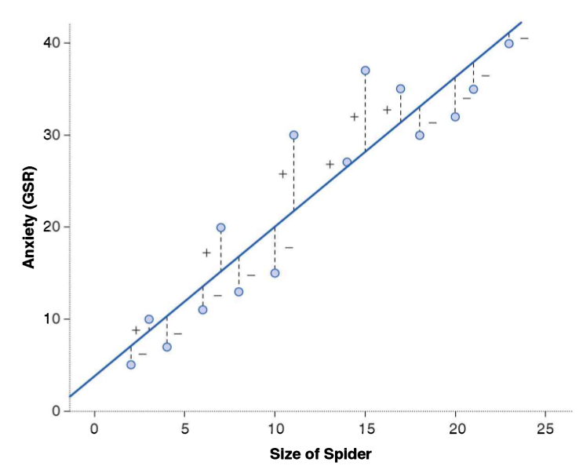

class: front

```{r eval=FALSE, include=FALSE}
# Correr esto para que funcione el infinite moonreader, el root folder debe ser static para si dirigir solo "bajndo" en directorios hacia el bib y otros

xaringan::inf_mr('/static/docpres/02_bases/2mlmbases.Rmd')

o en RStudio:
  - abrir desde carpeta root del proyecto
  - Addins-> infinite moon reader
```


```{r setup, include=FALSE, cache = FALSE}
require("knitr")
options(htmltools.dir.version = FALSE)
pacman::p_load(RefManageR)
# bib <- ReadBib("../../bib/electivomultinivel.bib", check = FALSE)
opts_chunk$set(warning=FALSE,
             message=FALSE,
             echo=TRUE,
             cache = FALSE,fig.width=7, fig.height=5.2)
library(flipbookr)
library(tidyverse)
```

<!---
Para correr en ATOM
- open terminal, abrir R (simplemente, R y enter)
- rmarkdown::render('static/docpres/07_interacciones/7interacciones.Rmd', 'xaringan::moon_reader')

About macros.js: permite escalar las imágenes como [scale 50%](path to image), hay si que grabar ese archivo js en el directorio.
--->


.pull-left[
# Estadística Multivariada
## Juan Carlos Castillo
## Sociología FACSO - UChile
## 1er Sem 2020
## [multivariada.netlify.com](https://multivariada.netlify.com)
]


.pull-right[
.right[

<br>
<br>
## Sesión 4: Regresión simple (2)
]

]
---

layout: true
class: animated, fadeIn

---
class: inverse

## Contenidos

- Repaso de sesión anterior

- Ajuste y residuos

- Notas sobre regresión y correlación


---
class: roja, middle, bottom, slideInRight

# 1. Repaso sesión anterior
---
# Objetivos centrales del modelo de regresión:

1. **Conocer**: la variación de la variable dependiente de acuerdo a la variación de otra(s) variable(s) independiente(s)

2. **Predecir**: estimar el valor de una variable (dependiente) de acuerdo al valor de otra(s)

3. **Inferir**: Establecer en que medida esta asociación es estadísticamente significativa


---
# Componentes de la ecuación de la recta de regresión

$$\widehat{Y}=b_{0} +b_{1}X$$

Donde

- $\widehat{Y}$ es el valor estimado de $Y$

- $b_{0}$ es el intercepto de la recta (el valor de Y cuando X es 0)

- $b_{1}$ es el coeficiente de regresión, que nos dice cuánto aumenta Y por cada punto que aumenta X

---
# Estimación de los coeficientes de la ecuación:

$$b_{1}=\frac{Cov(XY)}{VarX}$$

$$b_{1}=\frac{\frac{\sum_{i=1}^{n}(x_i - \bar{x})(y_i - \bar{y})} {n-1}}{\frac{\sum_{i=1}^{n}(x_i - \bar{x})(x_i - \bar{x})} {n-1}}$$

Y simplificando

$$b_{1}=\frac{\sum_{i=1}^{n}(x_i - \bar{x})(y_i - \bar{y})} {\sum_{i=1}^{n}(x_i - \bar{x})(x_i - \bar{x})}$$

---
# Estimación de los coeficientes de la ecuación:

Luego despejando el valor de $b_{0}$

$$b_{0}=\bar{Y}-b_{1}\bar{X}$$
---
# Estimación del modelo de regresión simple en `R`

La función para estimar regresión en `R` es `lm` (linear model):

`objeto <- lm(dependiente ~ independiente, data=datos)`

Donde

- **objeto**: el nombre (cualquiera) que le damos al objeto donde se guardan los resultados de la estimación
- **dependiente / independiente**: los nombres de las variables en los datos
- **datos** = el nombre del objeto de nuestros datos en R

---
class: inverse, middle, center
# INTERPRETACIÓN

#por cada unidad que aumenta X, Y aumenta en *Beta*


---

.pull-left-narrow[

]

.pull-right-wide[
**Ejemplo**: 
¿Cuántos pasos da un hijo (Y) por cada paso que da su mamá (x)?

.small[
```{r echo=FALSE}
mama_x=c(2,3,5)
hijo_y=c(6,9,15)
datos1 <-as.data.frame(cbind(mama_x,hijo_y))
options(scipen=3)
```

```{r echo=FALSE, results='markup'}
print(datos1)
```

```{r results='hide'}
reg<-lm(hijo_y ~ mama_x, data = datos1)
```

```
Coefficients:
(Intercept)       mama_x  
     -4.1          3.0  
```
]]

--

**POR CADA PASO QUE DA LA MAMÁ (X), UN HIJO (Y) AVANZA (EN PROMEDIO) 3 PASOS**

---
.pull-left[
# Ejemplo

<br>
Si tenemos

- Y = ingreso al egresar de la universidad

- X = puntaje PSU

<br>
$$Ingreso=200.000+400(puntajePSU)$$
<br>
<br>

]

--

.pull-right[
**1 - ¿Cuál es el valor estimado de Ingreso para un puntaje PSU de 500?**
{{content}}
]

--

- 400.000
{{content}}

--

**2 - ¿Cuál es el valor estimado de Ingreso para un puntaje (hipotético) de PSU=0?**
{{content}}

--

- 200.000
{{content}}

---
class: roja, bottom, right

# 2. Ajuste y residuos

---
#¿Qué tan bueno es nuestro modelo?

.center[
]
]

---
.pull-left-wide[

]


.pull-right-narrow[
<br>
# El cuarteto de Anscombe (1973)
.small[
Podemos tener un mismo modelo de regresión para relaciones distintas entre datos
]
]

---
class: inverse, right

## Un modelo es mejor mientras **mejor refleje** lo que sucede con los datos

--

## En otras palabras, cuando se **ajusta** mejor a los datos

--

## ... y en otras: cuando los **residuos** son menores
---
# Observado, estimado & residuo

.pull-left-wide[

]

.pull-right-narrow[
El ajuste del modelo se relaciona con la diferencia entre:

- pje. observado: $Y$  

- pje. estimado: $\widehat{Y}$
]
---
.pull-left-narrow[
.smally[
```{r echo=FALSE}
datos<- read.csv("../03-regsimple1/tacataca.txt", sep="")
reg1 <-lm(puntos_y ~ juegos_x, data = datos)
datos$estimado <- fitted(reg1)
datos$residuo = datos$puntos-datos$estimado
round(datos,2)
```
]
]

--

.pull-right[
.right[
## Ajuste y Residuos 


$$\widehat{Y}=b_{0} +b_{1}X$$

$$Y=b_{0}+b_{1}X+e$$
]

.small[
- X = puntaje observado juegos

- Y = puntaje observado puntos

- $\widehat{Y}$ = puntaje estimado puntos

- $b_{0}$= intercepto

- $b_{1}$= coeficiente de regresión de juegos

- $e$ = residuo (observado y - estimado)
]]

---
class: inverse, center

# ¿Cómo dar cuenta del ajuste total? 

# Calculando qué **proporción** de la varianza de Y se asocia a X


---
# Descomposición de Y

### -   Tres piezas de información relevante:

$Y$ = Valor observado de Y

$\widehat{Y}$ = estimación de Y a partir de X

$\bar{Y}$ = promedio de Y

---
.pull-left-wide[
]

.pull-right-narrow[
.right[
## Descomponiendo Y
]]

.pull-left-wide[
$$Y=\bar{Y}+(\bar{Y}-\widehat{Y})+(Y-\widehat{Y})$$

$$ \Sigma(y_i - \bar{y})^2=\Sigma (\bar{y}-\hat{y}_i)^2 + \Sigma(y_i-\hat{y}_i)^2$$
]

---
# Descomponiendo Y

Conceptualmente:

$$SS_{tot}=SS_{reg} + SS_{error}$$
.center[

]
---
# Varianza explicada

Por lo tanto:

$$SS_{tot}=SS_{reg} + SS_{error}$$

--

$$\frac{SS_{tot}}{SS_{tot}}=\frac{SS_{reg}}{SS_{tot}} + \frac{SS_{error}}{SS_{tot}}$$

--

$$1=\frac{SS_{reg}}{SS_{tot}}+\frac{SS_{error}}{SS_{tot}}$$

$$\frac{SS_{reg}}{SS_{tot}}= 1- \frac{SS_{error}}{SS_{tot}}=R^2$$

<br>

### .center[¿Qué quiere decir esto?]

---
# Varianza explicada R2

.center[]

- Parte de la variación de Y (ej: ingreso) se asocia a la variación de X (ej: educación)

---
# Varianza explicada R2

.pull-left-wide[
]

.pull-rigth-narrow[
<br>
<br>
<br>
Porcentaje de la variación de Y que puede ser asociado a la variación de X]

---
.pull-left[
.smally[
```{r echo=FALSE}
reg1 <-lm( puntos_y ~juegos_x, data = datos)
datos$estimado <- fitted(reg1)
datos$residuo = datos$puntos_y-datos$estimado
round(datos,2)
```
]
]

.pull-right[
.small[
### Volviendo al ejemplo: Puntos en partido

```{r}
ss_tot<- sum((datos$puntos_y-
          mean(datos$puntos_y))^2); ss_tot
ss_reg<- sum((datos$estimado -
          mean(datos$puntos_y))^2); ss_reg
ss_reg/ss_tot

```
]]

---
class: inverse, middle, center 


# Un 40% de la varianza en los puntos obtenidos en el juego se relaciona con la (varianza de) experiencia previa en juegos


---
.pull-left-narrow[
# Directamente en R

.smally[
```{r}
reg1 <-lm( puntos_y ~ 
              juegos_x, 
              data = datos)
```
]

]

.pull-right-wide[
.tiny[
```{r echo=FALSE, results='asis'}

stargazer::stargazer(reg1, type = "html")
```
]]
---
class:roja, right, bottom


# 3. Correlación y regresión

---
## Equivalencias en regresión y correlación

```{r}
cor(datos$juegos_x,datos$puntos_y)
```

Correlación entre juegos y puntos **al cuadrado**

```{r}
(cor(datos$juegos_x,datos$puntos_y))^2
```

Es decir: correlación de Pearson al cuadrado ( $r^2$ ) es $R^2$
---
## Diferencias en regresión y correlación

.pull-left-narrow[

- La correlación entre X e Y es la misma que entre Y e X

]

.pull-right-wide[

.small[
```{r}
cor(juegos_x,puntos_y)
cor(puntos_y,juegos_x)
```
]
]


---
## Diferencias en regresión y correlación

.pull-left-narrow[

- La regresión entre X e Y **no** es la misma que entre Y y X
]

.pull-right-wide[

.small[
```{r}
lm(puntos_y ~ juegos_x)$coefficients
lm(juegos_x ~ puntos_y)$coefficients
```
]
]

---
class: inverse

#RESUMEN

- Ajuste del modelo de regresión (R2): porcentaje de la varianza de la variable dependiente (Y) que se asocia a la independiente (X) 

- Correlación y regresión: primos cercanos, principalmente en regresión simple.


---
class: roja, right
# Próxima semana:

## Práctica 4: Ajuste y residuos
## Informe 1 


## - Lectura: [Moore: Residuos (144-154)](https://multivariada.netlify.app/docs/lecturas/moore_residuos.pdf)

---
class: roja, slideInDown

# Varios

- Tutorial RCloud

- Guía ejemplo Trabajo 1 y tutorial (Miércoles)

- Entrega Trabajo 1: se aplaza a Miércoles 10 de Junio

- Horario de clases será dedicado a asesoría para la elaboración del Informe 1

---
class: front

.pull-left-narrow[
# Estadística Multivariada

## multivariada.netlify.com

## Sociología FACSO 
## UChile
## 1er Sem 2020

]

 
.pull-right-wide[
.right[


]
]
