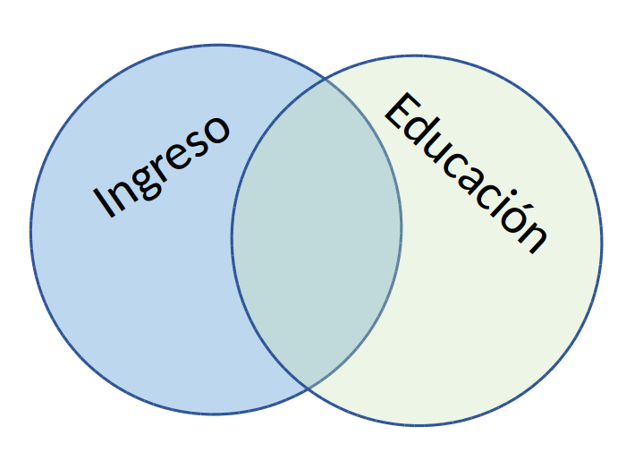

class: front

```{r eval=FALSE, include=FALSE}
# Correr esto para que funcione el infinite moonreader, el root folder debe ser static para si dirigir solo "bajndo" en directorios hacia el bib y otros

xaringan::inf_mr('/static/docpres/02_bases/2mlmbases.Rmd')

o en RStudio:
  - abrir desde carpeta root del proyecto
  - Addins-> infinite moon reader
```


```{r setup, include=FALSE, cache = FALSE}
require("knitr")
options(htmltools.dir.version = FALSE)
pacman::p_load(RefManageR)
# bib <- ReadBib("../../bib/electivomultinivel.bib", check = FALSE)
opts_chunk$set(warning=FALSE,
             message=FALSE,
             echo=FALSE,
             cache = FALSE,fig.width=7, fig.height=5.2)
library(flipbookr)
library(tidyverse)
```


```{r xaringanExtra, include=FALSE}
xaringanExtra::use_xaringan_extra(c("tile_view", "animate_css"))
xaringanExtra::use_share_again()
xaringanExtra::use_scribble()
```


```{r style-share-again, echo=FALSE}
xaringanExtra::style_share_again(
  share_buttons = c("none")
)
```


<!---
Para correr en ATOM
- open terminal, abrir R (simplemente, R y enter)
- rmarkdown::render('static/docpres/07_interacciones/7interacciones.Rmd', 'xaringan::moon_reader')

About macros.js: permite escalar las imágenes como [scale 50%](path to image), hay si que grabar ese archivo js en el directorio.
--->


.pull-left[
# Estadística Multivariada
## Juan Carlos Castillo
## Sociología FACSO - UChile
## 1er Sem 2021
## [multivariada.netlify.com](https://multivariada.netlify.com)
]


.pull-right[
.right[
<br>
## .purple[Sesión 5: Regresión múltiple (1)]


]

]
---

layout: true
class: animated, fadeIn


---
class: inverse, bottom, right, animated, slideInRight


# **Contenidos**

### Repaso regresión simple

### Introducción a regresión múltiple


---
class: inverse, bottom, right

# Repaso regresión simple

---
# Componentes de la ecuación de la recta de regresión

$$\widehat{Y}=b_{0} +b_{1}X$$

Donde

- $\widehat{Y}$ es el valor estimado de $Y$

- $b_{0}$ es el intercepto de la recta (el valor de Y cuando X es 0)

- $b_{1}$ es el coeficiente de regresión, que nos dice cuánto aumenta Y por cada punto que aumenta X

---
.pull-left[
# Resumiendo: Modelo de regresión (simple)


- Se estima mediante el método de mínimos cuadrados ordinarios (OLS)
]

.pull-right[

- Permite estimar el valor de una variable ( $\widehat{Y}$ ) a partir del valor conocido de otra variable ( $X$ )

- La estimación se expresa en el coeficiente de regresión $b_{1}$, también llamado "beta" o pendiente

- *"Por cada unidad que aumenta X, Y aumenta en $b_{1}$ unidades"*
]

---
# Descomponiendo Y


$$SS_{tot}=SS_{reg} + SS_{error}$$
.center[

]
---
# Varianza explicada II

.pull-left[
.center[]
]

.pull-right[
- Un porcentaje de la variación de Y puede ser asociado a la variación de X:  $R^2$]

---
class: inverse

### Resumen regresión simple ... hasta ahora

- Coeficiente de regresión por mínimos cuadrados: permite **predecir** en cuántas unidades aumenta _Y_ por cada punto de aumento en _X_

--

- El valor del **beta de regresión** nos informa sobre una magnitud y sentido de la pendiente, no sobre la bondad (ajuste) del modelo

--

- El **ajuste** del modelo a los datos se relaciona con la proporción de residuos generados por el modelo respecto de la varianza total de Y (R2)

---
class: roja left

.left[

# Introducción
#a regresión múltiple
]

---
# Estadística multivariada

- Hacia la **explicación** de los fenómenos sociales  

<br>
.center[

]
---
# Estadística multivariada

- Hacia la **explicación** de los fenómenos sociales  

.center[

]

$$\widehat{Y}=\beta_{0} +\beta_{1}X_{1}$$
 

 
---
# Estadística multivariada

- Hechos sociales: **multicausales**

.center[

]

---
# Estadística multivariada y regresión múltiple

- Hechos sociales: **multicausales**

.center[

]

$$\widehat{Y}=\beta_{0} +\beta_{1}X_{1} + \beta_{2}X_{2}+ \beta_{3}X_{3}$$
---
class: inverse, middle, center

.large[
# El modelo de regresión es un modelo .red[SUMATIVO]

]

---
# Problema de la multicausalidad

- posibilidad de predictores correlacionados 


.center[

]

---
# Problema de la multicausalidad 

\begin{align*}
(1) Y(ingreso) &=\beta_0 + \beta_1(educación) \\ 
(2) Y(ingreso) &=\beta_0 + \beta_1(inteligencia) \\
(3) Y(ingreso) &=\beta_0 + \beta_1(educación) + \beta_2(inteligencia) \\
\end{align*}

--


.center[
## ¿Qué sucedería si la educación estuviera relacionada con la inteligencia? 
-> estaríamos sobreestimando el ingreso al hacer un modelo sumativo "puro"
]


---
# Agregando predictores al modelo
.pull-left[
.center[]

$$\widehat{Ingreso}=b_0+b_1(Educ)$$

]

--

.pull-right[
.center[]

$$\widehat{Ingreso}=b_0+b_1(Educ)+b_2(Int)$$
]


???

- Tenemos un modelo teórico que relaciona ingreso con nivel educacional: a mayor ingreso, mayor nivel educacional.
- Esto puede expresarse en un modelo de regresión
- Qué sucede si nos surge la pregunta sobre la posibilidad de que otras variables también tienen que ver con ingreso?
- Se puede agregar una tercera variable al modelo, pero: ¿qué consecuencias teóricas y empíricas tiene esto?

---
# Agregando predictores al modelo

.pull-left-narrow[

.center[]

]

.pull-right-wide[

- Teóricamente el modelo asume covariación entre Ingreso y Educación, y entre _Ingreso_ e _Inteligencia_

- Pero ... también existe la posibilidad de covariación entre los predictores _Educación_ e _Inteligencia_

- Para poder sumar el efecto neto de cada predictor se debe **controlar** la covariación entre predictores
]

---
class:roja


# La regresión múltiple no es equivalente a regresiones simples estimadas por separado con distintos predictores


---
class: inverse, middle, center

# .large[.yellow[Concepto de .red[control]]]

---

## 1. Control por diseño

- Característico de la metodología experimental

- El control se logra por diseño mediante **aleatorización** (distribución al azar) de sujetos a diferentes situaciones experimentales, generando **grupos equivalentes**

- La aleatorización intenta aislar el **efecto del tratamiento** de todas las otras variables que podrían afectar en la respuesta

---
# Concepto de control

## 2. Control estadístico

- En datos observacionales de encuestas en general no hay  control por diseño, por lo que se recurre al **control estadístico**

--

- Se logra incluyendo predictores que teóricamente podrían dar cuenta o afectar la relación entre X e Y.

--

- La inclusión de otros predictores despeja o "controla" la asociación de $X_1$ e $Y$, aislando el efecto conjunto de $X_1$ y $X_2$ (... y $X_n$)

---
.pull-left-wide[
## Control estadístico
- ¿Qué efecto posee el nivel educacional en ingreso, _controlando por_ inteligencia?
]
.pull-right-narrow[

]

**Conceptualmente:**
.small[
- aislar el efecto de educación en ingreso, manteniendo la inteligencia _constante_.

- estimar el efecto de educación en ingreso independiente del efecto de la inteligencia

- estimación del efecto de educación en ingreso _ceteris paribus_ (manteniendo el efecto del resto de los predictores constante)
]


---
class: inverse, center, middle, exclude

# POR LO TANTO

## Un aspecto **clave** de la regresión múltiple, tanto conceptual como estadísticamente, tiene que ver con el .yellow[control de la CORRELACION] ENTRE .red[PREDICTORES] O VARIABLES INDEPENDIENTES (X)

---
### Simulación 1: sin correlación relevante entre predictores
.pull-left-narrow[

.center[]
]

--

.pull-right_wide[.small[
```{r, echo=FALSE,results='hide'}
set.seed(23)
nobs = 100

# Matriz a simular
m<- matrix(c(1.0,0.4,0.2,
             0.4,1.0,0.0,
             0.2,0.0,1.0),nrow=3,ncol=3)

m

# Cholesky decomposition
l = chol(m)
nvars = dim(l)[1]
r = t(l) %*% matrix(rnorm(nvars*nobs), nrow=nvars, ncol=nobs)
r
r = t(r)

rdata1 = as.data.frame(r)
rdata1
names(rdata1) = c('ingreso', 'educacion', 'inteligencia')

cor(rdata1)

cor_rdata1 <-cor(rdata1)
```

```{r fig.width=8, fig.height=8, echo=FALSE}
library(corrplot)
corrplot.mixed(cor_rdata1, number.cex=2, tl.cex=1.5)

```

]
]

---
### Simulación 1: sin correlación relevante entre predictores
.small[
```{r, echo=FALSE, results="asis", message=FALSE }
r1dat1<-lm(ingreso ~ educacion, data=rdata1)
r2dat1<-lm(ingreso ~ inteligencia, data=rdata1)
r3dat1<-lm(ingreso ~ educacion + inteligencia, data=rdata1)

library(texreg)
htmlreg(list(r1dat1, r2dat1, r3dat1), booktabs = TRUE, dcolumn = TRUE, doctype = FALSE, caption=" ")
```
]
---
### Simulación 2: con correlación entre predictores

.pull-left-narrow[
.center[]
]

--

.pull-right-wide[.medium[
```{r, echo=FALSE,results='hide'}
set.seed(23)
nobs = 100

## Using a correlation matrix (let' assume that all variables
## have unit variance

m<- matrix(c(1.0,0.4,0.2,
             0.4,1.0,0.3,
             0.2,0.3,1.0),nrow=3,ncol=3)

# Cholesky decomposition
l = chol(m)
nvars = dim(l)[1]


r = t(l) %*% matrix(rnorm(nvars*nobs), nrow=nvars, ncol=nobs)
r = t(r)

rdata2 = as.data.frame(r)
names(rdata2) = c('ingreso', 'educacion', 'inteligencia')

m2=cor(rdata2)
round(m2, digits=2)
```

```{r fig.width=8, fig.height=8, echo=FALSE}
library(corrplot)
corrplot.mixed(m2, number.cex=2, tl.cex=2)
```
]
]

---
### Simulación 2: con correlación entre predictores

.small[
```{r, echo=FALSE, results="asis"}
r1dat2<-lm(ingreso ~ educacion, data=rdata2)
r2dat2<-lm(ingreso ~ inteligencia, data=rdata2)
r3dat2<-lm(ingreso ~ educacion + inteligencia, data=rdata2)

library(texreg)
htmlreg(list(r1dat2, r2dat1, r3dat2), booktabs = TRUE, dcolumn = TRUE, doctype = FALSE, caption=" ")
```
]

---
## Comparando

.pull-left[
.small[
```{r, echo=FALSE, results="asis", message=FALSE }
htmlreg(list(r1dat1, r2dat1, r3dat1), booktabs = TRUE, dcolumn = TRUE, doctype = FALSE, caption=" ")
```
]
]

.pull-right[
.small[
```{r, echo=FALSE, results="asis"}
htmlreg(list(r1dat2, r2dat1, r3dat2), booktabs = TRUE, dcolumn = TRUE, doctype = FALSE, caption=" ")
```
]

]

---
# Estimación de parámetros y control estadístico

- Los coeficientes de regresión $\beta$ no alteran su valor en los modelos en ausencia de correlación entre predictores $X$ (Ejemplo 1)

--

- Si hay correlación entre predictores, el valor de los coeficientes de regresión será distinto en modelos simples y en modelos múltiples

--

- Por ello, en regresión múltiple se habla de coeficientes de regresión **parciales**

--

- Esta diferencia se relaciona con el concepto de **control estadístico**


---
# Estimación de parámetros y control estadístico

- Ejemplo 2, modelo 3: El ingreso aumenta en 0.4 puntos por cada nivel adicional de educación, **controlando por experiencia**. O también ...

      - manteniendo la experiencia _constante_

      - _ceteris paribus_

---
class: inverse

## Resumen

- Regresión múltiple: más de un predictor / variable independiente en el modelo

- Permite

  - contrastar hipótesis de la **influencia simultánea** de más de una variable

  - **controlar** por la posible influencia de terceras variables (control estadístico)


---
class: front

.pull-left[
# Estadística Multivariada
## Juan Carlos Castillo
## Sociología FACSO - UChile
## 1er Sem 2021
## [multivariada.netlify.com](https://multivariada.netlify.com)
]


.pull-right[
.right[
<br>

]

]


