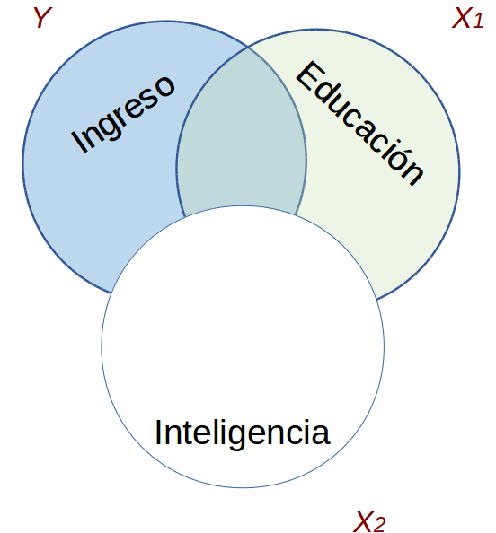
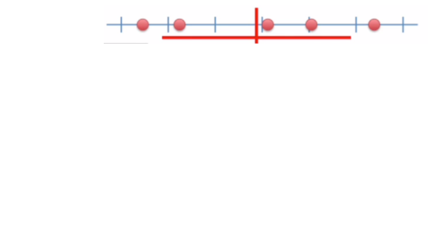
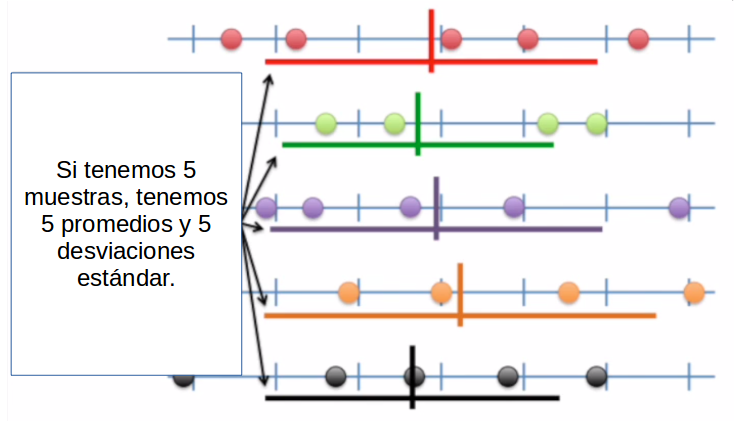
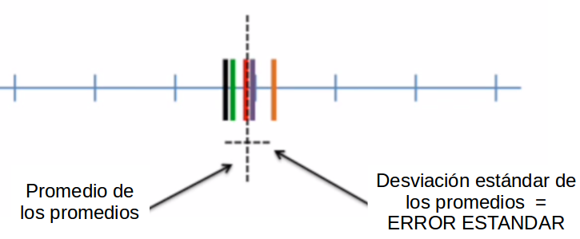
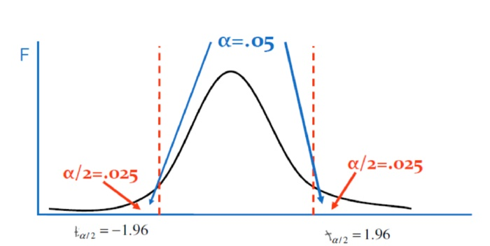
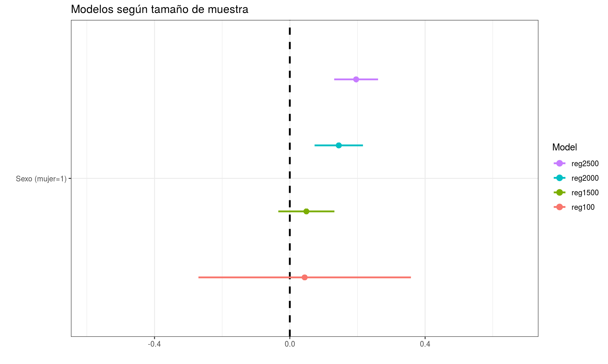

class: front

```{r eval=FALSE, include=FALSE}
# Correr esto para que funcione el infinite moonreader, el root folder debe ser static para si dirigir solo "bajndo" en directorios hacia el bib y otros

xaringan::inf_mr('/static/docpres/02_bases/2mlmbases.Rmd')

o en RStudio:
  - abrir desde carpeta root del proyecto
  - Addins-> infinite moon reader   
```


```{r setup, include=FALSE, cache = FALSE}
require("knitr")
options(htmltools.dir.version = FALSE)
pacman::p_load(RefManageR)
# bib <- ReadBib("../../bib/electivomultinivel.bib", check = FALSE)
opts_chunk$set(warning=FALSE,
             message=FALSE,
             echo=FALSE,
             cache = TRUE, fig.width=7, fig.height=5.2)
library(flipbookr)
library(tidyverse)
```

<!---
Para correr en ATOM
- open terminal, abrir R (simplemente, R y enter)
- rmarkdown::render('static/docpres/07_interacciones/7interacciones.Rmd', 'xaringan::moon_reader')

About macros.js: permite escalar las imágenes como [scale 50%](path to image), hay si que grabar ese archivo js en el directorio.
--->


.pull-left[
# Estadística Multivariada
## Juan Carlos Castillo
## Sociología FACSO - UChile
## 1er Sem 2021
## [.purple[multivariada.netlify.com]](https://multivariada.netlify.com)
]


.pull-right[
.right[
<br>

## .purple[Sesión 7: Inferencia en Regresión]


]

]
---

layout: true
class: animated, fadeIn


---
class: inverse, bottom, right, animated, slideInRight


# Contenidos

## 1. Repaso

## 2. Inferencia Estadística

## 3. Inferencia en regresión

---
class: roja bottom right slideInRight

# 1. Repaso

---
# Regresión múltiple: más de 1 predictor


.pull-left[
.center[]
.small[
$$\widehat{Ingreso}=b_0+b_1(Educ)$$
]
]

--

.pull-right[
.center[]
.small[
$$\widehat{Ingreso}=b_0+b_1(Educ)+b_2(Int)$$
]]


---
# Control estadístico

- Característico de análisis de datos secundarios (ej: encuestas)

- Se incluyen en el modelo variables que teóricamente podrían dar cuenta o afectar la relación entre X e Y.

- Esto despeja o "controla" la asociación de $X_1$ e $Y$, aislando el efecto conjunto de $X_1$ y $X_2$ (... y $X_n$)


---
# Regresión simple vs múltiple

```{r echo=FALSE, results='hide'}
pacman::p_load(dplyr,
               corrplot,
               ggplot2,
               scatterplot3d,
               texreg,
              stargazer
)
datos=read.csv("ingedexp.csv", sep=",")
```

.small[
```{r}
reg_y_x1=lm(ingr ~ educ, data=datos)
reg_y_x2=lm(ingr ~ intelig, data=datos)
reg_y_x1_x2=lm(ingr ~ educ + intelig , data=datos)
```
]
.small[
```{r echo=FALSE, results='asis'}
htmlreg(list(reg_y_x1,reg_y_x2,reg_y_x1_x2), booktabs = TRUE, dcolumn = TRUE, doctype = FALSE, caption=" ")
```
]


---
# Parcialización

_¿Cómo se despeja la regresión de $Y$ en $X_1$ del efecto de $X_2$?_

.pull-left[
.center[]
]

--

.pull-right[
.center[]
]

---
.pull-left[
# Parcialización

.medium[
¿Como obtenemos una variable $X_1$ parcializada de $X_2$?
]

.center[
]
]
--

.pull-right[

<br>
<br>

.medium[
- Pensemos en que $X_1$ parcializada (de $X_2$ ) es todo lo de $X_1$ (varianza) que no tiene que ver con $X_2$

- En otras palabras, en un modelo donde $X_1$ es la variable dependiente y $X_2$ la independiente, $X_1$ parcializada equivale al **residuo** de esta regresión
]
]

---
class: inverse

## RESUMEN

- Si hay correlación entre predictores, el valor de los coeficientes de regresión será **distinto** en modelos simples y en modelos múltiples

- Esta diferencia se relaciona con el concepto de  **parcialización**: se extrae la varianza común entre predictores

- La parcialización permite el **control estadístico**: *limpiar* o despejar los efectos de la influencia de otras variables


---
class: roja, bottom, right, slideInRight

# 2. Inferencia estadística

---


---
# Diferencias y diferencias **significativas**

- hasta ahora hemos interpretado solo la magnitud de los $\beta$ de regresión. Pero,

  - ¿son estos $\beta$ **_estadísticamente_** significativos?

  - es algo que podemos extrapolar de nuestra muestra a la población?

  - ... o es algo que se debe simplemente al azar?


---
.pull-left[
.medium[
## Conceptos claves de inferencia
- La **inferencia** en estadística se refiere a la relación que existe entre los resultados obtenidos basados en nuestra muestra y la población


- **¿En qué medida podemos hacer inferencias desde nuestra muestra a la población?**

- Un concepto central es el la probabilidad de **ERROR**
]]


.pull-right[
.center[

]
]

---
# Parámetros y estadísticos

<br>

|                     	| Población (parámetro)  	| Muestra (estadístico)  	|
|---------------------	|------------------------	|------------------------	|
| Promedio            	|       $\mu$           	|   $\bar{x}$           	|
| Varianza            	|        $\sigma²$      	|  $s²$                  	|
| Desviación estándar 	|        $\sigma$        	| $s$                    	|

---
# Bases de inferencia:

- dispersión: varianza y desviación estandar

- curva normal

- error estándar

---
.pull-left-narrow[
# Dispersión:
## Varianza
]

.pull-right-wide[


]


---
# Medidas de Dispersión

.pull-left[

## Varianza
<br>

<br>

<br>

## Desviación estándar
]

.pull-right[

$$s^2=\frac{\Sigma(x-\bar{x})²}{N-1}$$

<br>

$$s=\sqrt \frac{\Sigma(x-\bar{x})²}{N-1}$$]
---
## Desviación estándar y curva normal

.center[]

---
# Desviación estándar y error estándar

.pull-left[


]


- más que el promedio de la variable en nuestra **muestra**, en inferencia nos interesa estimar en qué medida ese promedio da cuenta del promedio de la **población**

- contamos con **una muestra**, pero sabemos que otras muestras podrían haber sido extraídas, probablemente con distintos resultados.

---
# Error estándar


---
# Error estándar


---
# Error estándar


---

# Error estándar

- ¿Cómo calculamos el error estándar a partir de **una** muestra?

- Basados en el **teorema del límite central**, en muestras mayores a 30 la desviación estándar de los promedios (error estándar) equivale a:

$$\sigma_{\bar{X}}=SE(error estándar)=\frac{s}{\sqrt{N}}$$


---
# Error, rangos y probabilidad


.pull-left[
.medium[

- Nuestro promedio muestral $\bar{x}$ posee una distribución normal con una desviación estandar = SE (error estándar)

- Esto nos permite calcular una probabilidad de error basados en los valores de la curva normal

]
]
.pull-right[
.center[]]

---
# Error, rangos y probabilidad


.pull-left[
.medium[

- Por ejemplo, $\bar{x}$ +/- 2 SE abarca aproximadamente el 95% de los valores probables

- De otra manera, puedo dar un rango de valores donde se encuentra el promedio(+- 2 SE), con un nivel de confianza de 95%

- ... o con una probabilidad de error p<0.05

]
]
.pull-right[
.center[]]

---
# Inferencia y significación estadística

- ¿Con qué nivel de **probabilidad** estamos dispuest_s a aceptar que las diferencias (entre promedios) son distintas de 0?

- Por convención, una probabilidad de error (o valor *p*) de menos de 0.05 (1 de 20 veces)

- Esto significa una probabilidad de acierto/nivel de confianza de 95% (2 SE)

---

.center[]


---
class: roja, bottom, right, slideInRight

# 3. Inferencia y regresión

---
## Volviendo a regresión

- el error estándar del promedio nos sirve como referencia cálculo de significación estadística de los coeficientes de regresión

- en regresión, las variables independientes poseen distintos niveles/valores, y queremos saber si las diferencias en Y de los valores de X son significativas = **estadísticamente distintas de 0**.

  - Ej: diferencias de ingreso (Y) entre hombres y mujeres (X)

---
# Inferencia y prueba de hipótesis

- La hipótesis nula (o $H_0$ ) se refiere a que las diferencias son = 0

- Por eso, queremos rechazar $H_0$ y para eso tenemos que establecer un nivel de probabilidad aceptable (al menos p<0.05)

---
## Prueba de hipótesis en regresión

Contrastamos la *hipótesis nula* (no hay asociación entre el predictor y la variable dependiente):

$$H_{0}: \beta_{j} = 0$$

En relación a la siguiente hipótesis alternativa:

$$H_{a}: \beta_{j} \neq 0$$

---
# Prueba T

- para **mayor precisión**, la prueba T nos permite establecer de manera exacta el nivel de error que estamos cometiendo al rechazar $H_0$

- para ello, T se ajusta por la cantidad de sujetos en la muestra (N), pero para un N>120 se aproxima a la distribución normal.


---
## Inferencia, diferencias y prueba _t_

.medium[
- La prueba _t_ se utiliza para inferencias sobre $\beta$  y básicamente es una razón entre

.center[]

- Ya que la diferencia esperada si $H_0$ es verdadera es 0, entonces:

$$t=\frac{b_j}{SE(b_j)}$$
]


---
# Pasos

1. obtener $\beta$

2. obtener SE (error estándar) de $\beta$

3.  calcular t: $t=\frac{b_j}{SE(b_j)}$

4. determinar la probabilidad de error asociada al valor t

---
## $SE(b_j)$

- Ej: para el caso simple de una variable dicotómica:

$$SE=\sqrt{\frac{\sigma_{diff}}{n_a}+\frac{\sigma_{diff}}{n_b}}$$

- Para lo cual se requiere calcular la desviación estandar de la diferencia:

$$\sigma_{diff}=\frac{\sigma^2_{a}(n_a-1)+\sigma^2_{b}(n_b-1)}{n_a+n_b-2}$$

---
# ¿Cómo utilizamos el valor T?

- T ( $\beta/SE$ ) se compara con un  **valor crítico**

- El valor crítico se obtiene de una tabla según el nivel de probabilidad de error $\alpha$ y los **grados de libertad** N-k-1 (siendo k el número de regresores)

- Si nuestro T observado > valor crítico de T, entonces rechazamos $H_0$ al nivel de confianza establecido

---
# Valor crítico de T




---
# Valor crítico de T

Imaginemos que nuestro $T=\frac{\beta}{SE}=\frac{10}{4}=2.5$

a) Nivel de confianza 95%

b) N= 300 y dos regresores (k=2)

En consecuencia tenemos un $\alpha = 0.05$ y $gl = 300 -2 - 1 = 297$

---
# Valor crítico de T
.medium[
- Con un $\alpha = 0.05$ al ser una $H_0$ de dos colas este será $0.05/1 = 0.025$. En la distribución t la cola inferior será 0.025 y la superior 0.975. ]

.center[

]

---
# Valor crítico de T
.medium[

  - Para un 95% de confianza ( $\alpha$ =0.05; 0.025 dos colas) y grados de libertad 297, se busca en alguna [tabla de valores críticos de T](https://people.richland.edu/james/lecture/m170/tbl-t.html) ... o directamente en R:


```{r echo=TRUE}
qt(0.975, 297)
```

- Nuestro T (2.5) es mayor que el T crítico (1.96), por lo tanto podemos rechazar $H_0$ con un 95% de confianza ... o con p<0.05 ]

---
# Valor crítico de T

Lo mismo pero para un $\alpha=0.01$ que equivale a un percentil = 0.995 (dos colas)

```{r echo=TRUE}
qt(0.995, 297)
```

En este caso, no podemos rechazar $H_0$ con un 99% de confianza.

---
## En tabla de regresión


---
## Intervalos de confianza

Los **Intervalos de Confianza** proporcionan un rango de valores posibles para el parámetro poblacional y no sólo una estimación puntual.

- Para los coeficientes de regresión,

$$IC=\beta_{j}\pm c*SE(\hat{\beta{j}})$$

donde $c$ representa el valor crítico de t


---
## Intervalos de confianza

$$IC=\beta_{j}\pm c*SE(\hat{\beta{j}})$$

.medium[
Calculamos el intervalo de confianza del $\beta$ del ejemplo anterior (10, SE=4)

- al 95% de confianza:

$$LimiteSuperior= 10 + 1.96*4=17.84$$
$$LimiteInferior= 10 - 1.96*4=2.16$$
Como se puede observar en ninguno de los límites el $\beta$ "atraviesa" el cero, por lo que se puede rechazar con el 95% de confianza que $\beta = 0$]

---
# Intervalos de Confianza



---
class: roja middle center

# LECTURA

## [Moore 7: Inferencia para medias (482-543)](/docs/lecturas/Moore_inferencia_medias.pdf)

---
class: inverse
## Resumen

- La **inferencia** en estadística se refiere a la relación que existe entre los resultados obtenidos basados en nuestra muestra y la población.

- La inferencia en regresión se asocia a establecer un nivel de probabilidad de error asociado a la estimación de $\beta$

- ¿Qué probabilidad de error estamos asumiendo al decir que nuestro $\beta$ existe en la población (= que es estadísticamente distinto de 0)?

---
class: inverse
## Resumen (II)


- La **prueba T** nos permite establecer de manera exacta el nivel de error que estamos asumiendo para rechazar $H_0$

- Conceptos clave:
  - hipótesis nula
  - hipótesis alternativa
  - nivel de error
  - nivel de significancia
  - intervalo de confianza
  - valor p


---
class: front

.pull-left[
# Estadística Multivariada
## Juan Carlos Castillo
## Sociología FACSO - UChile
## 1er Sem 2021
## [multivariada.netlify.com](https://multivariada.netlify.com)
]


.pull-right[
.right[
<br>

]

]
