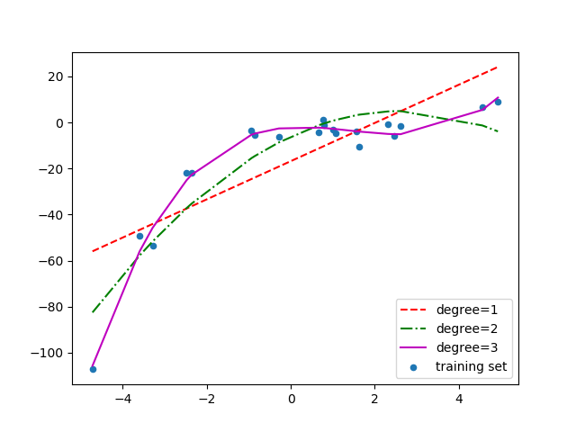
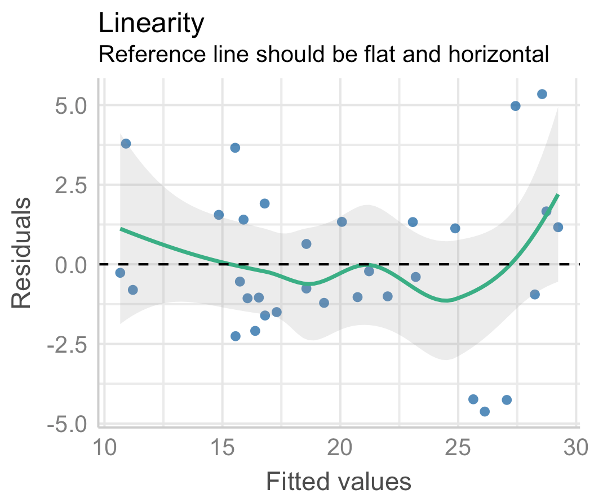
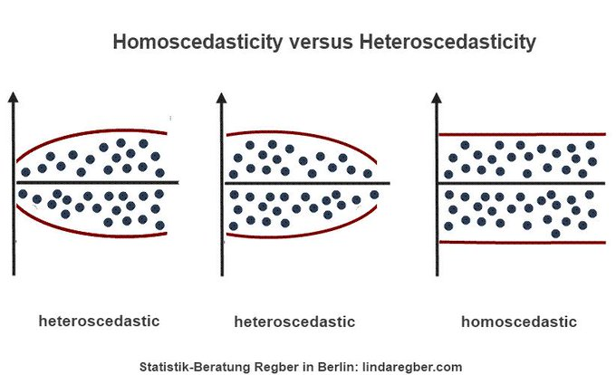
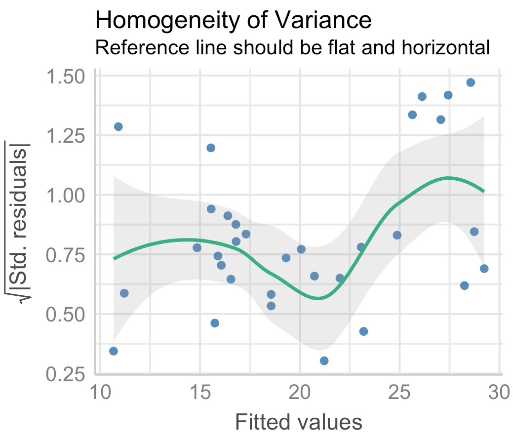
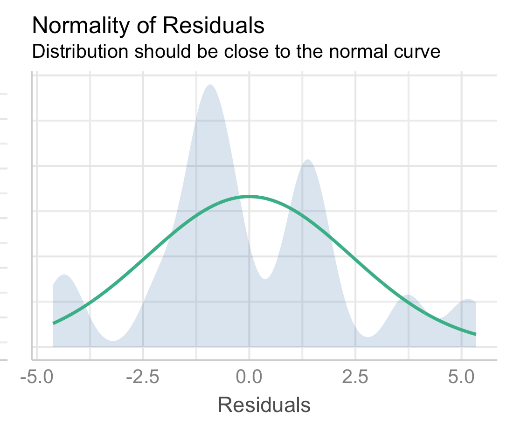
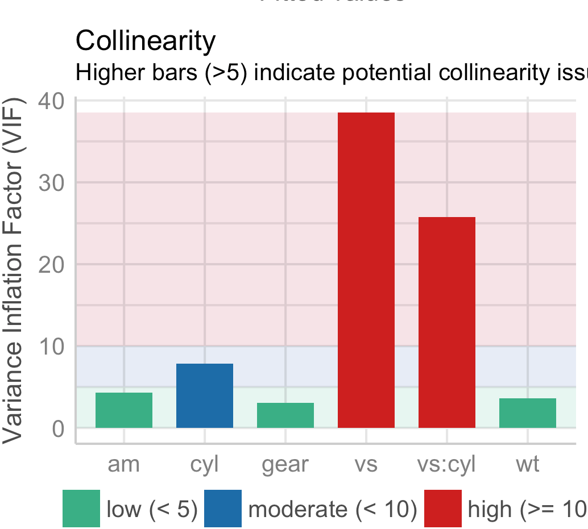
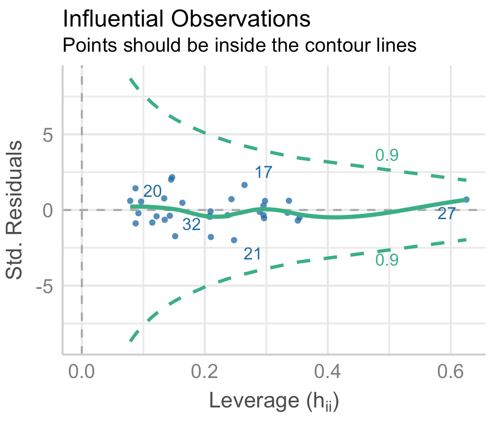

class: front

```{r eval=FALSE, include=FALSE}
# Correr esto para que funcione el infinite moonreader, el root folder debe ser static para si dirigir solo "bajndo" en directorios hacia el bib y otros

xaringan::inf_mr('/static/docpres/02_bases/2mlmbases.Rmd')

```

```{r setup, include=FALSE, cache = FALSE}
require("knitr")
options(htmltools.dir.version = FALSE)
opts_chunk$set(warning=FALSE,
             message=FALSE,
             echo=T,
             cache = TRUE, fig.width=7, fig.height=5.2)
```
```{r, warning= FALSE, echo = F}
pacman::p_load(dplyr, #manipulacion de datos
               sjPlot, #tablas
               summarytools, #estadisticos descriptivos
               sjlabelled,
               flipbookr, sjmisc)

pacman::p_load(tidyverse, magrittr,
               summarytools, sjPlot, performance, see)

```

```{r, echo = FALSE}
load("movid.RData") # Cargar base de datos

```


.pull-left[
# Estadística Multivariada
## Valentina Andrade
.small[
## Apoyo docente
## Sociología FACSO - UChile
## 1er Sem 2021
## [multivariada.netlify.com](https://multivariada.netlify.com)
]]


.pull-right[
.right[

<br>
<br>
## Clase 10: Diagnóstico de la calidad de los modelos: supuestos y transformación de variables

📌[URL a práctica](https://multivariada.netlify.app/assignment/10-code/) 
]

]
---

layout: true
class: animated, fadeIn

---
class: inverse, bottom, right, animated, slideInRight

# Objetivo

Introducir en aspectos de la evalución de la *calidad de los modelos* a partir del chequeo de supuestos, adjuste y comparación. 


---
class: inverse, bottom, right, animated

## Contenidos

### 0. 쮺칩mo se evalúa la calidad de los modelos?

--

#### 1. Robustez

--

#### 2. Bondad de ajuste

--

#### 3. Comparación

---

class: roja, bottom, right, slideInRight

# 0. 쮺칩mo se evalúa la calidad de los modelos?


---
class: fadeIn

# 0. 쮺칩mo se evalúa la calidad de los modelos?

.pull-right[Una vez que construimos nuestros modelos de regresión, es necesario evaluar la calidad de estos]

.pull-left[]

---

# 0. 쮺칩mo se evalúa la calidad de los modelos?

.pull-left[ ¡A ponerlos a prueba!
]

.pull-right[ ¡Evaluarlos! 
]


---

class: fadeIn

# 0. 쮺칩mo se evalúa la calidad de los modelos?

.center[


**Figura 1**. Proceso de evaluación de la calidad de los modelos estimados. Elaboración propia

]

---

# 0. 쮺칩mo se evalúa la calidad de los modelos?

**1. Robustez** (*pre-hoc*): los modelos de regresión tienen una serie de **supuestos** que se deben cumplir para que las estimaciones sean **fidedignas**.

- Algunos de ellos son **linealidad**, **normalidad de residuos**, **homogeneidad de la varianza**, **independencia de variables**, **multicolinealidad** y **casos influyentes** (*los primeros tres aplican solo para regresiones lineales*).

---

# 0. 쮺칩mo se evalúa la calidad de los modelos?

**2. Ajuste** (*post-hoc*): implica abordar qué tan bien ajustan nuestros modelos con los datos utilizados. La *bondad de ajuste* implica que si trabajamos con una

  - 2.1 *Regresión lineal múltiple*, analizaremos el $R^2$ ajustado
  
  - 2.2 *Regresión logística*, analizaremos el $Pseudo$ $R^2$ y los *Criterios de Información* $BIC$ y $AIC$ (ambos nos dicen cuánta información se está "perdiendo" con las variables que se ocupan en cada modelo. Por ello elegiremos el modelo que tenga un BIC y AIC más bajo)

---
class: inverse

# Pero ¡no te asustes!

- Que no se cumplan algunos supuestos no implica que debas abandonar el **lindo mundo de las regresiones**. Como veremos, existen formas de solucionar los problemas de supuestos y ajuste de los modelos.

.center[

]

---

# 0. 쮺칩mo se evalúa la calidad de los modelos?

**3. Comparación**: luego de que hacemos **transformaciones** a los modelos, una etapa importante para la **selección** de estos es compararlos. Para ello consideraremos toda la información que tenemos de ellos en su diagnóstico de **pre y post hoc.**

---

# 0. 쮺칩mo se evalúa la calidad de los modelos en **R**?

- Existen diversas funciones, pero la gran parte de ello se desenvuelve en distintos paquetes.

--

- ¡Buenas noticias!  **`performace`**  que reúne todas estas herramientas, y de los tres ejes de la **calidad de los modelos**.
.center[

]

---

# 0. 쮺칩mo se evalúa la calidad de los modelos en **R**?

.center[


**Figura 2.** paquete `performance` del proyecto easystats de [Lüdecke et al. (2021)](https://easystats.github.io/performance/)
]
---

class: roja, bottom, right, slideInRight

# Diagnóstico de calidad de los modelos

---

# 0. Construcción del modelo

Imaginemos que queremos analizar los determinantes de la **Fatiga pandémica**, y para ello estimaremos un modelo de regresión lineal.

```{r}
model1 <- lm(as.numeric(fatiga) ~
               c2_1 + c2_2 + c2_3 + c2_4 +
               trabaja + sexo + edad + ingreso,
             data = movid_proc)
```

---
class: slideInRight

# 1. Supuestos

.center[


**Figura 3**. Diferentes funciones de `performance` para evaluar robustez del modelo
]

---
class: slideInRight

# 1.1 Linealidad

Para la regresión lineal múltiple, un supuesto importante es que existe una **relación lineal entre la variable dependiente e independiente**.
.center[

]

---

# 1.1 Linealidad

- Cumplimiento supuesto: visualizar *gráfico de dispersión de datos*, que relacione la variable dependiente y la independiente, y verificar de manera "intuitiva" si la **tendencia** de esta relación se puede describir por una **línea recta**.

.center[

]

---
# 1.1 Linealidad

El paquete `performace` nos permite hacer esto con su función `check_model` indicando en el argumento `check = "ncv", "linearity"`  

```{r}
check_model(model1, check = c("ncv", "linearity"))
```

✔️ La línea de referencia es plana y horizontal


---

# 1.1 Linealidad

- No siempre es tan claro. Para ello se podría emplear el test de Ramsey
.center[

]
---

# 1.2 Homocedasticidad

- Concepto indica que **los residuos** se distribuyen de forma **homogénea**.

.center[

]

---

# 1.2 Homocedasticidad

- La variación de los residuos es homogénea,es decir, no veremos un patrón claro y más bien se *distribuirán de forma aleatoria*.
.center[

]

---

# 1.2 Homocedasticidad

- Prueba *Breusch-Pagan Godfrey* cuya hipótesis nula indica que

$H_0$: La varianza de los residuos del modelo de regresión no es constante (**heterocedasticidad**)

---

# 1.2 Homocedasticidad

- Función `check_heteroscedasticity` verificaremos qué ocurre con la hipótesis nula

```{r}
check_heteroscedasticity(model1)
```

✔️ La varianza es homocedástica 

---

# 1.3 Normalidad de residuos

- Sin **distribución normal** de los residuos: el modelo no es consistente a través de las variables y observaciones (esto significa que los errores **no son aleteatorios**).

.center[

]

---

# 1.3 Normalidad de residuos

- Función `check_normality` utilizaremos la prueba *Shapiro-Wilk* para ver qué ocurre con la hipótesis nula
```{r}
check_normality(model1)
```

⚠️ Los residuos no son normales

---

# 1.4 Independencia

- Los errores asociados a nuestro modelo de regresión deben ser **independientes** entre sí.

- Prueba de *Durbin-Watson*, donde la $H_0$ supone que **los residuos son independientes**


---

# 1.4 Independencia

- Función `check_autocorrelation` utilizaremos la prueba *Durbin-Watson* para ver qué ocurre con la hipótesis nula

```{r}
check_autocorrelation(model1)
```

⚠️ Hay correlación entre los residuos

---

class: inverse

- La regresión lineal **requiere de una relación lineal** entre sus variables independientes y dependiente.

--

- No solo es importante chequear la **distribución de los residuos**, sino dos posibilidades que pueden *tendenciar* esa relación lineal: como **casos influyentes** en la muestra y **predictores que están altamente relacionados**.

---
# 1.5 Multicolinealidad

- La multicolinealidad es la relación de **dependencia lineal fuerte** entre más de dos **predictores** de un modelo.

--

- Hace *difícil __cuantificar__ con exactitud el efecto de cada predictor sobre la variable dependiente*

---

# 1.5 Multicolinealidad

- Problemas con parcialización de efectos

- Relación **endógena** entre predictores se examina ante la existencia de altas correlaciones (*lineales*) entre variables.

--

- La aproximación numérica más utilizada es el **VIF** (factor de inflación de varianza) que indica hasta que punto la varianza de los coeficientes de regresión se debe a la colinealidad

---

# 1.5 Multicolinealidad

.pull-left[
- Ocuparemos el comando `check_collinearity()`. Como podemos ver en el gráfico, todos los valores son menores a 5 (*como recomienda el paquete*).
]

.pull-code-right[
```{r}
plot(check_collinearity(model1))
```
]
---

.center[

]

---

# 1.5 Multicolinealidad
- En ciencias sociales, las relaciones en general *no son tan altas.*

- Criterio: **evitar** valores del **VIF mayores a 2.5**. 

---
# 1.5 Multicolinealidad
```{r}
check_collinearity(model1)
```

---

# 1.5 Multicolinealidad

⚠️ Como podemos ver los ítems del módulo de salud mental tienen todos valores sobre 2.5.

- Eliminar alguno de los predictores o *evaluar si es que estas variables más bien son parte de un mismo constructo*
---
# 1.6 Casos influyentes

- También llamados en inglés, *outliers*. Son casos que pueden tendenciar nuestras rectas de regresión pese a que no es evidente una relación lineal.

.center[

]
---

# 1.6 Casos influyentes

- Examinaremos si la ausencia o presencia de ese caso genera un **cambio importante** en la estimación del modelo de regresión.

- Cálculo de la **Distancia de Cook** (Cook,1977)

---

# 1.6 Casos influyentes

.pull-left[
Graficaremos la influencia de los casos con `check_outliers()` dentro de un `plot()`
]
.pull-code-right[
```{r}
plot(check_outliers(model1))
```
]
---

# 1.6 Casos influyentes

- Verificar si la ausencia o presencia de estos casos que presentan mayor distancia producen una **diferencia** significativa en la estimación del modelo:

```{r}
check_outliers(model1)
```

✔️ No hay outliers


---
class: roja, bottom, right, slideInRight

# 2. Ajuste de los modelos

---
class: fadeIn

# 2. Ajuste del modelo

- [Práctica 5](https://multivariada.netlify.app/assignment/05-code/) que podemos evaluar qué tan bien ajustan nuestros modelos con los datos utilizados. Sabemos que:

--

- Si trabajamos una regresión lineal: el $R^2$ ajustado

- Si trabajamos una regresión logística:
  - Pseudo $R^2$
  - *Criterios de Información* BIC y AIC: cuánta información se está "perdiendo" con las variables que se ocupan en cada modelo. Por ello elegiremos el modelo que tenga un BIC y AIC más bajo.

---

# 2. Ajuste del modelo


```{r}
performance::model_performance(model1) %>% 
  print_md() #print_md() nos permite hacer tablas en buen formato
```

---

# 2. Ajuste del modelo

- **Transformaciones luego del chequeo de supuestos**:  no implica necesariamente que el ajuste mejore, sino que seremos más *fieles* a la información que realmente nos están otorgando las variables.

---

# Resumen de transformaciones posibles

```{r, echo = F}
table <- readxl::read_excel(path = "../../assignment/10code/tab-performance.xlsx")

table %>%  
kableExtra::kbl(., full_width = T, linesep = "", escape = FALSE) %>%
  kableExtra::kable_styling(
    full_width = F,
    position = "center",
    font_size = 14,
    bootstrap_options=c("striped", "bordered", "condensed", "responsive")) %>%  kableExtra::collapse_rows(columns = 1:2)
```

---

# 2.1 Transformar predictor al cuadrado o cubo

- Problemas de linealidad, indicamos que el término cuadrático o al cubo de algún predictor produce que la media de los residuos sea 0.

- Por lo general, por su distribución, esta variable es edad.

```{r}
movid_proc <- movid_proc %>% mutate(edad2 = (edad)^2)
```

---

## 2.2 Transformar variable dependiente

- Recuperar casos perdidos
- Logaritmizar
- Dicotomizar

---

## 2.2.1 Recuperar casos perdidos

- Datos perdidos, un ejemplo clásico: **ingresos**
  - Estrategias para solicitar que las personas reporten sus ingresos: (1) reporte directo del monto y (2) tramos.

- En nuestros datos tenemos un *porcentaje 25,3%* de datos perdidos.

---

## 2.2.1 Recuperar casos perdidos

- **Paso 1:** Calcular la media por cada tramo
- **Paso 2:** En el caso de no tener información, remplazar por la media del tramo
- **Paso 3:** Comparar el resultado de los tramos

---

## 2.2.1 Recuperar casos perdidos

```{r}
movid_proc <- movid_proc %>% 
  mutate(tingreso = case_when(tingreso == "Menos de $200 mil pesos" ~ 200000,
                              tingreso == "Entre $200 y 350 mil pesos" ~ 275000,
                              tingreso == "Entre $351 y 500 mil pesos" ~ 425500,
                              tingreso == "Entre 501 y 800 mil pesos" ~ 650500,
                              tingreso == "Entre 801 mil y 1 millón 200 mil pesos" ~ 1000500,
                              tingreso == "Entre 1 millón 201 mil y 2 millones de pesos" ~ 1600500,
                              tingreso == "Entre 2 millones y 5 millones de pesos" ~ 3500000,
                              tingreso == "Más de 5 millones de pesos" ~ 5000000), #Paso 1
         ingreso = if_else(is.na(ingreso), tingreso, ingreso))
```

---

## 2.2.1 Recuperar casos perdidos

- Pasamos de tener 25,3% de datos perdidos en ingresos a un 8,72% (es decir, recuperamos un 16,58% de los casos).

---
## 2.2.1 Otras: ingresos

A ingresos se le pueden hacer tres transformaciones más

**1. Logaritmizar**: en caso de que queramos seguir trabajando ingresos como una variable continua es una buena opción.

.center[

]

---
## 2.2.1 Otras: ingresos

**2. Calcular el ingreso per cápita**: si dividimos el ingreso por el tamaño del hogar (n° de habitantes en este), obtendremos el ingreso por persona.


**3. Cálculo de medidas de posición acumulada**: con los ingresos per cápita se puede calcular la media o mediana de medidas de posición acumulada como quitiles 

---

## 2.2.1 Otras: ingresos

```{r}
movid_proc <- movid_proc %>%
  mutate(log_ing = log(ingreso), #Log ingresos
         ing_per = ingreso/tamanohogar, #Ingreso percapita
    quintiles = dplyr::ntile(ing_per,
                              n = 5)) # n de categorias, para quintiles usamos 5
```

---

## 2.3 Dicotomizar variable dependiente

- Preguntas con *Escala Likert* que no tienen una distribución normal. 

- *Re-especificar la variable como dicotómica* no solo ayudará a trabajar de manera más *realista* el constructo, sino que **facilitará** las interpretaciones que queramos hacer de nuestro modelo. 

---

## 2.3 Dicotomizar variable dependiente

Ocuparemos dos criterios para la **dicotomización**:

1. **Medias**: se ocupará como criterio discriminante la media de la variable (donde 1 puede ser los valores mayores a la media, y 0 los inferiores). 

2. **Mediana**: la más frecuente en medidas ordinales como las *escalas Likert* es cuando el 50% de los casos se concentra en unas pocas categoría de respuesta (eg, "Muy de acuerdo" y "De acuerdo" serán 1 y el resto 0).

---

## 2.3 Dicotomizar variable dependiente

En el caso de la variable `fatiga` que indica *"A medida que ha avanzado la crisis sanitaria, me siento cada vez más desmotivado para seguir las medidas de protección recomendadas"*, recodificaremos a aquellos como *1* a quiénes asienten a esta frase (*"Muy de acuerdo" y "De acuerdo"*)

```{r}
movid_proc <- movid_proc %>% 
  mutate(fatigadummy = case_when(fatiga %in% c(5,4) ~ 1,
                                 fatiga %in% c(3,2,1) ~ 0, TRUE ~ NA_real_))
```

---

### 2.4 Errores estándares robustos

- Problemas de heterocedasticidad debemos re-estimar nuestro modelo considerando errores estándares robustos

```{r, eval = F}
model_robust<- lmtest::coeftest(model1, vcov=sandwich::vcovHC(model1))
```

- Luego solo reportamos el modelo robusto y comparamos

---

## 2.5 Creación de índices

- [Tutorial de dplyr](https://www.youtube.com/watch?v=APzU10EMMjg&t=321s) y [práctico N°1](https://multivariada.netlify.app/assignment/01-code/#bonus-track-generaci%C3%B3n-de-%C3%ADndices).

1. **Correlacionar** para verificar que estamos ante la presencia de ítems que podrían estar midiendo un constructo común.

---

```{r}
movid_proc %>% select(starts_with("c2")) %>%
  mutate_all(~as.numeric(.)) %>% 
sjPlot::tab_corr(., triangle = "lower")
```

---

## 2.5 Creación de índices

2. **Construcción de índice**: este puede ser sumativo o promedio.

```{r}
movid_proc <- movid_proc %>% 
  mutate_at(vars(starts_with("c2")),~as.numeric(.)) %>% 
  rowwise() %>% 
  mutate(salud_mental = sum(c2_1,c2_2,c2_3,c2_4, na.rm = T))
```

---

## 2.6 Eliminar casos influyentes

- Problema de casos influyentes debemos seguir los siguientes pasos

```{r, eval = F }
n<- nobs(model1) #n de observaciones
k<- length(coef(model1)) # n de parametros
dcook<- 4/(n-k-1) #Punto de corte

# Datos donde se filtran los valores sobre el punto de corte

movid_proc_so <- broom::augment_columns(model1,data = movid_proc) %>% filter(.cooksd<dcook) #Menos observaciones
```

---
class: roja, bottom, right, slideInRight

# 3. Comparación

---

# 3.1 Volvemos a estimar modelos

```{r}
model1_fit <- lm(as.numeric(fatiga) ~ salud_mental +
               trabaja + sexo + edad + ing_per,
             data = movid_proc)

model2 <- lm(as.numeric(fatiga) ~ salud_mental +
               trabaja + sexo + edad2 + ing_per,
             data = movid_proc)

model3 <- glm(fatigadummy ~ salud_mental +
               trabaja + sexo + edad2 + ing_per, family = "binomial",
             data = movid_proc)

```

---

# 3.2 Chequeo general

- Chequeo general de diagnósticos de robustez con `check_model`, pero ahora indicando que queremos evaluar todos los indicadores posibles

```{r, eval = F}
check_model(model1_fit, check = c("vif","normality", "linearity", "ncv", "homogeneity"))

check_model(model2, check = c("vif",  "normality", "linearity", "ncv", "homogeneity"))

check_model(model3, check = c("vif",  "homogeneity"))
```

---
.center-code[
```{r, echo = F}
check_model(model2, check = c("vif",  "normality", "linearity", "ncv", "homogeneity"))

```
]
---

- Existen otros diagnósticos posibles:

  - Posibles **interacciones** entre las variables que no han sido modeladas (Fox & Weisberg 2018).
  - Variable no observada.
  
- En caso de su interés pueden revisar esto y ver su [aplicación simple en R en el siguiente link.](https://strengejacke.github.io/ggeffects/articles/introduction_partial_residuals.html)

---

# 3. Comparación

- Con la tabla de regresión podemos tener un panorama, es **imprescindible** recordar que para comparar modelos (en su robustez y ajuste) es necesario que estos tengan *(1) la misma variable de respuesta y (2) el mismo número de observaciones.*

---

# 3. Comparación

```{r}
compare_performance(model1_fit, model2) %>% 
  print_md()
plot(compare_performance(model1_fit, model2))
```

---

# 3. Comparación

- El ajuste entre el `model1_fit` y `model2` no cambia sustantivamente.

- Podemos seleccionar `model3` por **criterios más sustantivos**.

- Podemos asegurarnos de esta comparación entre el modelo1 y modelo2 con un test que permite facilitar la decisión sobre la significancia de los índices que estamos viendo

```{r}
test_performance(model1_fit, model2) %>%
  print_md()
```

---
class: inverse

.center[


**Figura 1**. Proceso de evaluación de la calidad de los modelos estimados. Elaboración propia
]

---

# 쯏 eso era?

--
.center[

# ¡Sí!


]

---
class: front


.pull-left[
# Estadística Multivariada
## Valentina Andrade
.small[
## Apoyo docente
## Sociología FACSO - UChile
## 1er Sem 2021
## [multivariada.netlify.com](https://multivariada.netlify.com)
]]


.pull-right[
.right[

<br>
<br>
## Clase 10: Diagnóstico de la calidad de los modelos: supuestos y transformación de variables

📌[URL a práctica](https://multivariada.netlify.app/assignment/10-code/) 
]

]
