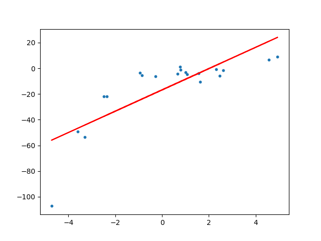
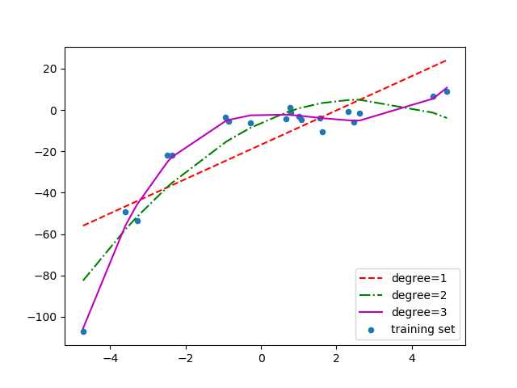
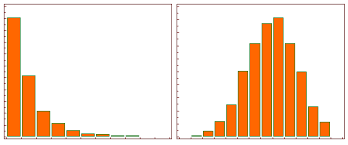
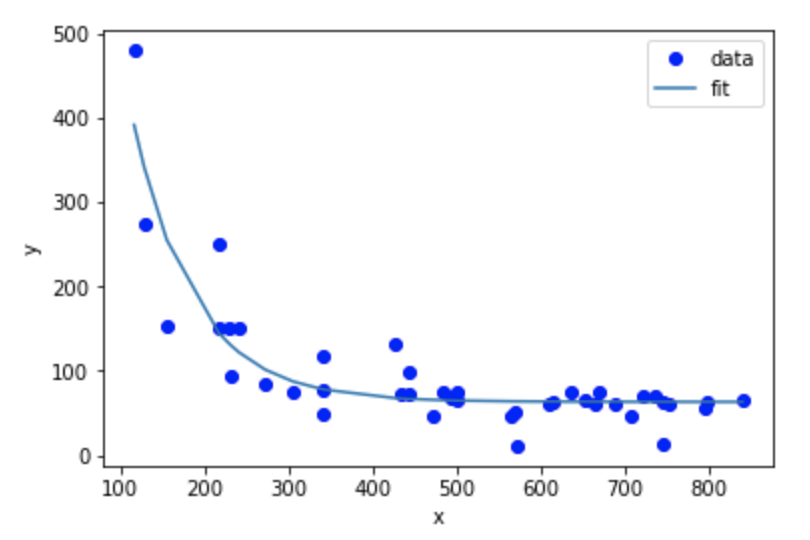
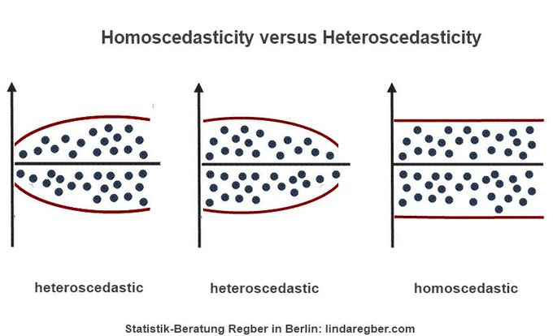

class: front

```{r eval=FALSE, include=FALSE}
# Correr esto para que funcione el infinite moonreader, el root folder debe ser static para si dirigir solo "bajndo" en directorios hacia el bib y otros

xaringan::inf_mr('/static/docpres/02_bases/2mlmbases.Rmd')

o en RStudio:
  - abrir desde carpeta root del proyecto
  - Addins-> infinite moon reader
```


```{r setup, include=FALSE, cache = FALSE}
require("knitr")
options(htmltools.dir.version = FALSE)
pacman::p_load(RefManageR)
# bib <- ReadBib("../../bib/electivomultinivel.bib", check = FALSE)
opts_chunk$set(warning=FALSE,
             message=FALSE,
             echo=TRUE,
             cache = TRUE, fig.width=7, fig.height=5.2)
pacman::p_load(flipbookr, tidyverse)
```

```{r xaringanExtra, echo=FALSE}
xaringanExtra::use_xaringan_extra(c("tile_view", "animate_css", "tachyons"))
```


<!---
Para correr en ATOM
- open terminal, abrir R (simplemente, R y enter)
- rmarkdown::render('static/docpres/07_interacciones/7interacciones.Rmd', 'xaringan::moon_reader')

About macros.js: permite escalar las imágenes como [scale 50%](path to image), hay si que grabar ese archivo js en el directorio.
--->


.pull-left[
# Estadística Multivariada
## Juan Carlos Castillo
## Sociología FACSO - UChile
## 1er Sem 2020
## [multivariada.netlify.com](https://multivariada.netlify.com)
]


.pull-right[
.right[

<br>
<br>
## Sesión 11: Supuestos y robustez del modelo de regresión

]

]
---

layout: true
class: animated, fadeIn

---
class: inverse, middle, center

# ¿Qué tan apropiado es el modelo de regresión para dar cuenta de las relaciones entre los datos?


---
.center[ 
```{r echo=FALSE}
pacman::p_load(stargazer,tidyverse,gridExtra,ggplot2,gridExtra,broom,
car,lmtest,sandwich,interplot,ape,multiwayvcov)
a1<-lm(y1~x1,data=anscombe)
a2<-lm(y2~x2,data=anscombe)
a3<-lm(y3~x3,data=anscombe)
a4<-lm(y4~x4,data=anscombe)
```

```{r echo=FALSE , fig.width=10, fig.height=6  }
# 4 nubes de puntos con las rectas de regresión.
F1 <- ggplot(anscombe)+aes(x1,y1)+geom_point()+
geom_abline(intercept=3,slope=0.5) + xlim(4, 19) + ylim(4, 13)

F2 <- ggplot(anscombe)+aes(x2,y2)+geom_point()+
geom_abline(intercept=3,slope=0.5) + xlim(4, 19) + ylim(4, 13)

F3 <- ggplot(anscombe)+aes(x3,y3)+geom_point()+
  geom_abline(intercept=3,slope=0.5) + xlim(4, 19) + ylim(4, 13)

F4 <- ggplot(anscombe)+aes(x4,y4)+geom_point()+
  geom_abline(intercept=3,slope=0.5) + xlim(4, 19) + ylim(4, 13)

# Mostrar los 4 gráficos en una figura
grid.arrange(F1,F2,F3,F4, ncol = 2)
```
]

.small[
Anscombe, F. J. (1973). Graphs in Statistical Analysis. The American Statistician, 27(1), 17–21. https://doi.org/10.1080/00031305.1973.10478966]


---
class: middle

.tiny[
```{r}
sjPlot::tab_model(list(a1,a2,a3,a4),
        show.se=TRUE,
        show.ci=FALSE,
        digits=2,
        p.style = "asterisk",
        dv.labels = c("Modelo 1", "Modelo 2", "Modelo 3", "Modelo 4"),
        string.pred = "Predictores",
        string.est = "β")

```
]

---
class: middle, center


---
class: inverse

<br>
<br>
<br>

- El modelo de regresión es para asociaciones **lineales** entre variables

--

- En ausencia de asocaciones lineales se pueden generar distorsiones en la estimación

--

- El **Análisis de robustez** o **chequeo de supuestos** permite analizar en qué medida el modelo es una representación adecuada de las asociaciones entre las variables.


---
class: inverse middle

## **A revisar:**
.pull-left-wide[


1. Observaciones influyentes

2. Linealidad

3. Homogeneidad de varianza (homocedasticidad)

4. Inflación de varianza

]

.pull-right-narrow[

<br>
<br>
<br>


]

---
class: inverse middle

## **A revisar:**
.pull-left-wide[


1.  **Observaciones influyentes**

2. Linealidad

3. Homogeneidad de varianza (homocedasticidad)

4. Inflación de varianza

]

.pull-right-narrow[

<br>
<br>
<br>


]

---
class: center

.small[

```{r echo=FALSE, fig.width=10}
grid.arrange(F3,F4, ncol = 2)
```
]

--
Una observación es **influyente** si su presencia/ausencia genera un cambio importante en la estimación de los coeficientes de regresión

---
## Ouliers vs observaciones influyentes

- la identificación descriptiva de un outlier en una variable no necesariamente implica influencia

--

.center[
.medium[
.content-box-red[
.red[
**No todo outlier es una observación influyente, pero toda observación influyente es un outlier ** 
]
]
]
]

--

- la capacidad de influencia de un outlier se asocia al concepto de  **"apalancamiento"** (leverage).

---
## Identificando influyentes: Distancia de Cook

$$DCook=\frac{\sum(\hat{y_{j}}-\hat{y_{j(i)}})^2}{p*MSE}$$

Se trata de una diferencia de la predicción del modelo con y sin la observación $i$, ponderada por el número de parametros en el modelo (p) y la media cuadrática del error (MSE).

Se establece un punto de corte de $4/(n-k-1)$, valores mayores se consideran influyentes -> outliers con alta capacidad de palanca.

---
## Manejo de casos influyentes

.pull-left[
.small[
```{r echo=FALSE}
load("final.85.RData")
model1 <- lm(logy ~ open + loglab +
               logland, data=final.85)
final.85v2 <- augment_columns(model1, final.85)
final.85v2$id <- as.numeric(row.names(final.85v2))
# identify obs with Cook's D above cutoff
ggplot(final.85v2, aes(id, .cooksd))+
geom_bar(stat="identity", position="identity")+
xlab("Obs. Number")+ylab("Cook's distance")+
geom_hline(yintercept=0.03)+
geom_text(aes(label=ifelse((.cooksd>0.03),id,"")),
vjust=-0.2, hjust=0.5)
```
]
]


.pull-right[
.content-box-red[
- estimar Cook para todas las observaciones

- detectar observaciones con Cook > punto de corte = influyentes

- re-estimar modelo sin las observaciones y comparar resultados
]
]


---
class: inverse middle

## **A revisar:**
.pull-left-wide[


1. Observaciones influyentes

2. **Linealidad**

3. Homogeneidad de varianza (homocedasticidad)

4. Inflación de varianza

]

.pull-right-narrow[

<br>
<br>
<br>


]

---
## Linealidad (asociaciones lineales)

Recordando:

- valores predichos: $\hat{Y}$
- residuos $\hat{Y}-Y$

--

Una forma en que se puede expresar la linealidad se relaciona con la **distribución de los residuos** 

En presencia de linealidad se esperaría que los residuos se distribuyan **aleatoriamente** en torno a la recta de regresión (representada por los valores predichos)

---
## Predichos (fitted) y residuos en Anscombe

.center[
```{r echo=FALSE, fig.width=10, fig.height=6 }
anscombe1 <- augment_columns(a1, anscombe)
fires1a <-ggplot(anscombe1, aes(x=.fitted, y=.resid)) +
geom_hline(yintercept=0) +
geom_point() 

anscombe2 <- augment_columns(a2, anscombe)
fires2a <-ggplot(anscombe2, aes(x=.fitted, y=.resid)) +
geom_hline(yintercept=0) +
geom_point() 

anscombe3 <- augment_columns(a3, anscombe)
fires3a <-ggplot(anscombe3, aes(x=.fitted, y=.resid)) +
geom_hline(yintercept=0) +
geom_point() 

anscombe4 <- augment_columns(a4, anscombe)
fires4a <-ggplot(anscombe4, aes(x=.fitted, y=.resid)) +
geom_hline(yintercept=0) +
geom_point() 

grid.arrange(fires1a,fires2a,fires3a,fires4a, ncol = 2)

```
]


---
## Predichos (fitted) y residuos en Anscombe

.center[
```{r echo=FALSE, fig.width=10, fig.height=6 }
fires1b <-fires1a + geom_smooth(method='loess',se=TRUE) 
fires2b <-fires2a + geom_smooth(method='loess',se=TRUE) 
fires3b <-fires3a + geom_smooth(method='loess',se=TRUE) 
fires4b <-fires4a + geom_smooth(method='loess',se=TRUE) 

grid.arrange(fires1b,fires2b,fires3b,fires4b, ncol = 2)

```
]
---
## Interpretación del gráfico de Diagnóstico.

- Los residuos deben ser **independientes** de los valores predichos

- Cualquier correlación entre los residuos y los valores predichos violarían este supuesto.

- Sí los residuos muestran una patrón no lineal, como una **relación curvilinea**, el modelo esta especificado incorrectamente.

---
## ¿Qué hacer en caso de no-linealidad?

- descartar observaciones influyentes

- transformación de variables, ej:

  - polinomial
  
  - logarítmica

---
## Transformación polinomial

.pull-left[
- transformaciones de potencia que permiten capturar asocaciones no lineales / curvas

- además de la variable original $x$, se suma(n) al modelo terminos cuadráticos $x^2$, cúbicos $x^3$...

- caso típico: edad

]

.pull-right[

]

---
## Transformación polinomial

.pull-left[

]


.pull-right[

]


---
## Transformación logarítmica

- utilizada para variables con un alto sesgo en su distribución

.center[

]

- pondera crecientemente las diferencias entre los valores de la escala


---
## Transformación logarítmica

.pull-left[
- Se reemplaza la variable por la transformada logarítmicamente en el modelo (a diferencia de los polinomios)

- caso típico: ingreso
]

.pull-right[

]


---
class: inverse middle

## **A revisar:**
.pull-left-wide[


1. Observaciones influyentes

2. Linealidad

3. **Homogeneidad de varianza (homocedasticidad)**

4. Inflación de varianza

]

.pull-right-narrow[

<br>
<br>
<br>


]

---
## Homogeneidad de varianza

- se refiere al supuesto de que la varianza de los residuos debería ser homogenea a lo largo de los valores predichos 

- problemas de homocedasticidad en los residuos (**=heterocedasticidad**) puede afectar la estimación de los parámetros y su significación estadística

---
## Homogeneidad de varianza

.center[

]

---
## Detección de Heterocedasticidad

- test Breush-Pagan, en R: `car::ncvTest(model1)` 

- test de Cook-Weisberg, en R: `lmtest::bptest(model1)`

- se contrasta la hipótesis nula de que la varianza del error es constante (=no diferencias), y la hipótesis alternativa de que el error de la varianza no es constante.


- por lo tanto, se busca no rechazar la hipótesis nula y valores p>0.05

---
## Correciones a problemas de Heterocedasticidad.

- estimar un modelo de regresión con errores estándar robustos a heterocedasticidad (Ej: Errores Estándar Robustos de White). En R:


```{r eval=FALSE}
library(lmtest)
library(sandwich)
model_robust<- coeftest(model, vcov=vcovHC)
```

- luego, comparar ambos modelos


---
class: inverse middle

## **A revisar:**
.pull-left-wide[


1. Observaciones influyentes

2. Linealidad

3. Homogeneidad de varianza (homocedasticidad)

4. **Inflación de varianza**

]

.pull-right-narrow[

<br>
<br>
<br>


]


---
## Multicolinealidad / inflación de varianza de error

- un supuesto de los modelos de regresión es que los predictores no están (altamente) correlacionados

- en casos de alta correlación, se produce una inflación de los errores estándar, disminuyendo los valores t y afectando el rechazo de la hipótesis nula

---
## Detección: VIF

$$VIF=\frac{1}{1-R^{2}_x}$$

- VIF (Variance Inflation Factor): se calcula en base a un modelo donde $X$ es la dependiente y las otras X independientes. 

- Mientras mayor el $R^2_x$, más pequeño el denominador y mayor será  VIF, indicando alta multicolinealidad para esa variable 

---
## Interpretación del VIF

- Si $VIF=1$, entonces $R^{2}_x=0$, queriendo decir que la variable open es completamente independiente de las otras variables explicativas del modelo original.

- Sin embargo, si $VIF=10$, entonces $R^{2}_x=0.9$, queriendo decir que el 90% de la varianza de la variable open puede ser explicada por las otras variables explicativas del modelo.


---
## Estimación de VIF

Para análizar el supuesto de no multicolinealidad en R, usamos la función **vif** de la librería car.

```{r eval=FALSE}
car::vif(model1)
```

- valores mayores a 2.5 pueden indicar alta multicolinealidad

---
class: inverse

## Resumen

.pull-left-narrow[

<br>
<br>
<br>


]


.pull-right[
1. Observaciones influyentes

2. Linealidad

3. Homogeneidad de varianza (homocedasticidad)

4. Inflación de varianza

]

---
class: inverse

## Recomendaciones generales

- buenos descriptivos uni y bivariados

- generar sección posterior al análisis de modelos: "Análisis de robustez"

- informar procedimientos y decisiones

---
class: roja

## Próxima clase: pendientes varios breves

- estandarización

- centrado de variables

- rescate de casos perdidos

- tratamiento de variable ingreso (continua, deciles, logarítmica)

- índices

- introducción interacciones ... 

---
class: front

.pull-left[
# Estadística Multivariada
## Juan Carlos Castillo
## Sociología FACSO - UChile
## 1er Sem 2020
## [multivariada.netlify.com](https://multivariada.netlify.com)
]


.pull-right[
.right[
<br>

]

]


